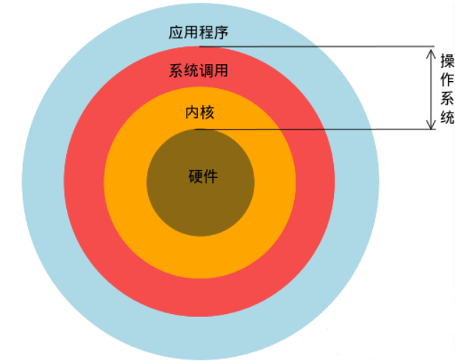
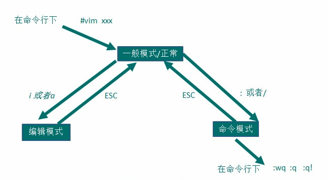

# Linux 简单入门

## 1 简介

Linux 是一个开源的、免费的操作系统，其稳定性、安全性、高效性、处理高并发等特点已经得到了业界的认可，目前很多中型、大型甚至是集群项目都部署到 Linux/Unix 系统的服务器上。

那什么是操作系统呢？**操作系统**是用户和计算机的接口，同时也是计算机硬件和应用程序的接口，也就是说我们和计算机打交道以及计算机底层硬件和应用程序打交道都是通过操作系统。

下图展示了操作系统在整个计算机系统中的角色。



Linux 的创始人是 Linux Torvalds。Linux 的吉祥物是一只企鹅，叫 Tux。

**Linux 主要有三个应用领域：** 个人桌面应用领域（因为传统的 Linux 界面简单、操作复杂、应用软件少的特点，它在这个领域特别薄弱）、服务器应用领域（Linux 在服务器应用领域是最强的）、嵌入式应用领域。

**Linux 发行版：** 以 Linux 内核为中心，再集成搭配各种各样的系统管理软件或应用工具软件组成一套完整的操作系统，这样的组合便称为 Linux 发行版。主要的发行版有 CentOS、Red Hat、Ubuntu、SuSE、红旗 Linux 等。

## 2 目录结构

Linux 的文件系统是采用**级层式**的树状目录结构，最上层是根目录 /，在根目录下再创建其它的目录。

> 在 Linux 世界里，一切皆文件。

根目录下的目录介绍：

| 目录        | 描述                                                                                                                      |
| ----------- | ------------------------------------------------------------------------------------------------------------------------- |
| /bin        | Binary 的简写，存放常用的指令                                                                                             |
| /sbin       | s 是 super user 的意思，存放系统管理员使用的系统管理程序                                                                  |
| /home       | 存放普通用户主目录，Linux 中每个用户都有一个自己的目录，一般目录名以用户的账号来命名                                      |
| /root       | 系统管理员（超级权限者）的用户主目录                                                                                      |
| /lib        | 系统开机所需要的最基本的动态连接共享库，作用类似于 Windows 中的 DLL 文件，几乎所有应用程序都需要用到这些共享库            |
| /lost+found | 一般情况下是空的，当系统非法关机后，这个目录就会存放一些文件                                                              |
| /etc        | 所有的系统管理所需要的配置文件和子目录                                                                                    |
| /usr        | 非常重要，用户的很多应用程序和文件都放在这个目录中，类似于 Windows 中的 Program Files 目录                                |
| /boot       | 存放的是启动 Linux 时的一些核心文件，包括一些连接文件和镜像文件                                                           |
| /proc       | 虚拟的目录，它是系统内存的映射，访问这个目录来获取系统信息                                                                |
| /srv        | service 的简写，该目录存放一些服务启动之后需要提取的数据                                                                  |
| /sys        | 这是 Linux2.6 内核的一个很大的变化，该目录下安装了 2.6 内核中新出现的一个文件系统 ysfs                                    |
| /tmp        | 存放一些临时文件                                                                                                          |
| /dev        | 把硬件设备映射成文件来管理，类似于 Windows 的设备管理器                                                                   |
| /media      | Linux 系统会自动识别一些设备、比如 U 盘、光驱等，会把识别到的设备挂载到这个目录下                                         |
| /mnt        | 系统提供该目录是为了让用户临时挂载别的文件系统，我们可以将外部的存储挂载到 /mnt/ 上，然后进入该目录就可以查看里面的内容了 |
| /opt        | 给主机额外安装软件所存放的目录（安装前），比如安装 Oracle 数据库就可以放在这个目录中，默认是空的                          |
| /usr/local  | 给主机额外安装软件所安装的目录（安装后），一般是通过编译源码方式安装的程序                                                |
| /var        | 存放不断扩充着的东西，习惯将经常修改的目录放在这个目录中，包括各种日志文件                                                |
| /selinux    | SELinux 是一个安装子系统，它能控制程序只能访问特定文件                                                                    |

#### (1) Xshell 6

Xshell6 用于远程登录和操作 Linux 系统。

Xshell 是一个强大的安全终端模拟软件，使用 Xshell，可以让我们在 Windows 界面下访问远端不同系统的服务器，从而比较好地达到远程控制终端的目的。

如果希望安装好的 Xshell 可以远程访问 Linux 系统的话，该 Linux 系统必须启用 SSHD 服务（该服务监听的端口号是 22）。

#### (2) Xftp 6

Xftp6 用于远程上传和下载文件。

Xftp 是一个基于 Windows 平台的功能强大的 SFTP、FTP 文件传输软件。使用 Xftp，Windows 用户可以安全地在 Unix/Linux 和 Windows PC 之间传输文件。

## 3 vi 和 vim 编辑器

所有的 Linux 系统都内置 vi 文本编辑器。vim 具有程序编辑的能力，可以看作是 vi 的增强版本。vim 具有丰富的高亮显示、代码补全、编译以及错误跳转等方便编程的功能，使得它在程序员之间被广泛使用。

### 3.1 vi 和 vim 常用的三种模式

#### (1) 正常模式

正常模式（默认模式、一般模式）下，可以使用快捷键。

以 vim 打开一个档案就直接进入正常模式了，在这个模式中，可以使用 `↑ ↓ ← →` 来移动光标，可以**删除字符**和**删除整行**，也可以使用**复制**和**粘贴**。

#### (2) 插入模式

插入模式（编辑模式）下，可以输入内容。

按 i、I、o、O、a、A、r、R 等任何一个字母，就会进入插入模式，一般来说按 i 即可。

#### (3) 命令行模式

从插入模式进入命令行模式，按 ESC 即可。

在这个模式下，可以通过相关的指令，完成读取、存盘、替换、离开 vim、显示行号、查找等操作。

如果打开档案，做了修改，但是不想保存，可以使用命令 `:q!`



### 5.2 常用快捷键操作

**注意！只有在正常模式下，才可以使用快捷键！**

**拷贝行：** 把光标移到某一行，输入 yy 会拷贝当前行，输入 p 会在当前行的下一行粘贴；如果想拷贝当前行向下的 5 行（包括当前行），可以输入 5yy。

**删除行：** 输入 dd 可以删除当前行，输入 5dd 可以删除当前行向下的 5 行（包括当前行）。

**在文档中查询：** 输入 `/要查找的内容`，然后按回车进行查找，输入 n 是查找下一个。

**行号：** 输入 `:set nu` 显示行号，输入 `:set nonu` 隐藏行号。

**首末行：** 输入 G 可以到达文档的最末行，输入 gg 可以到达文档的最首行。

**撤销：** 输入 u 可以撤销上一步的操作，比如我们输入了一些东西，想撤销掉。

**移动光标到指定行：** 首先输入 `:set nu` 显示行号，然后输入 20，最后按快捷键 shift+g，即可把光标移动到第 20 行。

## 4 关机、重启和用户登录注销

```shell
shutdown -h now # 立即关机
shutdown -h 1 # 一分钟后关机
shutdown -r now # 立即重启
halt # 关机
reboot # 重启
sync # 把内存的数据同步到磁盘上
```

**注意：** 不管是重启系统还是关闭系统，首先都需要执行 sync 命令，把内存中的数据同步到磁盘中，防止数据丢失。

一般登录 Linux 系统时，应该尽量少用 root 账号，因为它是系统管理员账号，具有最大的权限。为了避免操作失误引起系统崩溃，可以使用普通用户账号登录，登录后如果想切换成系统管理员，可以使用 `su root` 命令。

通过 logout 命令可以注销用户，相当于断开连接。注意，logout 这个指令在**图形运行级别**是无效的，在**运行级别 3** 下有效，比如远程登录。

## 5 用户管理

Linux 系统是一个多用户多任务的操作系统，任何一个要使用系统资源的用户，都必须首先向系统管理员申请一个账号，然后以这个账号进入系统。

用户管理有三个很重要的概念：用户、组、家目录。每个用户至少要属于一个**组**。/home/ 目录下有各个用户对应的**家目录**，用户登录后，会自动进入到自己的家目录。

### 5.1 添加用户
