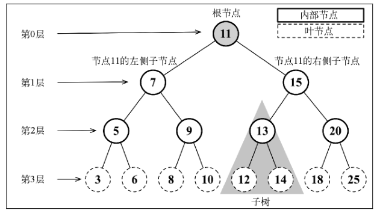

# 算法与数据结构

## 1 树

### 1.1 基本概念

树是一种分层数据的抽象模型。一个树结构包含一系列存在父子关系的节点。每个节点都有一个父节点（根节点没有父节点）以及零个或多个子节点。



树中的每个元素都叫作节点，节点分为**内部节点**和**外部节点**。

至少有一个子节点的节点称为**内部节点**，没有子元素的节点称为**外部节点或叶节点**。

节点的一个属性是**深度**，节点的深度取决于它的**祖先节点的数量**。

树的**高度**取决于所有节点深度的最大值。

**二叉树**中的节点最多只能有两个子节点：一个是左侧子节点，另一个是右侧子节点。

**二叉搜索树（BST）**是二叉树的一种，但是只允许在左侧节点存储（比父节点）小的值，在右侧节点存储（比父节点）大的值。

对于二叉树，JavaScript 表示如下：

```javascript
function TreeNode(val) {
  this.val = val
  this.left = this.right = null
}
```

对于 N 叉树，JavaScript 表示如下：

```javascript
function Node(val, children) {
  this.val = val
  this.children = children
}
```

### 1.2 遍历

树的遍历分为前序遍历、中序遍历、后序遍历。

**中序遍历：** 以上行顺序访问 BST 所有节点的遍历方式，也就是以从最小到最大的顺序访问所有节点，它的一种应用就是对树进行排序操作。

```javascript
// 中序遍历
const inOrderTraverseNode = (node, callback) => {
  if (node !== null) {
    inOrderTraverseNode(node.left, callback)
    callback(node.val)
    inOrderTraverseNode(node.right, callback)
  }
}
```

```javascript
// 打印所有节点的值
function inOrderTraverse(root) {
  const printNode = (value) => {
    console.log(value)
  }
  const inOrderTraverseNode = (node, callback) => {
    if (node !== null) {
      inOrderTraverseNode(node.left, callback)
      callback(node.val)
      inOrderTraverseNode(node.right, callback)
    }
  }
  inOrderTraverseNode(root, printNode)
}
```

**前序遍历：** 以优先于后代节点的顺序访问每个节点，它的一种应用是打印一个结构化的文档。

```javascript
// 前序遍历
const preOrderTraverseNode = (node, callback) => {
  if (node !== null) {
    callback(node.val)
    preOrderTraverseNode(node.left, callback)
    preOrderTraverseNode(node.right, callback)
  }
}
```

**后序遍历：** 先访问节点的后代节点，再访问节点本身，它的一种应用是计算一个目录及其子目录中所有文件所占空间的大小。

```javascript
// 后序遍历
const postOrderTraverseNode = (node, callback) => {
  if (node !== null) {
    postOrderTraverseNode(node.left, callback)
    postOrderTraverseNode(node.right, callback)
    callback(node.val)
  }
}
```


