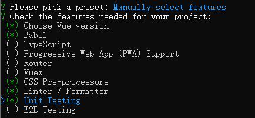
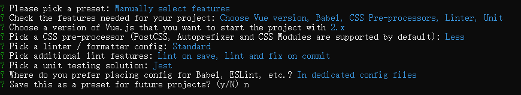

# 前端自动化测试

## 1 概述

前端开发人员在开发业务项目时，回归测试是一个比较头疼的事情。如果开发人员修改了某个公共模块，并想测试是否会影响现有功能时，常规做法是挨个找到使用这些公共模块的地方，检查是否有问题，如果公共模块应用于很多地方，这种人工测试方法不但低效而且可靠性低。

为了解决这个问题，我们可以引入前端自动化测试。

#### (1) 测试分类

测试可以分为**单元测试**、**集成测试**、**端到端测试**。

单元测试（Unit Testing）是指对程序中最小测试单元进行的测试，比如测试一个函数、一个组件、一个模块等等。

集成测试（Integration Testing）是指对已测试过的单元测试组合集成暴露出的高层函数或类的封装进行测试。

端到端测试（E2E Testing）是指从头到尾验证整个软件及其与外部接口的集成，目的是测试整个软件的依赖性、数据完整性以及与其他系统、接口和数据库等的通信，以模拟完整的生产场景。

#### (2) TDD 与 BDD

**TDD**（Test-Driven Development，测试驱动开发）也叫红绿开发（Red-Green Development），其流程如下：

1、编写测试用例；

2、运行测试，这时候，测试用例无法通过测试；

3、编写代码，使测试用例通过测试；

4、优化代码，完成开发；

5、重复上述步骤。

**BDD**（Behavior-Driven Development，行为驱动开发）是按照用户的行为进行开发并编写测试用例。

| TDD                                  | BDD                                  |
| ------------------------------------ | ------------------------------------ |
| 先写测试再写代码                     | 先写代码再写测试                     |
| 一般结合单元测试使用，是**白盒测试** | 一般结合集成测试使用，是**黑盒测试** |
| 测试重点在代码                       | 测试重点在 UI（DOM）                 |
| 安全感低                             | 安全感高                             |
| 速度快                               | 速度慢                               |

**补充：** **黑盒测试**一般也被称为功能测试，黑盒测试要求测试人员将程序看作一个整体，不考虑其内部结构和特性，只是按照期望验证程序是否能正常工作；**白盒测试**是基于代码本身的测试，一般指对代码逻辑结构的测试。

#### (3) 测试框架

**Jasmine** 是一个行为驱动的测试框架，可被用于测试各种 JavaScript 代码，主要用于 Angular 项目。

**Karma** 是一种通用的用例式前端测试框架，提供了跨浏览器测试的能力，可以在浏览器中执行测试用例。

**Mocha** 前端自动化测试框架，需要配合其他库一起使用，比如 chai、sinon 等。

**Jest** 是 Facebook 发布的开源的、零配置的 JavaScript **单元测试**框架，集成了快速命令行、Mock 工具集、断言、覆盖率报告等测试工具，支持 Babel、Webpack、TypeScript，功能强大，测试性能高。

## 2 Vue 项目测试

### 2.1 Vue CLI 项目

对于 Vue 项目，我们一般使用 Vue 官方提供的脚手架工具 Vue CLI 帮助我们快速搭建项目：

1、执行下面的命令，全局安装 Vue CLI：

```bash
npm install @vue/cli -g
```

脚手架安装成功后，就可以使用 vue 命令了，需要注意的是，如果使用的是 Windows 系统，vue 命令必须在 CMD 中使用：

```javascript
vue --version
```

2、执行下面的命令，创建项目，并手动选择项目特性：

```bash
vue create vue-app
```





从上图可以看出，我们在创建项目的时候，选择了支持单元测试，并选择了 Jest 作为测试运行器，因此，创建成功的项目会默认配置好与测试相关的功能。

3、在 package.json 中，可以看到如下配置，表示可以通过执行命令 `npm run test:unit` 来运行测试，也可以在命令后面添加 `--watch` 来开启 watch 模式：

```json
"scripts": {
  "test:unit": "vue-cli-service test:unit",
}
```

如果在使用 Vue CLI 搭建项目的时候，没有选择支持单元测试，可以通过命令 `vue add @vue/unit-jest` 来添加单元测试相关的功能。

### 2.2 已有项目

对于已有的并不是使用 Vue CLI 搭建的项目，我们可以按照下面的步骤搭建测试环境：

1、安装插件：

```bash
npm install jest @vue/test-utils --save-dev
```

2、在项目根目录创建 jest.config.js 文件，配置如下：

```javascript
module.exports = {
  // 在测试文件中引入的模块可以省略以下后缀名
  moduleFileExtensions: ['js', 'jsx', 'json', 'vue'],
  // 对测试文件中引入的模块先进行转换
  transform: {
    '^.+\\.vue$': require.resolve('vue-jest'), // 使用vue-jest转换vue模块
    // 使用jest-transform-stub把静态资源转换成字符串，因为测试的时候，对于样式这样的静态资源，无需解析和测试
    '.+\\.(css|styl|less|sass|scss|svg|png|jpg|ttf|woff|woff2)$': require.resolve('jest-transform-stub'),
    '^.+\\.jsx?$': require.resolve('babel-jest'), // 使用babel-jest把js、jsx模块中的语法转换成ES5语法，比如ESModule语法等
  },
  // 对于node_modules中的文件无需转换
  transformIgnorePatterns: ['/node_modules/'],
  // 处理Webpack配置的别名解析，比如'@'别名代表'/src'目录
  moduleNameMapper: { '^@/(.*)$': '<rootDir>/src/$1' },
  // 使用jest-serializer-vue序列化工具改进保存的快照
  snapshotSerializers: ['jest-serializer-vue'],
  // 以下文件会被当做是测试文件
  testMatch: ['**/tests/unit/**/*.(spec|test).[jt]s?(x)', '**/__tests__/*.[jt]s?(x)'],
  // 运行测试时，jsdom环境地址
  testURL: 'http://localhost/',
  // watch模式下，可以通过正则表达式查找测试文件名或者测试用例名
  watchPlugins: [require.resolve('jest-watch-typeahead/filename'), require.resolve('jest-watch-typeahead/testname')],
  collectCoverage: true, // 测试覆盖率
  // 用于统计测试覆盖率的文件
  collectCoverageFrom: ['**/*.{js,vue}', '!**/node_modules/**'],
}
```

3、安装 jest.config.js 中用到的插件：

```bash
npm install vue-jest babel-jest jest-transform-stub jest-serializer-vue jest-watch-typeahead --save-dev
```

4、在 package.json 中配置 scripts：

```json
"scripts": {
  "test": "jest",
}
```

5、通过执行命令 `npm run test` 来运行测试。

### 2.3 vue-test-utils

通过上面的学习，现在的 Vue 项目已经安装和配置好了 Jest 和 vue-test-utils。vue-test-utils 是 Vue 官方提供的单元测试实用工具库，支持主流的 JavaScript 测试运行器，本文选用的测试运行器是 Jest。

vue-test-utils 通过隔离挂载组件，模拟必要的输入（prop、注入和用户事件）和对输出（渲染结果、触发的自定义事件）的断言来测试 Vue 组件。被挂载的组件会返回一个包裹器，而包裹器会暴露很多封装、遍历和查询其内部的 Vue 组件实例的便捷的方法。

下面我们通过一个简单的测试用例来学习 vue-test-utils：

1、编写一个 HelloWorld 组件，如下：

```vue
<template>
  <div>
    <h1 class="hello_world">{{ msg }}</h1>
    <div>
      <span class="count">{{ count }}</span>
      <button @click="increment">Increment</button>
    </div>
  </div>
</template>

<script>
export default {
  name: 'HelloWorld',
  props: {
    msg: String,
  },
  data() {
    return {
      count: 0,
    }
  },
  methods: {
    increment() {
      this.count++
    },
  },
}
</script>
```

2、在与 HelloWorld.vue 文件同级的目录中新建 `__tests__` 文件夹，并在该文件夹中创建 HelloWorld.js 文件，用于编写对 HelloWorld 组件的测试用例。测试文件怎么命名以及放在什么目录下面，不同的前端开发有不同的选择方式，Jest 推荐在被测试代码所在目录下创建 `__tests__` 文件夹用于存放测试文件。

```javascript
import { shallowMount } from '@vue/test-utils'
import HelloWorld from '@/components/HelloWorld.vue'

describe('HelloWorld.vue', () => {
  // wrapper是包裹器，可以通过wrapper.vm访问实际的Vue实例
  const wrapper = shallowMount(HelloWorld, {
    // 渲染HelloWorld组件的时候，传递的props参数
    propsData: { msg: 'hello world' },
  })

  it('renders props.msg when passed', () => {
    expect(wrapper.findAll('.hello_world').length).toBe(1) // HelloWorld组件中class是"hello_world"的元素有一个
    expect(wrapper.props('msg')).toEqual('hello world') // 测试组件的props
  })
})
```

`@vue/test-utils` 提供的 shallowMount 表示浅渲染，也就是说，只渲染 HelloWorld 组件，而不会渲染 HelloWorld 组件中的子组件，对于子组件，会用占位符表示，所以 shallowMount 使用于单元测试。与 shallowMount 对应，mount 会渲染 HelloWorld 组件以及它的子组件，测试性能较低，适用于集成测试。

3、对于用户的交互，比如点击按钮，可以编写测试用例如下：

```javascript
it('button click should increment the count', () => {
  expect(wrapper.vm.count).toBe(0)
  const buttonWrapper = wrapper.find('button') // 返回该按钮元素的包裹器
  buttonWrapper.trigger('click') // 模拟点击操作
  expect(wrapper.vm.count).toBe(1)
})
```

4、如果只需要测试组件是否能够正常渲染，而不测试组件功能，可以使用快照测试：

```javascript
it('rendered normally', () => {
  expect(wrapper).toMatchSnapshot()
})
```

第一次执行 `toMatchSnapshot()` 的时候，会在与 HelloWorld.js 文件同级目录下生成`__snapshots__` 文件夹，里面存储有快照文件，如果后面真的需要对 HelloWorld 组件进行 DOM 更新，可以在 watch 模式下（watch 模式见下面）按 `u` 键进行更新。

快照测试可以用来测试组件中 DOM 结构的变化，主要用于 UI 测试。

5、执行下面的命令来运行测试：

```bash
npm run test:unit
```

可以在命令 `npm run test:unit` 后面加上 `--watch` 来开启 watch 模式。

## 3 React 项目测试

### 3.1 使用和配置 Jest

对于 React 项目，我们一般使用 React 官方提供的脚手架工具 create-react-app 帮助我们快速搭建项目：

```bash
npx create-react-app react-app
```

使用脚手架创建的 React 项目，默认安装和配置了 Webpack、Babel、ESLint、Jest 等工具，并隐藏了这些工具的配置文件，可以执行下面的命令，把配置文件弹射出来：

```bash
npm run eject
```

弹射出来的配置文件中的配置默认放在了 package.json 中，我们可以在项目根目录中创建 jest.config.js 文件，并把 package.json 中与 Jest 相关的配置剪切拷贝进去：

```javascript
module.exports = {
  roots: ['<rootDir>/src'],
  // 分析下列文件统计代码测试覆盖率，需要排除*.d.ts文件，它们是ts中的类型声明文件
  collectCoverageFrom: ['src/**/*.{js,jsx,ts,tsx}', '!src/**/*.d.ts'],
  // 运行测试之前，使用垫片对JSDOM做一些补偿，解决测试时js兼容性的问题
  setupFiles: ['react-app-polyfill/jsdom'],
  // 开始测试之前，执行某些文件，做一些准备工作
  setupFilesAfterEnv: [],
  // 以下文件会被当做是测试文件
  testMatch: ['<rootDir>/src/**/__tests__/**/*.{js,jsx,ts,tsx}', '<rootDir>/src/**/*.{spec,test}.{js,jsx,ts,tsx}'],
  // 在Node.js环境下模拟浏览器中的DOM行为
  testEnvironment: 'jest-environment-jsdom-fourteen',
  // 对测试文件中引入的模块需要进行转换
  transform: {
    '^.+\\.(js|jsx|mjs|cjs|ts|tsx)$': '<rootDir>/node_modules/babel-jest',
    '^.+\\.css$': '<rootDir>/config/jest/cssTransform.js',
    '^(?!.*\\.(js|jsx|mjs|cjs|ts|tsx|css|json)$)': '<rootDir>/config/jest/fileTransform.js',
  },
  // 对于如下文件，转换的时候进行忽略
  transformIgnorePatterns: [
    '[/\\\\]node_modules[/\\\\].+\\.(js|jsx|mjs|cjs|ts|tsx)$',
    '^.+\\.module\\.(css|sass|scss)$',
  ],
  // 测试文件中引入的模块会默认去node_modules中找，也可以配置其它路径
  modulePaths: [],
  moduleNameMapper: {
    '^.+\\.module\\.(css|sass|scss)$': 'identity-obj-proxy', // 把模块化样式转换成js对象
  },
  // 在测试文件中引入的模块可以省略以下后缀名
  moduleFileExtensions: ['js', 'ts', 'tsx', 'json', 'jsx'],
  // watch模式下，可以通过正则查找测试文件名或者测试用例名
  watchPlugins: ['jest-watch-typeahead/filename', 'jest-watch-typeahead/testname'],
}
```

在 package.json 中，可以看到如下配置，表示可以通过执行命令 `npm run test` 来运行测试，也可以在命令后面添加 `--watch` 来开启 watch 模式：

```json
"scripts": {
  "test": "node scripts/test.js"
}
```

对于一个没有使用脚手架工具搭建的 React 项目，如果想使用 Jest 的话，可以这样做：

1、安装 Jest：

```bash
npm install jest --save-dev
```

2、在项目根目录中创建 jest.config.js 文件，并把上面的配置拷贝进去；创建 config/jest 文件夹，在文件夹中创建 cssTransform.js、fileTransform.js 文件：

```javascript
/**
 * cssTransform.js
 * This is a custom Jest transformer turning style imports into empty objects
 */
'use strict'

module.exports = {
  process() {
    return 'module.exports = {};'
  },
  getCacheKey() {
    // The output is always the same.
    return 'cssTransform'
  },
}
```

```javascript
/**
 * fileTransform.js
 * This is a custom Jest transformer turning file imports into filenames
 */
'use strict'

const path = require('path')
const camelcase = require('camelcase')

module.exports = {
  process(src, filename) {
    const assetFilename = JSON.stringify(path.basename(filename))

    if (filename.match(/\.svg$/)) {
      // Based on how SVGR generates a component name:
      const pascalCaseFilename = camelcase(path.parse(filename).name, {
        pascalCase: true,
      })
      const componentName = `Svg${pascalCaseFilename}`
      return `const React = require('react');
      module.exports = {
        __esModule: true,
        default: ${assetFilename},
        ReactComponent: React.forwardRef(function ${componentName}(props, ref) {
          return {
            $$typeof: Symbol.for('react.element'),
            type: 'svg',
            ref: ref,
            key: null,
            props: Object.assign({}, props, {
              children: ${assetFilename}
            })
          };
        }),
      };`
    }

    return `module.exports = ${assetFilename};`
  },
}
```

3、安装使用到的插件：

```bash
npm install babel-jest babel-preset-react-app camelcase react-app-polyfill jest-environment-jsdom-fourteen jest-resolve identity-obj-proxy jest-watch-typeahead @testing-library/jest-dom --save-dev
```

4、在 package.json 中配置 scripts 如下：

```json
"scripts": {
  "test": "jest --watch"
}
```

5、执行命令 `npm run test` 运行测试。

需要注意的是，对于 Class 组件，一般使用 Jest 来测试 props，而不是测试组件中的方法。

### 3.2 使用 Enzyme 测试 React 组件

Enzyme 是 Airbnb 公司开源的一个用于 React 的 JavaScript 测试工具，方便判断、操纵和遍历 React 组件输出。Enzyme 的 API 模仿 jQuery，使得 DOM 操作和遍历很灵活、直观，且其兼容大多数断言库和测试框架。

在 React 项目中安装 Enzyme 以及其它插件：

```shell
npm install enzyme enzyme-adapter-react-16 react-test-renderer --save-dev
```

如果我们写了一个 App 组件：

```react
import React from 'react'

function App() {
  return (
    <div className="app_container" title="zoeying" data-test="app_container">
      Hello World
    </div>
  )
}

export default App
```

那么，App 组件的测试用例可以这样写：

```react
import React from 'react'
import Enzyme, { shallow } from 'enzyme'
import Adapter from 'enzyme-adapter-react-16'
import renderer from 'react-test-renderer'
import App from './App'

Enzyme.configure({ adapter: new Adapter() }) // 放在全局配置中

it('test App use Enzyme', () => {
  // shallow表示浅渲染，只是渲染App组件，不关注App中的子组件是怎么渲染的，与之对应的API是mount
  const wrapper = shallow(<App />)

  // data-test属性值是'app_container'的元素，data-test是为了测试加的自定义属性，不使用class，是为了让测试与代码逻辑解耦
  const container = wrapper.find('[data-test="app_container"]')

  // console.log(wrapper.debug()) // 用于调试，如果测试用例跑不过，会打印出html

  expect(container.length).toBe(1)
  expect(container.prop('title')).toBe('zoeying') // 有title属性，且值是'zoeying'
})

// 快照测试
it('App image', () => {
  const component = renderer.create(<App />)
  const tree = component.toJSON()
	expect(tree).toMatchSnapshot()
})
```

对于快照测试，官方推荐使用 react-test-renderer，而不是 Enzyme 自带的快照测试功能，一般使用 Enzyme 测试组件的行为。

还可以使用 jest-enzyme 提供的匹配器对上面的断言进行简化，如果想使用 jest-enzyme，需要先安装 jest-enzyme，然后在 jest.config.js 中修改配置如下：

```js
// 在开始测试之前，执行./node_modules/jest-enzyme/lib/index.js文件，对jest-enzyme进行初始化
setupFilesAfterEnv: ['./node_modules/jest-enzyme/lib/index.js']
```

这样，上面的两个断言就可以简写成如下的写法，其中 `.toExist`、`.toHaveProp` 都是 jest-enzyme 提供的匹配器：

```javascript
expect(container).toExist()
expect(container).toHaveProp('title', 'zoeying')
```

**补充：** **shallow** 主要用于**单元测试**，**mount** 主要用于**集成测试**。

## 4 E2E 测试

对于 React 项目和 Vue 项目的端到端测试，使用的测试框架是 Cypress。

Cypress 是在 Mocha API 的基础上开发的一套开箱即用的 E2E 测试框架，它并不依赖前端框架，也无需其它测试工具库，配置简单，并且提供了强大的 GUI 图形工具，可以自动截图录屏，实现时空旅行并在测试流程中 Debug 等。

可以按照下面的步骤在项目中使用 Cypress：

1、安装 Cypress：

```bash
npm install cypress --save-dev
```

如果无法通过访问 `https://download.cypress.io/desktop` 下载 Cypress，可以手动指定下载路径，然后再执行安装命令：

```bash
npm config set CYPRESS_INSTALL_BINARY=http://mirrors.tools.huawei.com/cypress/6.8.0/wind32-x64/cypress.zip
npm install cypress --save-dev
```

对于反复安装的场景，也可以指定本地的压缩包路径：

```bash
npm config set CYPRESS_INSTALL_BINARY=D:\xxx\cypress.zip
```

2、在项目根目录中创建 Cypress 的配置文件 cypress.json，配置如下：

```json
{
  "baseUrl": "http://localhost:8080" // 本地项目启动地址
}
```

3、在 package.json 中配置 scripts 如下：

```json
"scripts": {
  "cypress": "cypress open"
}
```

4、在项目根目录中新建 cypress/integration 目录，并在目录中新建 sample_spec.js 文件，用于编写测试用例，下面是一个官方示例：

```javascript
describe('My First Test', function () {
  it('Gets, types and asserts', function () {
    cy.visit('https://example.cypress.io') // 打开目标页面，实际项目中应是本地启动的http://localhost:8080页面
    cy.contains('type').click() // 找到文字内容是'type'的按钮，并模拟点击
    cy.url().should('include', '/commands/actions') // 跳转到路由中包含'/commands/actions'的页面
    // 可以找到class是'action-email'的input框，模拟输入'fake@email.com'，该input框的value值应该为'fake@email.com'
    cy.get('.action-email').type('fake@email.com').should('have.value', 'fake@email.com')
  })
})
```

5、执行命令 `npm run cypress`，在本地运行测试。
