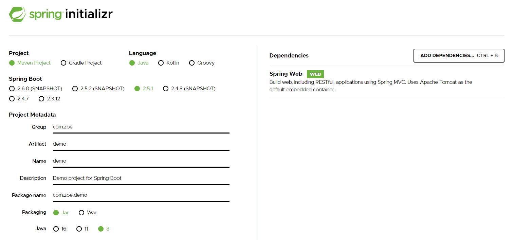
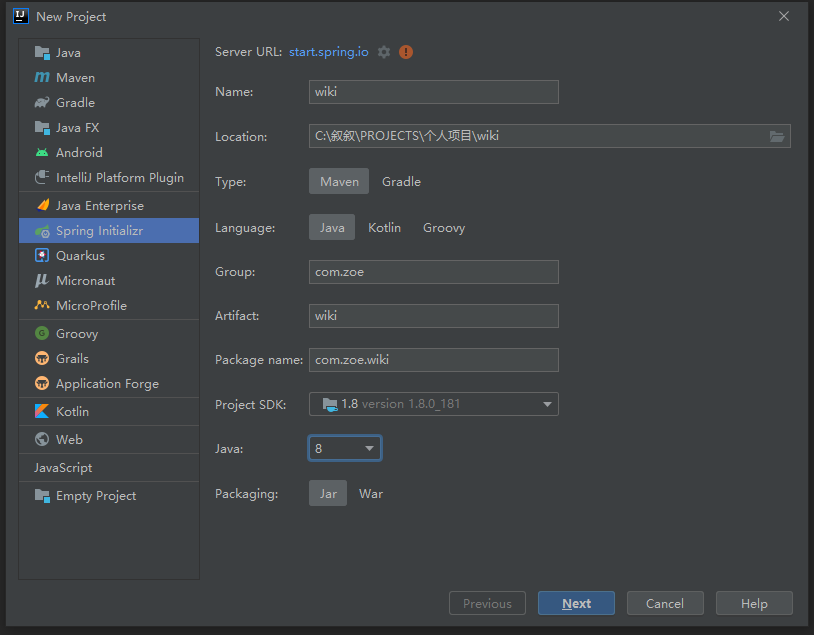
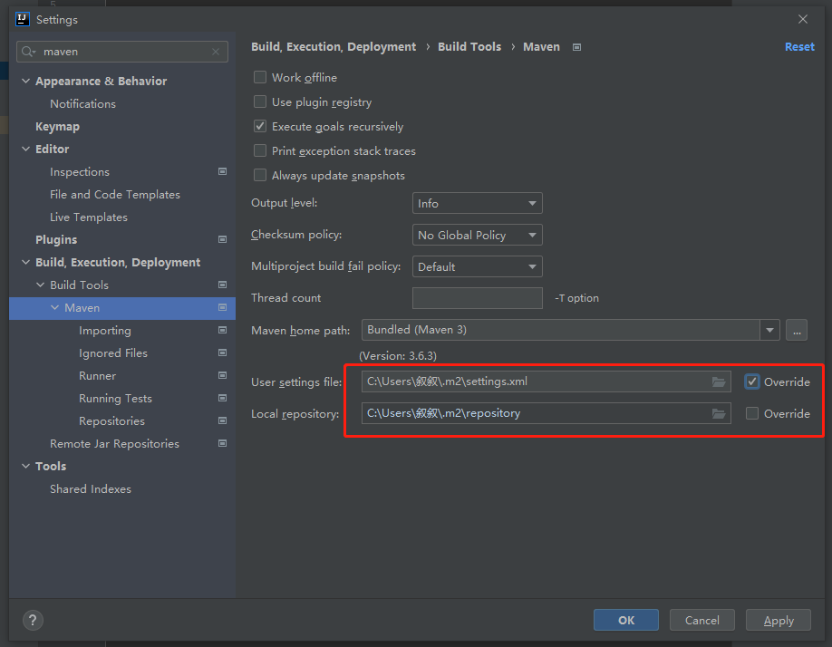
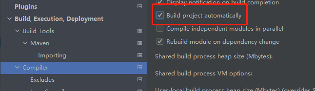
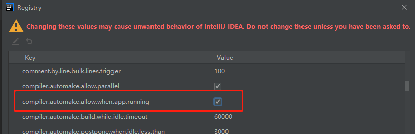
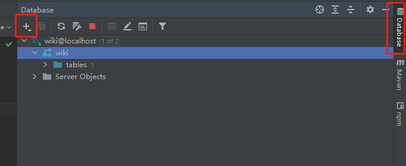
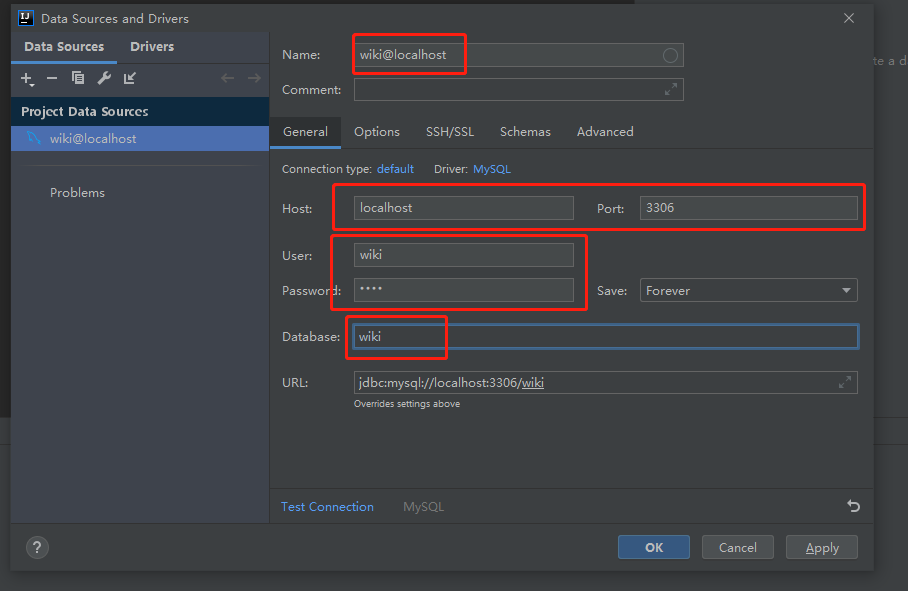
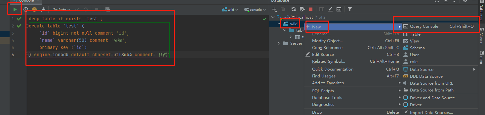
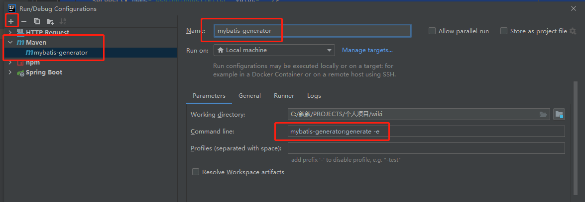

# Spring Boot 实战入门笔记

Spring Boot 是整合 Spring 技术栈的一站式框架，是简化 Spring 技术栈的快速开发脚手架，能够快速创建出生产级别的 Spring 应用。

**Spring Boot 优点：**

创建独立 Spring 应用；内嵌 web 服务器（servlet 容器）；自动 starter 依赖，简化构建配置；自动配置 Spring 以及第三方功能；提供生产级别的监控、健康检查及外部化配置；无代码生成、无需编写 XML。

**其它需要了解的方面：**

Spring Boot 有非常强大的 AutoConfiguration 功能，它是通过**自动扫描 + 条件装配**实现的。

由于 Spring 5 的重大升级，Spring Boot 也升级成了 Spring Boot 2，它包括两个方面：Reactive Stack 和 Servlet Stack。Reactive Stack 是响应式开发，可以以少量的线程和资源，处理大量的并发。

## 1 创建项目

创建 Spring Boot 项目有两种方式：在[官网](start.spring.io)上创建、使用 IDEA 创建。

在官网上填写相应配置信息，点击 GENERATE 按钮，会下载一个 zip 文件，解压该文件，用 IDEA 打开，Spring Boot 项目就创建好了。



使用 IDEA 创建项目，可以点击 IDEA 左上角的 File => New => Project，在打开的弹框中填写相应信息，然后点击 Next，选择 Dependencies，最后点击确认，即可创建 Spring Boot 项目。



## 2 文件结构

**src/main/java** 目录中存放所有 Java 类。

**src/main/java/com.zoe.demo** 目录中的 MainApplication 是**启动类**，在该文件上右击，点击 `Run 'MainApplication'` 即可启动项目，默认使用 Spring Boot 内嵌的 Tomcat 启动，默认端口是 8080，当然，也可以使用传统的方式，把项目打成 war 包，放入单独的 Tomcat 中来启动项目。

**MainApplication** 类中的 main 函数是用来启动项目的，需要加上 `@SpringBootApplication` 注解。

下面是一个启动类示例：

```java
package com.zoe.;

import org.springframework.boot.SpringApplication;
import org.springframework.boot.autoconfigure.SpringBootApplication;

/**
 * 主程序类，应用入口
 * 主程序所在的包及其子包中的所有组件都会被默认扫描进来
 * 也可以通过@SpringBootApplication(scanBasePackages="com.zoe")指定SpringBoot扫描包的范围
 * 注解@SpringBootApplication表示这是一个SpringBoot应用
 */
@SpringBootApplication
public class MainApplication {
    public static void main(String[] args) {
        SpringApplication.run(MainApplication.class, args);
    }
}
```

**src/main/resources** 目录中存放配置文件，至少有 8 个默认的配置文，比如，在 application.properties 中可以配置默认启动端口：

```properties
server.port = 8080
```

**src/test** 目录中存放单元测试文件。

**pom.xml** 是 Maven 的核心文件，用来管理 Jar 包。

**.mvn/wrapper** 主要用于自动化打包场景，比如在流水线中自动拉代码、下载 Maven、编译打包。

**.idea、target、*.iml** 是本地空间相关的文件，无需版本控制。

## 3 初始配置

**编码格式：** 点击 File => Settings => Editor => File Encodings，把 Project Encoding 和 Default encoding for properties files 修改成 UTF-8。

**配置 JDK：** 点击 File => Project Structure => Project Settings => Project，把 Project SDK 修改成本地 JDK 路径即可。

**配置 Maven：** 主要配置 settings.xml 和 repository，settings.xml 中主要配置 Maven 镜像地址。



```xml
<!-- settings.xml -->

<?xml version="1.0" encoding="UTF-8"?>
<settings xmlns="http://maven.apache.org/SETTINGS/1.0.0" xmlns:xsi="http://www.w3.org/2001/XMLSchema-instance" xsi:schemaLocation="http://maven.apache.org/SETTINGS/1.0.0 http://maven.apache.org/xsd/settings-1.0.0.xsd">
  <localRepository>C:\Users\叙叙\.m2\repository</localRepository>
  <mirrors>
    <mirror>
        <id>alimaven</id>
        <mirrorOf>central</mirrorOf>
        <name>aliyun maven</name>
        <url>http://maven.aliyun.com/nexus/content/repositories/central/</url>
    </mirror>
    <mirror>
        <id>huaweicloud</id>
        <name>huaweicloud maven</name>
        <mirrorOf>*</mirrorOf>
        <url>https://mirrors.huaweicloud.com/repository/maven/</url>
    </mirror>
  </mirrors>
</settings>
```

**配置 Git：** 点击 VCS => Enable Version Control Integration，选择 Git，即可把我们代码用 Git 管理起来。

## 4 Hello World

在 com.zoe.wiki 上右击，选择 New Package，在 com.zoe.wiki. 后面输入 controller，回车，即可创建 **controller 层**。接口一般都会放在 controller 层中。

下面我们就开始写第一个接口。

在 controller 中新建 HelloController 类，编写代码如下：

```javascript
package com.zoe.wiki.controller;

import org.springframework.web.bind.annotation.RequestMapping;
import org.springframework.web.bind.annotation.RestController;

@RestController
public class HelloController {
    @RequestMapping("/hello")
    public String hello(){
        return "Hello World";
    }
}
```

在 IDEA 中**启动项目**，用浏览器访问 <http://127.0.0.1:8080/hello>，即可在页面上看到字符串 'Hello World'。也可以把项目达成 jar 包，然后在 cmd 中执行 `java -jar demo-0.0.1-SNAPSHOT.jar` 命令来**启动项目**。

**补充：** 使用浏览器直接访问接口地址，发送的是 GET 请求。

@RestController 用来返回字符串或 JSON 对象；@Controller 用来返回页面，对于前后端分离项目，用不到。

常见的 HTTP 请求方式有四种（总共有 8 种）：GET、POST、PUT、DELETE。

使用 @RequestMapping 注解的接口，支持所有的请求方式。

@GetMapping、@PostMapping、@PutMapping、@DeleteMapping 对应上面的四种请求方式。

`@GetMapping("/hello")` 等同于 `@RequestMapping(value = "/hello", method = RequestMethod.GET)`。

Q：为什么我们只是写了一个 HelloController 类，启动项目后，接口就可用了呢？

A：因为启动类中的 @SpringBootApplication 注解中有一个 @ComponentScan 注解，它默认会扫描启动类所在包下面的子包中的类，如果要修改扫描的包，可以在启动类中手动增加 @ComponentScan 注解：

```java
@ComponentScan("com.zoe") // 扫描com.zoe包
@SpringBootApplication
```

```java
@ComponentScan({"com.zoe", "com.test"}) // 扫描com.zoe和com.test包
@SpringBootApplication
```

## 5 HTTP Client

HTTP Client 是 IDEA 自带的插件，可以用来测试接口。

使用 HTTP Client，需要在项目根目录新建 http 目录，并在目录中新建 test.http 文件，编写测试脚本：

```http
GET http://localhost:8080/hello
Accept: application/json
```

启动项目后，点击 GET 前面的 RUN 图标，就可以测试接口了。

**注：** 可以通过输入 gtr 快速生成 GET 请求的测试脚本，gtr 是 HTTP Client 自带的 Live Templates，其它的模板指令可以去 File => Settings => Editor => Live Templates 中查看。

我们也可以使用 HTTP Client 的结果验证功能，对我们的接口进行测试验证，其实就相当于单元测试：

```http
GET http://localhost:8080/hello

> 

###
```

## 6 配置文件

src/main/resources 或者 src/main/resources/config 中的 application.properties、application.yml 文件，都可以作为 Spring Boot 的配置文件。

对于 Spring Cloud 体系下的 Spring Boot 应用中的配置文件，还可以把上面的 application 改成 bootstrap。bootstrap 配置一般配合 nacos 一起使用，可以实现线上实时修改实时生效的动态配置。单个 Spring Boot 不会读 bootstrap 配置。

对于 application.properties 和 application.yml，配置写法完全不同：

```properties
# application.properties
server.port = 8080
```

```yaml
# application.yml
server:
  port: 8080
```

在配置文件中，除了可以修改默认配置以外，还可以**自定义配置项**，然后在类中通过 @Value 注解读取配置项：

```properties
test.hello = hello zoe
```

```java
// ZOE'是默认值
@Value("${test.hello:ZOE}")
private String testHello;
```

在 yaml 配置文件中，字符串配置值可以不用加引号。如果加引号，单双引号是有区别的。单引号会将 `\n` 作为字符串输出，双引号会将 `\n` 作为换行输出，也就是说，双引号不会转义，单引号会转义（转义 `\n` 转义字符）。

可以添加 spring-boot-configuration-processor 依赖，来增加**配置提示**功能：

```xml
<dependency>
    <groupId>org.springframework.boot</groupId>
    <artifactId>spring-boot-configuration-processor</artifactId>
    <optional>true</optional>
</dependency>
```

由于 spring-boot-configuration-processor 只是用于开发场景，无需打到 jar 包中，需要在打包的时候排除掉：

```xml
<build>
    <plugins>
        <plugin>
            <groupId>org.springframework.boot</groupId>
            <artifactId>spring-boot-maven-plugin</artifactId>
            <configuration>
                <excludes>
                    <exclude>
                        <groupId>org.springframework.boot</groupId>
                        <artifactId>spring-boot-configuration-processor</artifactId>
                    </exclude>
                </excludes>
            </configuration>
        </plugin>
    </plugins>
</build>
```

## 7 集成热部署

集成热部署可以让我们的代码一改完就即时生效，而无需手动重启应用。

配置集成热部署有三个步骤：

1、在 pom.xml 中增加 dependency：

```xml
<dependency>
    <groupId>org.springframework.boot</groupId>
    <artifactId>spring-boot-devtools</artifactId>
    <optional>true</optional>
</dependency>
```

2、修改 IDEA 设置，如下图，开启静态自动编译：



3、点击 Help => Find Action，输入 Registry，打开，勾选如下配置项，开启动态自动编译：



需要注意的是，必须触发文件的保存（比如手动 Ctrl + S），才会自动编译和热部署。

如果修改完代码后，手动点击 Build Project 图标（快捷键 Ctrl + F9），可以减少等待编译和热部署时间。

其实，上面步骤配置的集成热部署本质上是**自动重启**。

## 8 安装配置 MySQL

下面介绍 MySQL 安装配置步骤：

1、在官网下载 MySQL 8.0 免压缩版，放在 C 盘中，并解压；

2、以管理员身份运行 cmd，进入 MySQL 的 bin 目录中；

3、安装 MySQL 的服务：

```bash
mysqld --install
```

4、初始化 MySQL，记住生成的随机密码：

```bash
mysqld --initialize --console
```

5、开启 MySQL 服务：

```bash
net start MySQL
```

6、输入下面的命令，回车，输入上面的随机密码，回车，即可登录 MySQL：

```bash
mysql -u root -p
```

7、把密码修改成 'root'：

```bash
alter user 'root'@'localhost' identified by 'root';
```

8、设置系统全局变量

## 9 IDEA 配置数据库

在 IDEA 中配置数据库，可以按照下图操作：







在 console 控制台中可以写一些 SQL 语句，然后点击 Execute 按钮执行语句：

```mysql
drop table if exists `test`;
create table `test` (
    `id` bigint not null comment 'id',
    `name` varchar(50) comment '名称',
    primary key (`id`)
) engine=innodb default charset=utf8mb4 comment='测试'
```

也可以在项目根目录中新建 doc 目录，在目录中新建 test.sql 文件，把上面的 SQL 语句写进去，然后选中某条或者某几条 SQL 语句，右击选择 Execute。

## 10 MyBatis

MyBatis 是一个基于 Java 的持久层框架，支持定制化 SQL、存储过程以及高级映射，避免了几乎所有的 JDBC 代码和手动设置参数以及获取结果集。MyBatis 可以使用简单的 XML 或注解来配置和映射原生信息，将接口和 Java 的 POJOs（Plain Ordinary Java Object）映射成数据库中的记录。

补充：**持久层**是指相对独立的逻辑层面，专著于数据持久化逻辑的实现。

在 Spring Boot 项目中集成 MyBatis，首先需要引入场景启动器：

```xml
<dependency>
  <groupId>org.mybatis.spring.boot</groupId>
  <artifactId>mybatis-spring-boot-starter</artifactId>
  <version>2.1.4</version>
</dependency>
```

`mybatis-spring-boot-starter` 自动配置了 SqlSessionFactory、SqlSessionTemplate（组合了 SqlSession）、Mapper 等。

MyBatis 相关的配置在配置文件中以 mybatis 为前缀。

#### (1) 基本使用

下面，通过具体的例子来学习如何使用 MyBatis。

1、配置 MyBatis：

```yaml
mybatis:
  config-location: classpath:mybatis/mybatis-config.xml # MyBatis全局配置文件位置
  mapper-locations: classpath:mybatis/mapper/*.xml # SQL映射文件位置
```

MyBatis 全局配置文件 mybatis-config.xml 如下：

```xml
<?xml version="1.0" encoding="UTF-8" ?>
<!DOCTYPE configuration
        PUBLIC "-//mybatis.org//DTD Config 3.0//EN"
        "http://mybatis.org/dtd/mybatis-3-config.dtd">
<configuration>
  <settings>
    <setting name="mapUnderscoreToCamelCase" value="true"/>
  </settings>
</configuration>
```

上面的 MyBatis 全局配置文件中配置了开启**驼峰命名自动映射规则**，即从经典数据库列名 A_COLUMN 映射到经典 Java 属性名 aColumn，也可以配置在 application.yaml 中：

```yaml
mybatis:
  configuration:
    map-underscore-to-camel-case: true # 开启驼峰命名自动映射规则
```

需要注意的是，application.yaml 中，config-location 和 configuration 不能同时配置，否则项目会无法启动。推荐使用 configuration 配置项来配置 MyBatis 全局配置文件中的配置。

2、新建 bean 层，也可以是 domain、entity、POJO 等，该层的实体类与数据库表一一映射，然后在 bean 层中新建实体类 Ebook：

```java
@ToString
@Data
public class Ebook {
  private Long id;

  private String name;

	// ...
}
```

3、新建 mapper 层（**持久层**，早期也叫 **Dao 层**），然后在 mapper 层中新建 Mapper 接口 EbookMapper，并标注 @Mapper 注解：

```java
// 注解@Mapper表示这是一个Mapper接口，用来操作数据库的
@Mapper
public interface EbookMapper {
    public Ebook getEbookById(Long id);
}
```

4、在 `resources/mybatis/mapper` 目录中新建 SQL 映射文件 EbookMapper.xml，并通过 namespace 绑定上面的 Mapper 接口：

```xml
<?xml version="1.0" encoding="UTF-8" ?>
<!DOCTYPE mapper
        PUBLIC "-//mybatis.org//DTD Mapper 3.0//EN"
        "http://mybatis.org/dtd/mybatis-3-mapper.dtd">
<mapper namespace="com.zoe.admin.mapper.EbookMapper">
    <!-- 根据id查找电子书，getEbookById是EbookMapper接口中的方法 -->
    <select id="getEbookById" resultType="com.zoe.admin.bean.Ebook">
        select * from ebook where id=#{id}
    </select>
</mapper>
```

插入一条数据的 XML 写法和注解写法如下：

```xml
<insert id="insertEbook" useGeneratedKeys="true" keyProperty="id">
  insert into ebook(`name`, `description`) values(#{name}, #{description})
</insert>
```

```java
@Insert("insert into ebook(`name`, `description`) values(#{name}, #{description})")
@Options(useGeneratedKeys = true, keyProperty = "id")
```

需要注意的是，如果成功插入一条数据后，想要返回该条数据，并且加上自增 id，需要加上 useGeneratedKeys 和 keyProperty 属性。

5、新建 service 层，并在 service 层中新建 EbookService 类，用来处理具体的业务逻辑：

```java
// 注解@Service表示这个Service交给Spring来管理，Spring会扫描到这个类
@Service
public class EbookService {
  @Autowired
  EbookMapper ebookMapper;

  public Ebook getEbookById(Long id) {
    return ebookMapper.getEbookById(id);
  }
}
```

6、在 TestController 中增加一个 GET 请求：

```java
@Controller
public class TestController {
  @Autowired
  EbookService ebookService;

  @ResponseBody
  @GetMapping("/ebook")
  public Ebook getEbookById(@RequestParam("id") Long id) {
    return ebookService.getEbookById(id);
  }
}
```

最后启动项目，访问 `/ebook?id=xxx`，即可根据 id 获取到一条 Ebook 数据。

在上面的例子中，我们创建了 SQL 映射文件（XML 格式的文件）用于编写 SQL 语句，其实，如果 SQL 语句比较简单的话，可以通过注解的方式，省略 SQL 映射文件。

使用注解方式，需要在 Mapper 接口中增加 @Select 注解（如果是插入操作，用 @Insert 注解），并把 SQL 语句写在该注解中，比如：

```java
@Mapper
public interface EbookMapper {
  @Select("select * from ebook where id=#{id}")
  public Ebook getEbookById(Long id);
}
```

可以混合使用 SQL 映射文件和 @Select 注解。

#### (2) 最佳实践

1、引入 mybatis-spring-boot-starter；

2、配置 application.yaml ，指定 mapper-locations 位置即可；

3、编写 Mapper 接口，并标注 @Mapper 注解；

4、简单方法，直接通过注解方式编写 SQL 语句；

5、复杂方法，可以通过 Mapper.xml 编写 SQL 语句，并绑定映射到 Mapper 接口；

6、如果不想在每个 Mapper 接口上标注 @Mapper 注解，可以在启动类上标注 @MapperScan，如下：

```java
@MapperScan("com.zoe.admin.mapper")
```

#### (3) 代码生成器

MyBatis 官方提供了一个代码生成器，可以简化 MyBatis 代码。对于单表的增删改查，可以直接使用代码生成器。

集成代码生成器的步骤如下：

1、在 pom.xml 中增加 plugin：

```xml
<!-- MyBatis代码生成器插件 -->
<plugin>
  <groupId>org.mybatis.generator</groupId>
  <artifactId>mybatis-generator-maven-plugin</artifactId>
  <version>1.4.0</version>
  <configuration>
    <configurationFile>src/main/resources/generator/generator-config.xml</configurationFile>
    <overwrite>true</overwrite>
    <verbose>true</verbose>
  </configuration>
  <dependencies>
    <dependency>
      <groupId>mysql</groupId>
      <artifactId>mysql-connector-java</artifactId>
      <version>8.0.22</version>
    </dependency>
  </dependencies>
</plugin>
```

2、在 src/main/resources 中创建 generator 目录，在目录中新建代码生成器的配置文件 generator-config.xml，配置如下：

```xml
<?xml version="1.0" encoding="UTF-8"?>
<!DOCTYPE generatorConfiguration
        PUBLIC "-//mybatis.org//DTD MyBatis Generator Configuration 1.0//EN"
        "http://mybatis.org/dtd/mybatis-generator-config_1_0.dtd">

<generatorConfiguration>
  <context id="Mysql" targetRuntime="MyBatis3" defaultModelType="flat">

    <!-- 自动检查关键字，为关键字增加反引号 -->
    <property name="autoDelimitKeywords" value="true"/>
    <property name="beginningDelimiter" value="`"/>
    <property name="endingDelimiter" value="`"/>

    <!--覆盖生成XML文件-->
    <plugin type="org.mybatis.generator.plugins.UnmergeableXmlMappersPlugin" />
    <!-- 生成的实体类添加toString()方法 -->
    <plugin type="org.mybatis.generator.plugins.ToStringPlugin"/>

    <!-- 不生成注释 -->
    <commentGenerator>
      <property name="suppressAllComments" value="true"/>
    </commentGenerator>

    <jdbcConnection driverClass="com.mysql.cj.jdbc.Driver"
                    connectionURL="jdbc:mysql://localhost:3306/wikidev"
                    userId="wikidev"
                    password="wikidev">
    </jdbcConnection>

    <!-- domain类的位置 -->
    <javaModelGenerator targetProject="src\main\java"
                        targetPackage="com.zoe.wiki.domain"/>

    <!-- mapper xml的位置 -->
    <sqlMapGenerator targetProject="src\main\resources"
                     targetPackage="mapper"/>

    <!-- mapper类的位置 -->
    <javaClientGenerator targetProject="src\main\java"
                         targetPackage="com.zoe.wiki.mapper"
                         type="XMLMAPPER"/>

    <table tableName="demo" domainObjectName="Demo"/>
  </context>
</generatorConfiguration>
```

3、增加启动命令：




4、启动 mybatis-generator，即可生成 demo 表的 MyBatis 持久层代码。

代码生成器帮我们生成了持久层代码，下面就可以直接使用了。

首先，在 service 层新建 DemoService 类：

```java
@Service
public class DemoService {
    @Resource
    private DemoMapper demoMapper;

    public List<Demo> list(){
        // 查表中所有数据
        return demoMapper.selectByExample(null);
    }
}
```

然后，在 controller 层新建 DemoController 类：

```java
@RestController
// 接口前缀
@RequestMapping("/demo")
public class DemoController {
    @Resource
    private DemoService demoService;

    @GetMapping("/list")
    public List<Demo> list(){
        return demoService.list();
    }
}
```

启动项目，访问 /demo/list 接口，即可获取到 demo 表中的所有数据。

## 11 通用返回类

项目开发中，需要对接口的返回值进行统一。可以手动构造一个**通用返回类**。

本项目中，在 com.zoe.wiki 中创建了 resp 层，并在该层中创建了通用返回类 CommonResp：

```java
public class CommonResp<T> {

    /**
     * 业务上的成功或失败
     */
    private boolean success = true;

    /**
     * 返回信息
     */
    private String message;

    /**
     * 返回泛型数据，自定义类型
     */
    private T content;

    public boolean getSuccess() {
        return success;
    }

    public void setSuccess(boolean success) {
        this.success = success;
    }

    public String getMessage() {
        return message;
    }

    public void setMessage(String message) {
        this.message = message;
    }

    public T getContent() {
        return content;
    }

    public void setContent(T content) {
        this.content = content;
    }

    // toString方法主要用来打印日志
    @Override
    public String toString() {
        final StringBuffer sb = new StringBuffer("ResponseDto{");
        sb.append("success=").append(success);
        sb.append(", message='").append(message).append('\'');
        sb.append(", content=").append(content);
        sb.append('}');
        return sb.toString();
    }
}
```

然后，在 controller 层中使用 CommonResp 类：

```java
@RestController
@RequestMapping("/ebook")
public class EbookController {
    @Resource
    private EbookService ebookService;

    @GetMapping("/list")
    public CommonResp list(){
        CommonResp<List<Ebook>> resp = new CommonResp<>();
        List<Ebook> list = ebookService.list();
        resp.setContent(list);
        return resp;
    }
}
```

这样，访问 /ebook/list 接口，会返回一个对象，属性有 success、message 和 content，content 属性的值就是 ebook 表中的数据。

## 12 跨域

在 Spring Boot 项目中，对于跨域问题，可以通过添加一个**配置类**的方式来解决。

需要在 com.zoe.wiki 中创建 config 层，然后在 config 层中创建 CorsConfig 类：

```java
@Configuration
public class CorsConfig implements WebMvcConfigurer {

    @Override
    public void addCorsMappings(CorsRegistry registry) {
        registry.addMapping("/**")
                .allowedOriginPatterns("*")
                .allowedHeaders(CorsConfiguration.ALL)
                .allowedMethods(CorsConfiguration.ALL)
                .allowCredentials(true)
                .maxAge(3600); // 1小时内不需要再预检（发OPTIONS请求）
    }
}
```

然后重启项目，就不会出现跨域问题了。

## 13 过滤器

**接口耗时**在我们的应用监控中，是一个非常重要的监控点，可以用来衡量应用的处理能力。在 Spring Boot 项目中可以通过配置**过滤器**来打印接口耗时。

需要在 com.zoe.wiki 中创建 filter 层，并在该层中创建 LogFilter 类用来编写过滤器代码。过滤器的代码一般比较固定，如下所示：

```java
// 添加@Component注解，这样Spring Boot就会自动去扫描LogFilter类，容器就会拿到这个过滤器了
@Component
public class LogFilter implements Filter {

    private static final Logger LOG = LoggerFactory.getLogger(LogFilter.class);

    @Override
    public void init(FilterConfig filterConfig) throws ServletException {

    }

    @Override
    public void doFilter(ServletRequest servletRequest, ServletResponse servletResponse, FilterChain filterChain) throws IOException, ServletException {
        // 打印请求信息
        HttpServletRequest request = (HttpServletRequest) servletRequest;
        LOG.info("------------- LogFilter开始 -------------");
        LOG.info("请求地址: {} {}", request.getRequestURL().toString(), request.getMethod());
        LOG.info("远程地址: {}", request.getRemoteAddr());

        long startTime = System.currentTimeMillis();
       // 通过链来调用业务方法
        filterChain.doFilter(servletRequest, servletResponse);
        LOG.info("------------- LogFilter结束耗时: {} ms -------------", System.currentTimeMillis() - startTime);
    }
}
```

这样，重启项目，访问接口，就能打印出过滤器日志了。

上面的代码中实现了 Filter 接口，它是 servlet 包里的。其实，过滤器是 servlet（可以理解成请求接口）的一个概念，而 servlet 是容器的一个概念，所以过滤器是给容器（比如 Tomcat）用的。

## 14 拦截器

上面介绍了如何使用**过滤器**来打印接口耗时。对于打印接口耗时，也可以采用配置**拦截器**的方式。

需要在 com.zoe.wiki 中创建 interceptor 层，并在 interceptor 层中创建 LogInterceptor 类：

```java
/**
 * 拦截器：Spring框架特有的，常用于登录校验，权限校验，请求日志打印
 */
@Component
public class LogInterceptor implements HandlerInterceptor {

    private static final Logger LOG = LoggerFactory.getLogger(LogInterceptor.class);

    @Override
    public boolean preHandle(HttpServletRequest request, HttpServletResponse response, Object handler) throws Exception {
        // 打印请求信息
        LOG.info("------------- LogInterceptor开始 -------------");
        LOG.info("请求地址: {} {}", request.getRequestURL().toString(), request.getMethod());
        LOG.info("远程地址: {}", request.getRemoteAddr());

        long startTime = System.currentTimeMillis();
        request.setAttribute("requestStartTime", startTime);
        // 可以在这里增加登录校验，如果没有登录或者登录超时，就return false，这样后面的业务逻辑就不会执行了
        return true;
    }

    @Override
    public void postHandle(HttpServletRequest request, HttpServletResponse response, Object handler, ModelAndView modelAndView) throws Exception {
        long startTime = (Long) request.getAttribute("requestStartTime");
        LOG.info("------------- LogInterceptor结束耗时: {} ms -------------", System.currentTimeMillis() - startTime);
    }
}
```

然后，还需要在 config 层中创建配置类 SpringMvcConfig：

```java
@Configuration
public class SpringMvcConfig implements WebMvcConfigurer {

    // 把拦截器注入进来
    @Resource
    LogInterceptor logInterceptor;

    public void addInterceptors(InterceptorRegistry registry) {
        // 对于所有请求，除了/login，注册拦截器
        registry.addInterceptor(logInterceptor)
                .addPathPatterns("/**").excludePathPatterns("/login");
    }
}
```

这样，重启项目，访问接口，就能打印出拦截器日志了。

## 15 AOP

在 Spring Boot 项目中，可以配置 AOP，用来打印接口耗时、请求参数、返回参数。

首先，需要在 pom.xml 中增加依赖：

```xml
<!-- Spring Boot自带的AOP依赖 -->
<dependency>
  <groupId>org.springframework.boot</groupId>
  <artifactId>spring-boot-starter-aop</artifactId>
</dependency>

<!-- 在AOP类中处理JSON用的，不是配置AOP必须的 -->
<dependency>
  <groupId>com.alibaba</groupId>
  <artifactId>fastjson</artifactId>
  <version>1.2.70</version>
</dependency>
```

然后，在 com.zoe.wiki 中创建 aspect 层，并在该层中创建 LogAspect 类：

```java
@Aspect
@Component
public class LogAspect {

    private final static Logger LOG = LoggerFactory.getLogger(LogAspect.class);

    /**
     * 定义一个切点
     * com.zoe.*.controller中的所有Controller中的所有方法（包括参数），都会被AOP拦截到
     */
    @Pointcut("execution(public * com.zoe.*.controller..*Controller.*(..))")
    public void controllerPointcut() {}

    /**
     * 前置通知
     * 表示在执行业务代码之前要去做的事情
     */
    @Before("controllerPointcut()")
    public void doBefore(JoinPoint joinPoint) throws Throwable {

        // 开始打印请求日志
        ServletRequestAttributes attributes = (ServletRequestAttributes) RequestContextHolder.getRequestAttributes();
        HttpServletRequest request = attributes.getRequest();
        Signature signature = joinPoint.getSignature();
        String name = signature.getName();

        // 打印请求信息
        LOG.info("------------- AOP开始 -------------");
        LOG.info("请求地址: {} {}", request.getRequestURL().toString(), request.getMethod());
        LOG.info("类名方法: {}.{}", signature.getDeclaringTypeName(), name);
        LOG.info("远程地址: {}", request.getRemoteAddr());

        /**
         * 打印请求参数
         * AOP跟过滤器和拦截器不同，需要通过连接点（joinPoint）拿到请求参数
         */
        Object[] args = joinPoint.getArgs();
        // LOG.info("请求参数: {}", JSONObject.toJSONString(args));

        Object[] arguments  = new Object[args.length];
        for (int i = 0; i < args.length; i++) {
            if (args[i] instanceof ServletRequest
                    || args[i] instanceof ServletResponse
                    || args[i] instanceof MultipartFile) {
                continue;
            }
            arguments[i] = args[i];
        }
        // 排除字段，敏感字段（密码等）或太长的字段（文件内容或者富文本等）不显示
        String[] excludeProperties = { "password", "file" };
        PropertyPreFilters filters = new PropertyPreFilters();
        PropertyPreFilters.MySimplePropertyPreFilter excludefilter = filters.addFilter();
        excludefilter.addExcludes(excludeProperties);
        LOG.info("请求参数: {}", JSONObject.toJSONString(arguments, excludefilter));
    }

    /**
     * 环绕通知，也就是环绕业务内容
     * 在业务内容之前和之后，都会执行
     */
    @Around("controllerPointcut()")
    public Object doAround(ProceedingJoinPoint proceedingJoinPoint) throws Throwable {
        long startTime = System.currentTimeMillis();
        // 执行业务内容
        Object result = proceedingJoinPoint.proceed();
        // 打印返回结果，同时排除字段，敏感字段或太长的字段不显示
        String[] excludeProperties = { "password", "file" };
        PropertyPreFilters filters = new PropertyPreFilters();
        PropertyPreFilters.MySimplePropertyPreFilter excludefilter = filters.addFilter();
        excludefilter.addExcludes(excludeProperties);
        LOG.info("返回结果: {}", JSONObject.toJSONString(result, excludefilter));
        LOG.info("------------- AOP结束耗时: {} ms -------------", System.currentTimeMillis() - startTime);
        return result;
    }

}
```

最后，重启项目，访问接口，就能打印出 AOP 日志了。

上面的 LogAspect 类又叫做**切面**，把切点和通知结合起来就是切面。

一般项目中，过滤器、拦截器、AOP 三选一即可。

## 16 雪花算法

雪花算法主要用来生成数据库 ID，雪花算法生成的 ID 其实就是时间戳加上一些机器码，再加上递增的序列号，它是一个**长整型**。

**雪花算法 ID：** 时间戳 + 数据中心 + 机器中心 + 序列号，数据中心和机器中心具体的数值一般可以放在配置文件中，也可以通过一些算法在机器启动的时候自动到 Redis 缓存中去获取一个唯一的不重复的值。

由于雪花算法生成的 ID 是长整型，传到前端会导致精度丢失，有两种解决方案：

1、在查询接口返回的实体类的 id 上增加注解：

```java
@JsonSerialize(using=ToStringSerializer.class)
private Long id;
```

2、在 com.zoe.wiki.config 中新增 JacksonConfig 类：

```java
@Configuration
public class JacksonConfig {
    @Bean
    public ObjectMapper jacksonObjectMapper(Jackson2ObjectMapperBuilder builder) {
        ObjectMapper objectMapper = builder.createXmlMapper(false).build();

        // 全局配置序列化返回JSON处理
        SimpleModule simpleModule = new SimpleModule();
        // Long => String
        simpleModule.addSerializer(Long.class, ToStringSerializer.instance);
        objectMapper.registerModule(simpleModule);
        return objectMapper;
    }
}
```

## 17 参数校验

后端的参数校验需要增加依赖：

```xml
<dependency>
    <groupId>org.springframework.boot</groupId>
    <artifactId>spring-boot-starter-validation</artifactId>
</dependency>
```

对于查询接口的分页参数 size，需要增加校验规则，防止有人用一些工具脚本直接访问后端接口的时候，恶意把 size 改成很大的值，导致查询数据量过大造成服务器崩溃。

对于 size 增加校验规则，只需在分页请求的实体类中增加如下注解即可：

```java
@NotNull(message = "size不能为空")
@Max(value = 1000, message = "size不能超过1000")
private int size;
```

然后，在相应的查询接口的请求参数前面加上 @Valid 注解，表示对于该请求参数开启校验规则：

```java
@GetMapping("/list")
public CommonResp list(@Valid EbookQueryReq req){}
```

## 18 Jar 包

创建一个可执行的 Jar 包，需要在 pom.xml 中引入 spring-boot-maven-plugin；

然后在命令行中执行 `mvn package`，或者执行 Maven Lifecycle 中的 clean 和 package，即可在 target 目录中创建一个 Jar 包，名字类似于 spring-boot-demo-1.0-SNAPSHOT；

最后，把该 Jar 包上传到目标服务器，执行 `java -jar spring-boot-demo-1.0-SNAPSHOT.jar` 命令，即可执行该 Jar 包。


