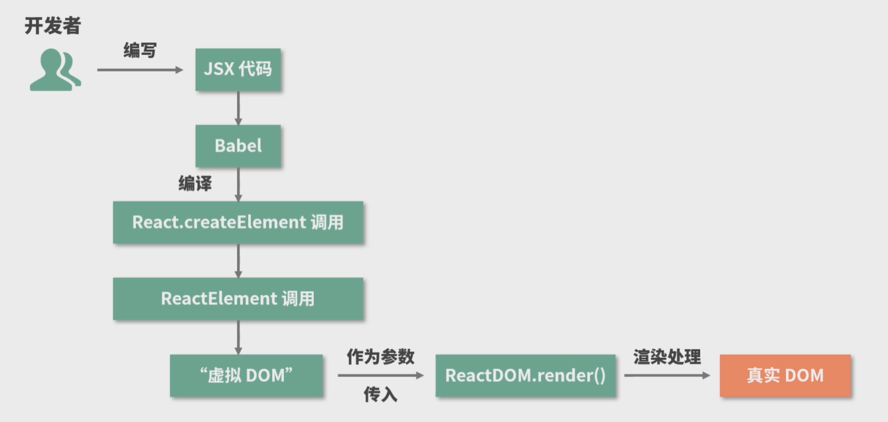

# 深入学习 React

这是一篇学习拉勾教育修言的《深入浅出搞定 React》课程的学习笔记。

## 1 JSX 语法

JSX 是 JavaScript 的一种语法**扩展**，它和模板语言很接近，但是它充分具备 JavaScript 的能力。

JSX 会被**编译**（由 Babel 完成）为 `React.createElement()`，`React.createElement()` 会返回一个叫作 React Element 的对象实例。这个 **React Element 对象实例**本质上是以 JavaScript 对象形式存在的对 DOM 的描述，也就是**虚拟 DOM**。

总结来说，JSX 的本质是 `React.createElement()` 的**语法糖**，每个 JSX 标签都是一个 `React.createElement` 调用，它允许前端开发者使用熟悉的类 HTML 标签语法来创建虚拟 DOM。

**补充：** Babel 是一个工具链，主要用于将 ECMAScript 2015+ 版本的代码转换为向后兼容的 JavaScript 语法，以便能够运行在当前和旧版本的浏览器或其他环境中。同时，Babel 也具备将 JSX 语法转换为 JavaScript 代码的能力。

## 2 生命周期

componentWillReceiveProps 并不是由 props 的变化触发的，而是由父组件的更新触发的。如果父组件重新渲染了（比如父组件的 state 发生了变化），即使传递给子组件的 props 没有更改，子组件中的 componentWillReceiveProps 也会被触发。

常常会将 componentDidUpdate 的执行作为子组件更新完毕的标志通知到父组件。
