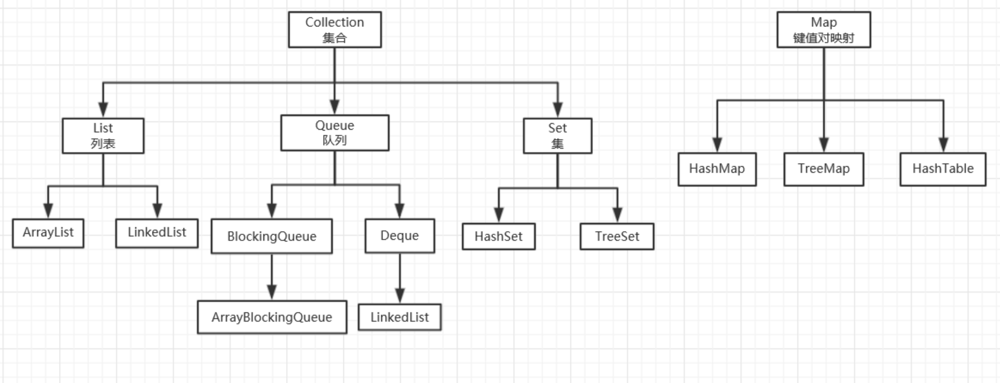

# Java 基础知识

## static、final

用 static 修饰的变量，无论 new 了多少个实例，该变量只创建一次；用 final 修饰表示常量，不可修改。

## 构造函数

Java 构造函数（构造方法），是 JAVA 中一种特殊的函数，与类名相同，无返回值，一般用来初始化成员的属性和方法。

## 集合

在 Java 中，**集合类**通常属于 java.util 包中。

Java 集合主要由 2 大体系构成，分别是 **Collection 体系**和 **Map 体系**，其中 Collection 和 Map 分别是 2 大体系中的**顶层接口**。



1、Collection

Collection 主要有三个**子接口**，分别为 List、Set、Queue，其中，List、Queue 中的元素**有序可重复**，而 Set 中的元素**无序不可重复**。

List 接口的主要实现类有 ArrayList、LinkedList、Stack；

Queue 是在 JDK1.5 后才出现，主要以数组和链表两种形式存在；

Set 接口的主要实现类有 HashSet。

2、Map

Map 中都是以 key-value 的形式存在，其中 key 必须唯一，Map 接口的实现类主要有 HashMap、HashTable、TreeMap。

3、List

## Java 判空

```
ObjectUtils.isEmpty()
```

## 一些 API

把 source 中的每个属性拷贝到 target 中：

```
BeanUtils.copyProperties(source, target)
```

## JavaBean

JavaBean 是一种 Java 语言写成的可重用组件。

所谓 JavaBean，是指符合如下标准的 Java 类：类是公共的；有一个无参的公共的构造器；有属性，且属性有对应的 get、set 方法。

用户可以使用 JavaBean 将功能、处理、值、数据库访问和其它任何可以用 Java 代码创造的**对象**进行打包，并且其他的开发者可以通过内部的 JSP 页面、Servlet、其它的 JavaBean、applet 程序或者应用来使用这些**对象**。用户可以认为 JavaBean 提供了一种随时随地的复制和粘贴的功能，而不用关心任何改变。 

## 其它

JDK 包含 JRE，JRE 包含 JVM。

注解是一种用作标注的**元数据**。

有一些注解可以修饰其他注解，这些注解被称为**元注解**。

一些注解：@Target、@Retention、@Repeatable、@Inherited。

读取注解，需要使用反射 API。

```java
// 判断注解是否存在，存在就读取
Class cls = Person.class;
if (cls.isAnnotationPresent(Report.class)) {
    Report report = cls.getAnnotation(Report.class);
    // ...
}
```

```java
// 直接读取注解，不存在就返回null
Class cls = Person.class;
Report report = cls.getAnnotation(Report.class);
if (report != null) {
   // ...
}
```

通过 `Class` 实例获取 `class` 信息的方法称为反射。

在 Java 中，如果一个 Java 对象可以在内部持有若干其他 Java 对象，并对外提供访问接口，我们把这种 Java 对象称为**集合**。 

```java
String[] ss = new String[10]; // 可以持有10个String对象
```


