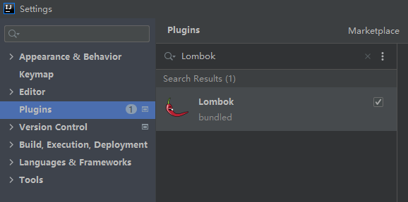

# Spring Boot 深入学习笔记

## 1 两大特性

Spring Boot 的两大特性：依赖管理、自动配置。

#### (1) 依赖管理

Spring Boot 项目其实是一个 Maven 父子项目，在生成的项目的 pom.xml 中可以看到下面一段代码，其中，spring-boot-starter-parent 是父项目，用于依赖管理，它几乎声明了所有开发中常用的依赖的版本号（自动版本仲裁机制，可以在 spring-boot-dependencies 中查看依赖的版本号），所以我们在 dependencies 中引入大部分依赖都无需声明版本号。

```xml
<parent>
    <groupId>org.springframework.boot</groupId>
    <artifactId>spring-boot-starter-parent</artifactId>
    <version>2.5.5</version>
</parent>
```

如果需要修改默认版本号，有两种方案：

1、直接依赖引入具体版本号，原理是 Maven 的就近依赖原则；

2、通过 properties，重新声明版本号，原理是 Maven 的属性的就近优先原则：

```xml
<properties>
    <mysql.version>5.1.43</mysql.version>
</properties>
```

开发项目的时候，可以根据不同开发需要，引入不同的场景启动器（Starters）。

只要引入某个场景，该场景所需要的所有常规依赖都会被自动引入。

spring-boot-starter-* 是官方提供的场景启动器，*-spring-boot-starter 是第三方提供的场景启动器。

所有场景启动器的最底层依赖都是 spring-boot-starter。

#### (2) 自动配置

Spring Boot 自动配置好了 Tomcat、SpringMVC 的全套组件、Web 开发的常见场景和功能、默认的包结构等。

Spring Boot 配置了默认的包结构，主程序所在包及其子包里面的组件默认都会被扫描进来，可以通过 `@SpringBootApplication(scanBasePackages="com.zoe")` 来修改包扫描范围，也可以通过注解 `@ComponentScan` 指定包扫描路径。

各种配置都有默认值，配置文件的值最终都会绑定到某个类上，这些类都是容器中的组件。

Spring Boot 按需加载自动配置项，只有引入的场景的自动配置项才会开启。Spring Boot 所有的自动配置功都在 spring-boot-autoconfigure 包中。

Spring Boot 中还有一个概念叫**配置绑定**，也就是读取 properties 文件中的内容，并将其封装到 JavaBean 中，下面是一个例子：

```java
@ToString
@Data
@Component
@ConfigurationProperties(prefix = "mycar")
public class Car {
    private String brand;
    private Integer price;
}

```

只有在容器中的组件，才会拥有 SpringBoot 提供的强大功能，比如配置绑定，所以上面的类上需要标注 @Component。

注解 `@ConfigurationProperties(prefix = "mycar")` 将实体类与配置文件中以 mycar 为前缀的属性进行了一一绑定。

如果没有上面的 @Component 注解，还可以在配置类上，通过注解 `@EnableConfigurationProperties(Car.class)` 开启 Car 的配置绑定功能（同时会将 Car 组件注入到容器中），对于一些第三方包中的类，可以使用这种方式。

## 2 向容器中添加组件

#### (1) @Configuration + @Bean

```java
/**
 * 注解@Configuration用于告诉Spring Boot这是一个配置类，等同于以前的XML配置文件，配置类本身也是组件
 * proxyBeanMethods=true，外部调用MyConfig中注册组件的方法，返回的都是单实例对象
 */
@Configuration(proxyBeanMethods = true)
public class MyConfig {

    /**
     * 注解@Bean标注在方法上给容器中注册组件，默认是单实例的
     * 以方法名作为组件名，返回类型是组件类型，返回值是组件在容器中的实例
     * 也可以在注解中通过传参的方式自定义组件名@Bean("user02")
     */
    @Bean
    public User userCom() {
        return new User("zoeeying", "4869");
    }
}
```

在主程序类中，通过下面的代码获取并查看容器中的组件：

```java
@SpringBootApplication
public class SpringBootAdminWebApplication {

    public static void main(String[] args) {
        // 返回IOC容器
        ConfigurableApplicationContext run = SpringApplication.run(SpringBootAdminWebApplication.class, args);

        // 查看容器中的组件
        String[] names = run.getBeanDefinitionNames(); // 获取所有组件定义的名字
        for (String name: names){
            System.out.println(name);
        }

        // 获取容器中的组件
        User user01 = run.getBean("userCom", User.class);
        User user02 = run.getBean("userCom", User.class);
        System.out.println("容器中的组件是单实例的: " + (user01 == user02));

        /**
         * 配置类中注册组件的方法返回的对象是否相同？
         * 如果MyConfig被@Configuration(proxyBeanMethods = true)标注了
         * bean是被增强了的代理对象，调用userCom方法，总是返回相同的单实例对象
         */
        MyConfig bean = run.getBean(MyConfig.class);
        System.out.println(bean);

        User user03 = bean.userCom();
        User user04 = bean.userCom();
        System.out.println(user03 == user04);
    }
}
```

@Configuration 注解中有个 proxyBeanMethods 参数，如果参数值是 true，表示组件是 Full 模式，如果参数值是 false，表示组件是 Lite 模式。最佳实践是，配置类中组件之间无依赖关系，使用 Lite 模式，可以减少判断，加速容器启动，否则使用 Full 模式。

补充：@Component 表示组件，@Controller 表示控制器，@Service 表示业务逻辑组件，@Repository 表示数据库层组件，这些注解都可以把

#### (2) @Import

在容器中的组件类上，通过 @Import 注解，向容器中导入组件，且组件名是全类名。

通过 `@Import({ Ebook.class, DBHelper.class })`，可以调用这两个类的无参构造器，创建出相应类型的组件，放在容器中。

#### (3) @Conditional

@Conditional 注解用于**条件装配**，只有满足指定的条件，才向容器中注册组件。

 `@ConditionalOnBean(name = "ebookCom")` 表示有 ebookCom 组件，才注册组件。

#### (4) @ImportResource

@ImportResource 注解用于将以前的 XML 配置的组件解析并放入容器中，比如：

```java
@ImportResource("classpath:beans.xml")
```

## 3 自动配置原理

注解 `@SpringBootApplication` 是下面三个注解的合成注解：

```java
@SpringBootConfiguration
@EnableAutoConfiguration
@ComponentScan
```

@SpringBootConfiguration 包含了 @Configuration，表明主程序类也是一个配置类。

@ComponentScan 用于指定包扫描路径。

@EnableAutoConfiguration 是下面两个注解的合成注解：

```
@AutoConfigurationPackage
@Import({AutoConfigurationImportSelector.class})
```

@AutoConfigurationPackage 通过 `@Import({Registrar.class})` 把主程序类所在包下的所有组件批量导入容器中。

spring-boot-autoconfigure-2.5.5.jar 中的 META-INF/spring.factories 文件中写死了 Spring Boot 启动加载的所有自动配置类，但并不是所有自动配置类都会生效，因为 Spring Boot 会按照**条件装配**规则让部分配置类生效，生效的配置类与配置文件中指定的配置一一绑定，且生效的配置类还会给容器中装配一些组件，这样一些功能就生效了。

Spring Boot 在底层配置了所有的组件，但是如果用户自定义了配置，以用户的配置优先。

自定义配置有几种方式：

1、直接通过 @Bean 替换底层的配置组件；

2、通过配置文件进行配置；

3、使用自定义器，类似于 XXXCustomizer。

可以在配置文件中添加 `debug=true`，开启自动配置报告，查看生效和不生效的自动配置。

## 4 静态资源

静态资源目录：**类路径**下的 `/static`、`/public`、`/resources`、`/META-INF/resources`。

**类路径的根路径**是 `/src/main/resources`。

如果在**静态资源目录**中放入静态资源，比如一张图片 `xxx.jpg`，那么启动项目后，可以通过 `localhost:8080/xxx.jpg` 访问该图片。

`localhost:8080/` 是**项目根路径**。

请求进来，会先去看 Controller 中有没有处理，**不能处理的所有请求会交给静态资源处理器**，如果在静态资源目录中没有找到相应名称的静态资源，就会报 404。

在实际项目中，访问静态资源，一般会加一个路径前缀（方便拦截器拦截并处理动态请求），比如，想通过 `localhost:8080/zoe/xxx.jpg` 访问上面的图片，可以在配置文件中增加如下配置：

```properties
spring.mvc.static-path-pattern=/zoe/**
```

也可以通过配置，修改默认的静态资源目录：

```properties
spring.web.resources.static-locations=classpath:/res/
```

**Webjars 技术：** 把 jQuery、BootStrap 等前端用的 JS 文件打成 Jar 包，然后在 pom.xml 中引入，Webjars 技术会自动映射这些 JS 静态资源。如果在项目中引入了 3.5.1 的 jQuery 的 Jar 包（在 Webjars 官网上找需要的 Jar 包），项目启动后，可以通过访问 `localhost:8080/webjars/jquery/3.5.1/jquery.js`，访问这个 jquery.js 文件。`/webjars/` 后面的路径是依赖中的静态资源文件路径。

Spring Boot 支持两种形式的欢迎页：静态形式、模板形式。

静态形式的欢迎页：在静态资源目录中放入 index.html 文件，启动项目后，访问 `localhost:8080` 会默认展示该 index.html 页面，也可以在 Controller 中通过处理 `/index` 请求来实现欢迎页功能。

把 favicon.ico 文件放入静态资源目录，可以实现自定义网页小图标的功能。

Spring Boot 启动会默认加载各种自动配置类（XXXAutoConfiguration），SpringMVC 的自动配置类是 WebMvcAutoConfiguration。

```properties
# 禁用所有静态资源规则，导致无法访问静态资源
spring.web.resources.add-mappings=false
```

HandlerMapping：SpringMVC 中的一个核心组件，保存了每个 Handler 能处理哪些请求。

**补充：** 如果一个配置类只有有参构造器，那么有参构造器中所有参数值都是从容器中确定的。访问静态资源默认都有缓存策略。

## 5 REST 风格和请求映射

**REST 风格：** 使用 HTTP **请求方式**来区分对资源的操作，比如请求路径都是 `/user`，GET 请求表示获取用户，DELETE 请求表示删除用户，PUT 请求表示修改用户，POST 请求表示新增用户。

因为表单的提交方式只支持 GET 和 POST，如果需要提交其它方式的请求（REST 风格），需要做一些处理。

Spring Boot 默认支持**表单提交 REST 风格**，底层的核心 Filter 是 HiddenHttpMethodFilter，默认是关闭的，需要在配置文件中手动开启：

```properties
mvc.hiddenmethod.filter.enabled=true
```

表单提交 REST 风格写法如下：

```html
<form action="/user" method="get">
    <input value="REST-GET提交" type="submit">
</form>
<form action="/user" method="post">
    <input value="REST-POST提交" type="submit">
</form>
<form action="/user" method="post">
    <input type="hidden" name="_method" value="put" >
    <input value="REST-PUT提交" type="submit">
</form>
<form action="/user" method="post">
    <input type="hidden" name="_method" value="delete" >
    <input value="REST-DELETE提交" type="submit">
</form>
```

表单提交 REST 风格的核心是：表单 `method="post"`，隐藏域 `_method="put"`。

`_method` 支持 PUT、DELETE、PATCH，不区分大小写，表单提交的时候，`_method` 会作为请求参数，传递给服务端。

如果使用客户端工具（比如 Postman）发送 PUT、DELETE 等方式的请求，请求会被 HiddenHttpMethodFilter 拦截，然后直接放行，不会有请求包装处理的过程。

隐藏域中的 `_method` 也可以自定义成其它字段名：

```java
// 配置类
@Configuration(proxyBeanMethods = false)
public class WebConfig {
    
    @Bean
    public HiddenHttpMethodFilter hiddenHttpMethodFilter() {
        HiddenHttpMethodFilter methodFilter = new HiddenHttpMethodFilter();
        methodFilter.setMethodParam("_METHOD");
        return methodFilter;
    }
}
```

**请求映射原理：** 所有的请求映射都保存在 HandlerMapping 中，请求进来，会遍历所有的 HandlerMapping，看是否有请求信息，如果有，就找到了这个请求相应的 handler。

Spring Boot 自动配置的 HandlerMapping：RequestMappingHandlerMapping、WelcomePageHandlerMapping（欢迎页）、BeanNameUrlHandlerMapping、routerFunctionMapping、SimpleUrlHandlerMapping。

RequestMappingHandlerMapping 是默认的，可以解析所有标注了 @RequestMapping 注解的方法，并且保存了所有 @RequestMapping 与 handler 的映射规则。

如果需要一些自定义的映射处理，也可以给容器中放自定义的 HandlerMapping。

## 6 请求参数

SpringMVC 在底层处理 web 请求，可以接收多种传参类型：注解、Servlet API、复杂参数、自定义对象参数。

#### (1) 注解

在处理请求的时候，可以通过这些注解来接收请求参数：@PathVariable、@RequestHeader、@ModelAttribute、@RequestParam、@MatrixVariable、@CookieValue、@RequestBody。

看下面的例子：

```java
@Controller
public class ParameterController {

    @ResponseBody
    @GetMapping("/pet/{id}/name/{name}")
    public Map<String, Object> getPet(
        // 路径变量
        @PathVariable("id") Integer id,
        @PathVariable("name") String name,
        @PathVariable Map<String, String> pet, // 把所有路径变量封装成Map
        // 请求头
        @RequestHeader("host") String host,
        @RequestHeader Map<String, String> headers,
        @RequestHeader HttpHeaders httpHeaders,
        // query参数、查询字符串
        @RequestParam("price") Integer price,
        @RequestParam("nickname") String nickname,
        @RequestParam Map<String, String> params,
        // Cookie
        @CookieValue("_ga") String _ga,
        @CookieValue("_ga") Cookie cookie // "_ga"的所有Cookie信息，是一个对象
    ) {
        Map<String, Object> map = new HashMap<>();
        map.put("cookie", cookie);
        return map;
    }

    @ResponseBody
    @PostMapping("/pet")
    // 获取请求体数据，content值类似于"name=zoe&age=18"
    public Map<String, Object> postPet(@RequestBody String content) {
        Map<String, Object> map = new HashMap<>();
        map.put("content", content);
        return map;
    }

    @GetMapping("/goto")
    public String goToPage(HttpServletRequest request) { // request是原生的请求对象
        // 向请求域中放入数据
        request.setAttribute("msg", "Hello Zoe!");
        request.setAttribute("code", 200);
        return "forward:/success"; // 转发到/success请求
    }

    @ResponseBody
    @GetMapping("/success")
    public Map success(
        @RequestAttribute("msg") String msg,
        @RequestAttribute("code") Integer code,
        // 因为是转发，所有request与goToPage中的request是同一个对象
        HttpServletRequest request
    ) {
        Object msg2 = request.getAttribute("msg"); // 取出请求域中的属性值
        Map<String, Object> map = new HashMap<>();
        map.put("annotation_msg", msg);
        map.put("request_msg", msg2);
        map.put("code", code);
        return map;
    }
}

```

**矩阵变量：** 矩阵变量必须绑定在**路径变量**中。如果有多个矩阵变量，应当使用英文分号 `;` 进行分隔；如果一个矩阵变量有多个值，应当使用英文逗号 `,` 进行分隔，或者命名多个重复的 key 即可。

矩阵变量类似于下面的形式：

```
/pet/{petId};age=2;name=周茶茶;eat=冻干,猫条,罐头
/boss/{bossId};age=20/{employeeId};age=30
```

矩阵变量主要用于解决 cookie 被浏览器禁用后，无法使用 session 的问题。

cookie & session 机制：每个用户都有一个 jsessionid，保存在 cookie 中，每次发送请求，cookie 都会携带 jsessionid，服务端可以根据 jsessionid 找到 session 对象。

可以通过**路径重写**，把 cookie 中的值使用矩阵变量的方式传递给服务端，解决 cookie 被浏览器禁用的问题，类似于 `/{path};jsessionid=xxx`。

在 Spring Boot 底层，使用 UrlPathHelper 类来处理路径，这个类中的 removeSemicolonContent 属性控制了矩阵变量功能的开闭，默认是 true，也就是默认禁用了矩阵变量的功能，如果想开启，需要自定义 SpringMVC 的自动配置。

自定义 SpringMVC 自动配置有三种方案：

1、不使用 @EnableWebMvc 注解，使用 @Configuration + WebMvcConfigurer 自定义规则；

2、声明 WebMvcRegistrations 改变默认底层组件；

3、使用 @EnableWebMvc + @Configuratoin + DelegatingWebMvcConfiguartion 全面接管 SpringMVC。

通过自定义 SpringMVC 自动配置，开启矩阵变量功能，有两种方式：

```java
// 方式1
@Configuration(proxyBeanMethods = false)
public class WebConfig implements WebMvcConfigurer {

    //jdk8对接口有默认实现，所以无需手动实现接口中的每个方法
    // 修改底层配置，不移除路径中分号后面的内容，使矩阵变量生效
    @Override
    public void configurePathMatch(PathMatchConfigurer configurer) {
        UrlPathHelper urlPathHelper = new UrlPathHelper();
        urlPathHelper.setRemoveSemicolonContent(false);
        configurer.setUrlPathHelper(urlPathHelper);
    }

}

// 方式2
@Configuration(proxyBeanMethods = false)
public class WebConfig {
    @Bean
    public WebMvcConfigurer webMvcConfigurer() {
        // 实例化接口，接口有默认实现，只需要实现configurePathMatch方法即可
        return new WebMvcConfigurer() {
            @Override
            public void configurePathMatch(PathMatchConfigurer configurer) {
                UrlPathHelper urlPathHelper = new UrlPathHelper();
                urlPathHelper.setRemoveSemicolonContent(false);
                configurer.setUrlPathHelper(urlPathHelper);
                WebMvcConfigurer.super.configurePathMatch(configurer);
            }
        };
    }
}
```

测试矩阵变量代码如下：

```java
@Controller
public class ParameterController {

    // 测试路径：/pet/{petId};age=2;name=周茶茶;eat=冻干,猫条,罐头
    @ResponseBody
    @GetMapping("/pet/{petId}")
    public Map testMatrix(
            @PathVariable("petId") Integer petId,
            @MatrixVariable("age") Integer age,
            @MatrixVariable("name") String name,
            @MatrixVariable("eat") List<String> eat
    ) {
        Map<String, Object> map = new HashMap<>();
        map.put("petId", petId);
        map.put("age", age);
        map.put("name", name);
        map.put("eat", eat);
        return map;
    }

    // 测试路径：/boss/{bossId};age=20/{employeeId};age=30
    @ResponseBody
    @GetMapping("/boss/{bossId}/{employeeId}")
    public Map testMatrixAdvanced(
            @PathVariable("bossId") Integer bossId,
            @PathVariable("employeeId") Integer employeeId,
            @MatrixVariable(value = "age", pathVar = "bossId") Integer bossAge,
            @MatrixVariable(value = "age", pathVar = "employeeId") Integer employeeAge
    ) {
        Map<String, Object> map = new HashMap<>();
        map.put("bossId", bossId);
        map.put("employeeId", employeeId);
        map.put("bossAge", bossAge);
        map.put("employeeAge", employeeAge);
        return map;
    }
}
```

2、Servlet API

WebRequest、ServletRequest、MultipartRequest、HttpSession、javax.servlet.http.PushBuilder、Principal、InputStream、Reader、HttpMethod、Locale、TimeZone、ZoneId

```java
@GetMapping("/sql")
public String queryFromDB(HttpSession httpSession) {
    // 后续可以通过httpSession操作session，向session中放入一些数据
    Long count = jdbcTemplate.queryForObject("select count(*) from ebook", Long.class);
    return count.toString();
}
```

3、复杂参数

Map、Errors/BindingResult、Model、RedirectAttributes、ServletResponse、SessionStatus、UriComponentsBuilder、ServletUriComponentsBuilder

```java
@RequestMapping("/car")
public Car car(Model model) {
    // model中的数据会被放入request请求域中，可以在页面拿到请求域中的数据
    return car;
}
```

4、自定义对象参数

可以自动类型转换与格式化，可以级联封装。

```java
@PostMapping("/ebook")
public Ebook insertEbook(Ebook ebook) {
    // 请求参数或者请求体中的数据被封装到Ebook对象中，方便后续
    ebookService.insertEbook(ebook);
    return ebook;
}
```


## 4 Lombok 简化开发

Lombok 可以简化 JavaBean 开发。

首先需要引入依赖：

```xml
<dependency>
    <groupId>org.projectlombok</groupId>
    <artifactId>lombok</artifactId>
    <optional>true</optional>
</dependency>
```

然后安装 IDEA 的 Lombok 插件：



最后，简化的 JavaBean 写法如下：

```java
import lombok.*;

@NoArgsConstructor
@AllArgsConstructor
@ToString
@Data
@EqualsAndHashCode
public class User {
    private String userName;
    private String password;
}
```

在编译阶段，@Data 可以生成 getter、setter 方法，@ToString 可以生成 toString 方法（用于打印日志）。

@NoArgsConstructor 表示无参构造器，@AllArgsConstructor 表示全参构造器，部分参数构造器需要手写。

@EqualsAndHashCode 用于重写 HashCode（不太懂，需要研究一下）。

打包的时候，Lombok 无需打到 jar 包中，需要排除掉：

```xml
<build>
    <plugins>
        <plugin>
            <groupId>org.springframework.boot</groupId>
            <artifactId>spring-boot-maven-plugin</artifactId>
            <configuration>
                <excludes>
                    <exclude>
                        <groupId>org.projectlombok</groupId>
                        <artifactId>lombok</artifactId>
                    </exclude>
                </excludes>
            </configuration>
        </plugin>
    </plugins>
</build>
```

## 5 Thymeleaf

Spring Boot 默认不支持 JSP，需要引入第三方模板引擎技术来实现页面渲染。

下面介绍使用 Thymeleaf 的方式：

#### (1) 引入启动器

```xml
<dependency>
    <groupId>org.springframework.boot</groupId>
    <artifactId>spring-boot-starter-thymeleaf</artifactId>
</dependency>
```

引入 Thymeleaf 启动器后，会自动配置好 SpringTemplateEngine 和 ThymeleafViewResolver（视图解析器），我们只需要开发页面即可。

页面需要放在 resources/templates 目录中，并且以 .html 结尾。

补充：所有 Thymeleaf 的配置值都在 ThymeleafProperties 中。

#### (2) 页面

在 templates 中编写页面 helloThymeleaf.html：

```html
<!DOCTYPE html>
<!-- 加上Thymeleaf的名称空间，可以有代码提示 -->
<html lang="en" xmlns:th="http://www.thymeleaf.org">
    <head>
        <meta charset="UTF-8">
        <title>Hello Thymeleaf</title>
    </head>
    <body>
        <!-- 域中的属性取值用${} -->
        <h1 th:text="${msg}">Hello</h1>
        <h2>
            <a href="www.zoe.com" th:href="${link}">去百度-使用$</a>
            <br />
            <!-- link会被当做字符串，/表示当前项目，如果项目有前置路径，会自动加在/link前面 -->
            <a href="www.zoe.com" th:href="@{/link}">去百度-使用@</a>
        </h2>
    </body>
</html>
```

项目中前置路径配置示例：

```properties
server.servlet.context-path=/zoe
```

#### (3) 请求处理

在 controller 层中新建 ThymeleafTestController 类用于处理请求：

```java
@Controller
public class ThymeleafTestController {
    @GetMapping("/thymeleaf")
    public String thymeleaf(Model model){
        // model中的数据会被放在请求域中，相当于调用了request.setAttribute('a', aa)
        model.addAttribute("msg", "Hello Thymeleaf");
        model.addAttribute("link", "www.baidu.com");
        // templates中的helloThymeleaf.html页面
        return "helloThymeleaf";
    }
}
```

最后，访问 `http://localhost:8080/zoe/thymeleaf`，即可访问上面的页面。


## 4 数据访问

导入 **JDBC 场景**和**数据库驱动**：

```xml
<dependency>
  <groupId>org.springframework.boot</groupId>
  <artifactId>spring-boot-starter-data-jdbc</artifactId>
</dependency>
<dependency>
  <groupId>mysql</groupId>
  <artifactId>mysql-connector-java</artifactId>
  <version>8.0.22</version>
</dependency>
```

JDBC 场景中是不包含数据库驱动的，需要根据项目中使用的具体的数据库类型以及版本，来导入相应的数据库驱动。

虽然 Spring Boot 对 MySQL 的驱动版本做了版本仲裁，但是实际开发场景中，需要保证驱动版本和数据库版本相对应。

JDBC 场景中默认使用的数据源（数据库连接池）是 HikariDataSource，它可以帮助我们连接数据库。

修改**数据源**相关的配置项是以 spring.datasource 为前缀的；在容器中没有数据源时才自动配置 HikariDataSource；在没有配置 MyBatis 的情况下，可以使用自带的 JdbcTemplate 来操作数据库（CRUD）。

比如，本地有个数据库 demo，配置文件中相关配置如下：

```yaml
spring:
  datasource:
    url: jdbc:mysql://localhost:3306/demo?characterEncoding=UTF8&autoReconnect=true&serverTimezone=Asia/Shanghai
    username: root
    password: root
    driver-class-name: com.mysql.cj.jdbc.Driver
```

使用 JdbcTemplate 操作数据库的测试代码如下：

```java
@Slf4j
@SpringBootTest
class SpringBootAdminWebApplicationTests {

  @Autowired
  JdbcTemplate jdbcTemplate;

  @Test
  void contextLoads() {
    Long count = jdbcTemplate.queryForObject("select count(*) from test", Long.class);
    log.info("记录总数：{}", count);
  }
}
```

## 5 Druid

Druid 是阿里开源的数据库连接池，它能够提供强大的监控和扩展功能。

下面介绍两种方式整合 Druid 数据源，替换 JDBC 中默认的数据源 HikariDataSource，一种是自定义的方式，一种是使用场景启动器。

#### (1) 自定义方式

首先，引入依赖：

```xml
<dependency>
  <groupId>com.alibaba</groupId>
  <artifactId>druid</artifactId>
  <version>1.1.17</version>
</dependency>
```

然后，新建 config 目录，并在目录中新建 MyDataSourceConfig 配置类：

```java
/**
 * 注解@Configuration表示MyDataSourceConfig是一个配置类
 * 如果配置了Druid数据源，默认的HikariDataSource会失效
 */
@Configuration
public class MyDataSourceConfig {
  // 把DataSource中的属性与配置文件中的以spring.datasource开头的配置进行绑定
  @ConfigurationProperties("spring.datasource")
  @Bean
  public DataSource dataSource() throws SQLException {
    DruidDataSource druidDataSource = new DruidDataSource();
    // 打开Druid的监控统计功能，需要配置StatFilter，并配置防火墙
    // 也可以配置在配置文件中
    druidDataSource.setFilters("stat,wall");
    return druidDataSource;
  }

  /**
     * 配置Druid监控页功能，并设置登录名和密码
     */
  @Bean
  public ServletRegistrationBean statViewServlet() {
    StatViewServlet statViewServlet = new StatViewServlet();
    ServletRegistrationBean<StatViewServlet> registrationBean =  new ServletRegistrationBean<StatViewServlet>(statViewServlet, "/druid/*");
    registrationBean.addInitParameter("loginUsername", "admin");
    registrationBean.addInitParameter("loginPassword", "123456");
    return registrationBean;
  }

  /**
     * WebStatFilter用于采集web-jdbc关联监控的数据，监控web应用
     */
  @Bean
  public FilterRegistrationBean webStatFilter() {
    WebStatFilter webStatFilter = new WebStatFilter();
    FilterRegistrationBean<WebStatFilter> filterFilterRegistrationBean = new FilterRegistrationBean<WebStatFilter>(webStatFilter);
    filterFilterRegistrationBean.setUrlPatterns(Arrays.asList("/*"));
    filterFilterRegistrationBean.addInitParameter("exclusions","*.js,*.gif,*.jpg,*.png,*.css,*.ico,/druid/*");
    return filterFilterRegistrationBean;
  }
}
```

最后访问 `http://localhost:8080/druid`，即可访问 Druid 监控页。

#### (2) 场景启动器


