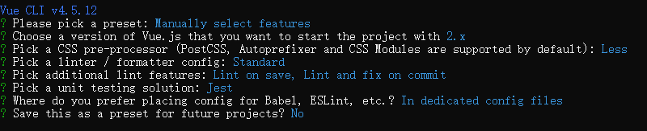

# 前端自动化测试

## 1 概述

目前，前端开发人员对于测试相关的知识是比较欠缺的，可能是因为近年前端技术更新比较快，也可能是因为开发周期短、人员紧缺。其实，在大型项目中，前端自动化测试是一个非常重要的环节。

为什么前端自动化测试重要呢？

先看看前端开发中常见的问题：

1、修改某个模块时，其它模块也受到影响，增加定位 bug 的难度；

2、多人开发，代码越来越难以维护；

3、不方便迭代和重构；

4、代码质量差。

增加自动化测试后：

1、为核心功能编写测试后，可保障项目的可靠性；

2、强迫开发者编写更容易被测试的代码，提高代码质量；

3、编写的测试有文档的作用，方便维护。

#### (1) 测试分类

测试可以分为**单元测试**、**集成测试**、**端到端测试**。

单元测试（Unit Testing）是指对程序中最小测试单元进行的测试，比如测试一个函数、一个组件、一个模块等等。

集成测试（Integration Testing）是指对已测试过的单元测试组合集成暴露出的高层函数或类的封装进行测试。

端到端测试（E2E Testing）是指从头到尾验证整个软件及其与外部接口的集成，目的是测试整个软件的依赖性、数据完整性以及与其他系统、接口和数据库等的通信，以模拟完整的生产场景。

#### (2) TDD 与 BDD

**TDD**（Test-Driven Development，测试驱动开发）也叫红绿开发（Red-Green Development），其流程如下：

1、编写测试用例；

2、运行测试，这时候，测试用例无法通过测试；

3、编写代码，使测试用例通过测试；

4、优化代码，完成开发；

5、重复上述步骤。

**BDD**（Behavior-Driven Development，行为驱动开发）是按照用户的行为进行开发并编写测试用例。

| TDD                                  | BDD                                  |
| ------------------------------------ | ------------------------------------ |
| 先写测试再写代码                     | 先写代码再写测试                     |
| 一般结合单元测试使用，是**白盒测试** | 一般结合集成测试使用，是**黑盒测试** |
| 测试重点在代码                       | 测试重点在 UI（DOM）                 |
| 安全感低                             | 安全感高                             |
| 速度快                               | 速度慢                               |

**补充：** **黑盒测试**一般也被称为功能测试，黑盒测试要求测试人员将程序看作一个整体，不考虑其内部结构和特性，只是按照期望验证程序是否能正常工作；**白盒测试**是基于代码本身的测试，一般指对代码逻辑结构的测试。

#### (3) 测试框架

**Jasmine** 是一个行为驱动的测试框架，可被用于测试各种 JavaScript 代码，主要用于 Angular 项目。

**Karma** 是一种通用的用例式前端测试框架，提供了跨浏览器测试的能力，可以在浏览器中执行测试用例。

**Mocha** 前端自动化测试框架，需要配合其他库一起使用，比如 chai、sinon 等。

**Jest** 是 Facebook 发布的开源的、零配置的 JavaScript **单元测试**框架，集成了快速命令行、Mock 工具集、断言、覆盖率报告等测试工具，支持 Babel、Webpack、TypeScript，功能强大，测试性能高。

## 2 使用和配置 Jest

#### (1) 使用 Jest

我们可以通过一个简单的例子，来学习在 React 或 Vue 项目中使用 Jest：

1、通过命令 `npm install jest --save-dev` 在项目中安装 Jest；

2、创建 math.js 文件，编写简单的待测试的 add 函数：

```javascript
function add(a, b) {
  return a + b
}
module.exports = add
```

3、创建 math.test.js 文件，编写测试用例：

```javascript
const add = require('./add')

test('测试加法3+7', () => {
  expect(add(3, 7)).toBe(10) // 断言语句
})
```

4、通过命令 `npx jest` 对上面的 add 函数进行测试，并在控制台显示测试结果；

5、也可以把 jest 配置到 package.json 中，这样就可以通过命令 `npm run test` 来运行测试了：

```json
{
  "scripts": {
    "test": "jest"
  }
}
```

scripts 配置中，如果在 jest 后面加上 `--watch All`，可以监听测试文件的变化，如果有变化，会自动跑所有测试文件中的测试用例；如果在 jest 后面加上 `--watch`，相当于开启了 Jest 的 `o` 模式（必须配合 Git 一起使用），它可以监听测试文件的变化，如果有变化，只会跑有变化的测试文件中的测试用例。

#### (2) 配置 Jest

通过命令 `npx jest --init` 可以在项目根目录中生成 Jest 的配置文件 jest.config.js。

如果在 jest.config.js 中配置了 `coverageDirectory: 'coverage'`，那么我们可以通过执行命令 `npx jest --coverage` 生成代码测试覆盖率报告，并保存在项目根目录中的 coverage 目录中。对于 jest.config.js 中的配置项后文会有较详细的介绍。

Jest 默认是无法测试使用 ES6 语法的代码的，比如 ESModule 语法，需要做一些处理（现代 React 项目或者 Vue 项目其实都配置了 Babel，所以可以直接在项目中使用 Jest 来进行测试，而无需下面的处理）:

1、安装依赖：

```bash
npm install @babel/core @babel/preset-env --save-dev
```

2、在项目根目录创建 .babelrc 文件，配置如下：

```json
{
  "presets": [["@babel/preset-env", { "targets": { "node": "current" } }]]
}
```

presets 是 Babel 使用的插件集合。上面配置的意思是，Babel 会使用 @babel/preset-env 插件来转换代码，使其兼容当前的 Node 版本。

3、这样，ES6 语法就会被转换，比如 ESModule 语法会被转换成 CommonJS 语法，然后 Jest 就可以测试了。

## 2 Vue 项目测试

### 2.1 脚手架项目使用 Jest

对于 Vue 项目，我们一般使用 Vue 官方提供的脚手架工具 Vue CLI 帮助我们快速搭建项目，并选择 Jest 作为单元测试框架：

1、在 CMD 中执行下面的命令，全局安装 Vue CLI：

```bash
npm install @vue/cli -g
```

2、执行下面的命令，创建项目，并手动选择项目特性：

```bash
vue create vue-todo-list-with-testing
```



项目搭建成功后，可以在项目根目录中看到 Jest 配置文件 jest.config.js：

```javascript
module.exports = {
  preset: '@vue/cli-plugin-unit-jest'
}
```

`@vue/cli-plugin-unit-jest` 插件对于在 Vue 项目中使用和配置 Jest 进行了封装。

3、搭建成功的项目的根目录中有一个 tests 文件夹，里面有一个测试用例，可以执行下面的命令来运行测试：

```bash
npm run test:unit
```

可以在命令 `npm run test:unit` 后面加上 `--watch` 来开启 Jest 的 watch 模式。

### 2.2 已有项目使用 Jest

对于一个已有的 Vue 项目，如果是 Vue CLI 搭建的项目，可以通过添加 `@vue/cli-plugin-unit-jest` 插件来使用 Jest；如果已有项目不是通过 Vue CLI 搭建的，可以通过下面的步骤来使用 Jest：

1、执行命令，在项目中安装 Jest：

```
npm install jest --save-dev
```

2、在项目根目录中创建 jest.config.js 文件，配置如下：

```javascript
module.exports = {
  // 在测试文件中引入的模块可以省略以下后缀名
  moduleFileExtensions: ['js', 'jsx', 'json', 'vue'],
  // 对测试文件中引入的模块先进行转换
  transform: {
    '^.+\\.vue$': require.resolve('vue-jest'), // 使用vue-jest转换vue模块
    // 使用jest-transform-stub把静态资源转换成字符串，因为测试的时候，对于样式这样的静态资源，无需解析和测试
    '.+\\.(css|styl|less|sass|scss|svg|png|jpg|ttf|woff|woff2)$': require.resolve('jest-transform-stub'),
    '^.+\\.jsx?$': require.resolve('babel-jest') // 使用babel-jest把js、jsx文件中ES高级转换成ES5语法
  },
  // 对于node_modules中的文件无需转换
  transformIgnorePatterns: ['/node_modules/'],
  // 模块映射，把@别名映射到src目录
  moduleNameMapper: { '^@/(.*)$': '<rootDir>/src/$1' },
  // 使用jest-serializer-vue对快照进行格式化
  snapshotSerializers: ['jest-serializer-vue'],
  // 以为文件会被当做是测试文件
  testMatch: ['**/tests/unit/**/*.spec.[jt]s?(x)', '**/__tests__/*.[jt]s?(x)'],
  // 运行测试时，jsdom环境地址
  testURL: 'http://localhost/',
  // watch模式下，可以通过正则表达式查找测试文件名或者测试用例名
  watchPlugins: [
    require.resolve('jest-watch-typeahead/filename'),
    require.resolve('jest-watch-typeahead/testname')
  ]
}
```

3、安装 jest.config.js 中用到的插件：

```bash
npm install vue-jest jest-transform-stub babel-jest jest-serializer-vue jest-watch-typeahead/filename jest-watch-typeahead/testname --save-dev
```

4、配置好 Jest 后，可以把 jest 配置到 package.json 中，这样就可以通过执行命令 `npm run test` 来运行测试了：

```json
{
  "scripts": {
    "test": "jest"
  }
}
```

### 2.3 使用 vue-test-utils 测试 Vue 组件

## 3 React 项目测试

### 3.1 使用 Jest

对于 React 项目，我们一般使用 React 官方提供的脚手架工具 create-react-app 帮助我们快速搭建项目：

### 3.2 使用 Enzyme 测试 React 组件

Enzyme 是 Airbnb 公司开源的一个用于 React 的 JavaScript 测试工具，方便判断、操纵和遍历 React 组件输出。Enzyme 的 API 模仿 jQuery，使得 DOM 操作和遍历很灵活、直观。Enzyme 兼容大多数断言库和测试框架。

在 React 项目中安装 Enzyme 以及其它插件：

```shell
npm install enzyme enzyme-adapter-react-16 jest-enzyme --save-dev 
```

如果我们写了一个 App 组件：

```react
import React from 'react'

function App() {
  return (
    <div className="app_container" title="zoeying" data-test="app_container">
      Hello World
    </div>
  )
}

export default App
```

那么，App 组件的测试用例可以这样写：

```react
import React from 'react'
import Enzyme, { shallow } from 'enzyme'
import Adapter from 'enzyme-adapter-react-16'
import App from './App'

Enzyme.configure({ adapter: new Adapter() })

it('test App use Enzyme', () => {
  // shallow表示浅渲染，只是渲染App组件，不关注App中的子组件是怎么渲染的，与之对应的API是mount
  const wrapper = shallow(<App />)

  expect(wrapper).toMatchSnapshot() // 快照测试

  // data-test属性值是'app_container'的元素，data-test是为了测试加的自定义属性，不使用class，是为了让测试与代码逻辑解耦
  const container = wrapper.find('[data-test="app_container"]')

  // console.log(wrapper.debug()) // 用于调试，如果测试用例跑不过，会打印出html

  expect(container.length).toBe(1)
  expect(container.prop('title')).toBe('zoeying') // 有title属性，且值是'zoeying'
})
```

我们还可以使用 jest-enzyme 提供的匹配器对上面的断言进行简化。

如果想使用 jest-enzyme，需要做一些配置。上面我们已经安装了 jest-enzyme，然后，在 jest.config.js 中修改配置如下：

```js
setupFilesAfterEnv: ['./node_modules/jest-enzyme/lib/index.js']
```

上面的配置表示，在测试环境启动好之后，会执行 ./node_modules/jest-enzyme/lib/index.js 文件，对 jest-enzyme 进行初始化。

这样，上面的两个断言就可以简写成如下的写法，其中 `.toExist`、`.toHaveProp` 都是 jest-enzyme 提供的匹配器：

```javascript
expect(container).toExist()
expect(container).toHaveProp('title', 'zoeying')
```

**补充：** **shallow** 主要用于**单元测试**，**mount** 主要用于**集成测试**。

## 4 E2E 测试

对于 React 项目和 Vue 项目的端到端测试，我们使用的测试框架是 Cypress。


