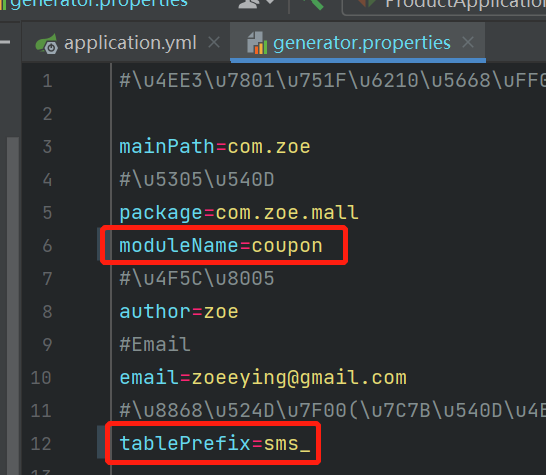
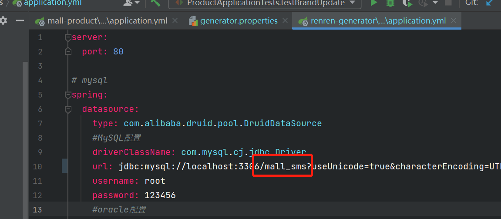
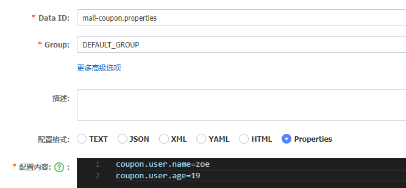
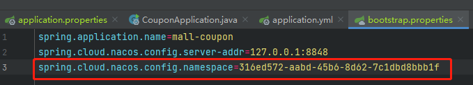
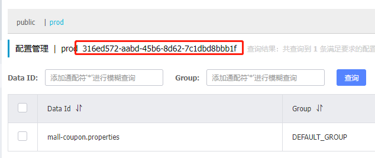
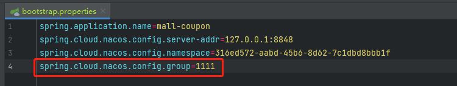
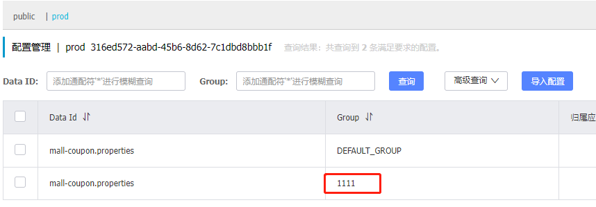
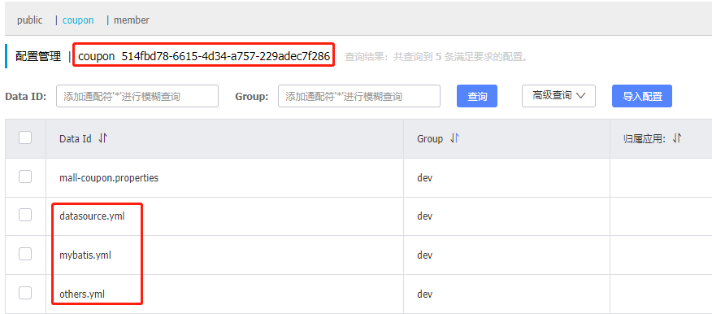

# 分布式开发

微服务：拒绝大型单体应用，基于业务边界进行服务微化拆分，各个服务独立部署运行，运行在不同的进程中。

集群是一个物理形态，分布式是一个工作方式。只要是一堆机器，就可以叫集群。

分布式系统是建立在网络之上的软件系统。

分布式系统是若干独立计算机的集合，这些计算机对于用户来说就像是单个相关系统。

分布式是指将不同的业务分布在不同的地方；集群指的是将几台服务器集中在一起，实现同一业务。

分布式中的每一个节点，都可以做集群，而集群并不一定就是分布式的。

在分布式系统中，各个服务可能处于不同主机，但是服务之间不可避免的需要互相调用，称之为远程调用。Spring Cloud 中推荐使用 HTTP + JSON 的方式进行远程调用。

负载均衡：分布式系统中，A 服务需要调用 B 服务，B 服务在多台机器中存在，A 调用任意一个服务器均可完成功能。为了使每一个服务器都不要太忙或太闲，可以通过负载均衡，调用每一个服务器，提升网站的健壮性。

常用的负载均衡算法：轮询、最小连接、散列。

注册中心：A 服务调用 B 服务，A 服务并不知道 B 服务当前在哪几台服务器有，哪些正常，哪些已经下线，解决这个问题可以引入注册中心。如果某些服务下线，其他人可以实时感知到，从而避免调用不可用的服务。

配置中心：每一个服务最终都有大量的配置，并且每个服务都可能部署在多台机器上，可以把配置信息都集中到配置中心进行管理，然后让每个服务自动去配置中心获取自己的配置。

在微服务架构中，微服务之间通过网络进行通信，存在相互依赖，当其中一个服务不可用时，有可能会造成雪崩效应，为了防止这种情况，必须要有容错机制来保护服务。

服务熔断：设置服务的超时，当被调用的服务经常失败到达某个阈值，可以开启断路保护机制，后来的请求不再去调用这个服务，本地直接返回默认的数据。

服务降级：在运维期间，当系统处于高峰期，系统资源紧张，可以让非核心业务降级运行，也就是某些服务不处理，或者简单处理，比如抛异常、返回 null、调用 mock 数据、调用 fallback 处理逻辑。

API 网关：在微服务架构中，API Gateway 作为整体架构的重要组件，它抽象了微服务中都需要的公共功能，同时提供了客户端负载均衡、服务自动熔断、灰度发布、统一认证、限流流控、日志统计等丰富的功能，能够帮助我们解决很多 API 管理难题。

Docker 是虚拟化容器技术，基于镜像，可以秒级启动各种容器，每一个容器都是一个完整的运行环境，容器之间相互隔离。

**renren-generator 项目启动方式：**





## Spring Cloud Alibaba

Spring Cloud Alibaba 致力于提供**微服务开发**的一站式解决方案，包含开发分布式应用微服务的必需组件，方便开发者通过 Spring Cloud 编程模型轻松使用这些组件来开发分布式应用服务。

依托 Spring Cloud Alibaba，只需要添加一些注解和少量配置，就可以将 Spring Cloud 应用接入阿里微服务解决方案，通过阿里中间件来迅速搭建分布式应用系统。

Spring Cloud Alibaba 设计合理，性能强悍，搭建简单，学习曲线低，且搭配完善的可视化界面，给开发运维带来极大的便利。

练习项目中的技术搭配方案：

Spring Cloud Alibaba - Nacos：注册中心（服务发现和注册）、配置中心（动态配置管理）

Spring Cloud Alibaba - Sentinel：服务容错，用于限流、降级、熔断

Spring Cloud Alibaba - Seata：分布式事务解决方案

Spring Cloud - Ribbon：负载均衡

Spring Cloud - Feign：声明式 HTTP 客户端，用于调用远程服务

Spring Cloud - Gateway：API 网关，使用了 webflux 编程模式

Spring Cloud - Sleuth：调用链监控

使用 Spring Cloud Alibaba，需要在 `dependencyManagement` 中添加如下配置，然后在 `dependencies` 中添加所需使用的组件的依赖即可：

```xml
<dependencyManagement>
    <dependencies>
        <dependency>
            <groupId>com.alibaba.cloud</groupId>
            <artifactId>spring-cloud-alibaba-dependencies</artifactId>
            <version>2021.0.1.0</version>
            <type>pom</type>
            <scope>import</scope>
        </dependency>
    </dependencies>
</dependencyManagement>
```

## Spring Cloud Alibaba - Nacos

**启动 Nacos Server：**

下载 [Nacos Server](https://github.com/alibaba/nacos/releases)，解压（不能有中文目录），进入 bin 目录，通过命令行执行 `startup.cmd -m standalone`，启动 Nacos Server。

### 使用 Nacos 作为注册中心

1、引入 Nacos Discovery Starter

```xml
<dependency>
    <groupId>com.alibaba.cloud</groupId>
    <artifactId>spring-cloud-starter-alibaba-nacos-discovery</artifactId>
</dependency>
```

2、配置 Nacos Server 地址：

```properties
spring.cloud.nacos.discovery.server-addr=127.0.0.1:8848
```

3、配置应用名：

```properties
spring.application.name=mall-coupon
```

4、使用 @EnableDiscoveryClient 注解开启服务注册与发现功能：

```java
@EnableDiscoveryClient
@SpringBootApplication
// ...
```

### 使用 Nacos 作为配置中心

1、引入 Nacos Config Starter：

```xml
<dependency>
    <groupId>com.alibaba.cloud</groupId>
    <artifactId>spring-cloud-starter-alibaba-nacos-config</artifactId>
</dependency>
```

2、在应用的 /src/main/resources/bootstrap.properties 配置文件中配置 Nacos Config 元数据：

```properties
spring.application.name=mall-coupon
spring.cloud.nacos.config.server-addr=127.0.0.1:8848
```

bootstrap.properties 会优先于 application.properties 加载。

3、在 Nacos 配置中心中添加配置如下：



Data ID 默认规则是 `应用名.properties`。

4、在相应的 Controller 上添加 @RefreshScope 注解，编写测试请求如下，这样就可以动态获取配置中心中的配置了：

```java
@RefreshScope
@RestController
@RequestMapping("coupon/coupon")
public class CouponController {
    @Autowired
    private CouponService couponService;

    @Value("${coupon.user.name}")
    private String name;

    @Value("${coupon.user.age}")
    private Integer age;

    @RequestMapping("/properties")
    public R propertiesTest() {
        return R.ok().put("name", name).put("age", age);
    }
}
```

5、如果配置中心和当前应用的配置文件中配置了相同的项，优先使用配置中心中的配置。

### Nacos 配置中心细节

#### 命名空间

用于进行租户粒度的配置隔离。不同的命名空间下，可以存在相同的 Group 或 DataID 的配置。

命名空间的常用场景之一是不同环境的配置的区分隔离，例如开发测试环境和生产环境的资源（如配置、服务）隔离等。默认是 public（保留空间），新增的所有配置默认都在 public 空间中。

命名空间还可以用于隔离每个微服务之间的配置。给每个微服务都创建自己的命名空间，然后只加载自己命名空间中的所有配置。

下面是命名空间示例：





#### 配置集

一组相关或不相关的配置项的集合称为配置集。在系统中，一个配置文件通常就是一个配置集，包含了系统各个方面的配置，比如，一个配置集可能包含了数据源、线程池、日志级别等配置项。 

配置集 ID 类似于配置文件名。

#### 配置分组

Naco 中的一组配置集，是组织配置的维度之一。主要是通过有意义的字符串对配置集进行分组，从而区分 DataID 相同的配置集。

默认所有配置集都属于 DEFAULT_GROUP 分组。

配置分组的常用场景是，不同的应用或组件使用了相同的配置类型。

下面是配置分组示例：





**最佳实践：** 为每个微服务创建自己的**命名空间**，然后使用**配置分组**区分环境，比如 dev、test、prod 等。

#### 同时加载多个配置集



```properties
# bootstrap.properties
spring.application.name=mall-coupon
spring.cloud.nacos.config.server-addr=127.0.0.1:8848
spring.cloud.nacos.config.namespace=514fbd78-6615-4d34-a757-229adec7f286
spring.cloud.nacos.config.group=dev

spring.cloud.nacos.config.extension-configs[0].data-id=datasource.yml
spring.cloud.nacos.config.extension-configs[0].group=dev
spring.cloud.nacos.config.extension-configs[0].refresh=true

spring.cloud.nacos.config.extension-configs[1].data-id=mybatis.yml
spring.cloud.nacos.config.extension-configs[1].group=dev
spring.cloud.nacos.config.extension-configs[1].refresh=true

spring.cloud.nacos.config.extension-configs[2].data-id=others.yml
spring.cloud.nacos.config.extension-configs[2].group=dev
spring.cloud.nacos.config.extension-configs[2].refresh=true
```

## Spring Cloud - Feign

Feign 是一个声明式的 HTTP 客户端，用于调用远程服务。

下面介绍使用 Feign 的步骤：

1、mall-member 服务想调用 mall-coupon 服务，需要在 mall-member 服务中引入 spring-cloud-starter-openfeign：

```xml
<dependency>
    <groupId>org.springframework.cloud</groupId>
    <artifactId>spring-cloud-starter-openfeign</artifactId>
</dependency>
```

2、在 mall-coupon 服务中，写一个测试请求：

```java
@RestController
@RequestMapping("coupon/coupon")
public class CouponController {
    /**
     * 获取会员优惠券
     * 用于远程调用，别的服务会调用该接口
     */
    @RequestMapping("/member/list")
    public R memberCoupons(){
        CouponEntity couponEntity = new CouponEntity();
        couponEntity.setCouponName("满100减20");
        return R.ok().put("coupons", Arrays.asList(couponEntity));
    }
}
```

3、在 mall-member 服务中，创建 feign 包，编写接口：

```java
/**
 * 声明式的远程调用，告诉SpringCloud，这是一个远程客户端
 * 调用memberCoupons方法，会去注册中心中找到远程服务mall-coupon
 * 再去调用/coupon/coupon/member/list请求
 * 接口中的每个方法都是调用某个服务中的某个请求
 */
@FeignClient("mall-coupon")
public interface CouponFeignService {
    @RequestMapping("/coupon/coupon/member/list")
    public R memberCoupons();
}
```

4、在 mall-member 中开启远程调用功能：

```java
@EnableFeignClients(basePackages = "com.zoe.mall.member.feign")
@SpringBootApplication
```

5、在 mall-member 中写一个测试请求：

```java
@RestController
@RequestMapping("member/member")
public class MemberController {
    @Autowired
    private MemberService memberService;

    @Autowired
    CouponFeignService couponFeignService;


    @RequestMapping("/coupons")
    public R test() {
        MemberEntity memberEntity = new MemberEntity();
        memberEntity.setNickname("Zoe");

        R memberCoupons = couponFeignService.memberCoupons();
        return R.ok().put("member", memberEntity).put("coupons", memberCoupons.get("coupons"));
    }
}
```

6、如果启动 mall-member 报错 No Feign Client for loadBalancing defined，需要引入 spring-cloud-loadbalancer：

```xml
<dependency>
    <groupId>org.springframework.cloud</groupId>
    <artifactId>spring-cloud-loadbalancer</artifactId>
    <version>2.2.2.RELEASE</version>
</dependency>
```

## Spring Cloud - Gateway

网关作为流量的入口，常用功能包括路由转发、权限校验、限流控制等。Spring Cloud Gateway 作为 Spring Cloud 官方推出的第二代网关框架，取代了 Zuul。

网关提供 API 全托管服务。丰富的 API 管理功能，可以辅助企业管理大规模的 API，以降低管理成本和安全风险，包括协议适配、协议转发、安全策略、防刷、流量、监控日志等功能。

Spring Cloud Gateway 旨在提供一种简单而有效的方式来对 API 进行路由，并为他们提供切面，比如安全性、监控/指标、弹性等。


 


