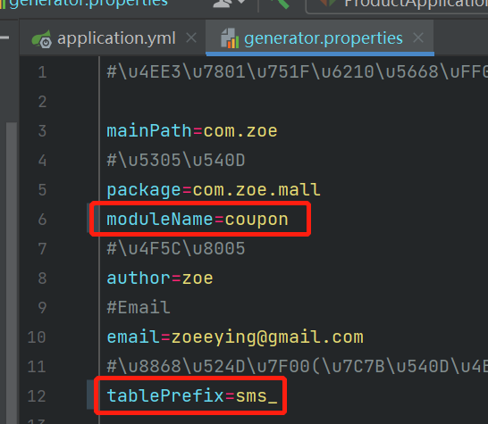

# 服务端相关

微服务：拒绝大型单体应用，基于业务边界进行服务微化拆分，各个服务独立部署运行，运行在不同的进程中。

集群是一个物理形态，分布式是一个工作方式。只要是一堆机器，就可以叫集群。

分布式系统是建立在网络之上的软件系统。

分布式系统是若干独立计算机的集合，这些计算机对于用户来说就像是单个相关系统。

分布式是指将不同的业务分布在不同的地方；集群指的是将几台服务器集中在一起，实现同一业务。

分布式中的每一个节点，都可以做集群，而集群并不一定就是分布式的。

在分布式系统中，各个服务可能处于不同主机，但是服务之间不可避免的需要互相调用，称之为远程调用。Spring Cloud 中推荐使用 HTTP + JSON 的方式进行远程调用。

负载均衡：分布式系统中，A 服务需要调用 B 服务，B 服务在多台机器中存在，A 调用任意一个服务器均可完成功能。为了使每一个服务器都不要太忙或太闲，可以通过负载均衡，调用每一个服务器，提升网站的健壮性。

常用的负载均衡算法：轮询、最小连接、散列。

注册中心：A 服务调用 B 服务，A 服务并不知道 B 服务当前在哪几台服务器有，哪些正常，哪些已经下线，解决这个问题可以引入注册中心。如果某些服务下线，其他人可以实时感知到，从而避免调用不可用的服务。

配置中心：每一个服务最终都有大量的配置，并且每个服务都可能部署在多台机器上，可以把配置信息都集中到配置中心进行管理，然后让每个服务自动去配置中心获取自己的配置。

在微服务架构中，微服务之间通过网络进行通信，存在相互依赖，当其中一个服务不可用时，有可能会造成雪崩效应，为了防止这种情况，必须要有容错机制来保护服务。

服务熔断：设置服务的超时，当被调用的服务经常失败到达某个阈值，可以开启断路保护机制，后来的请求不再去调用这个服务，本地直接返回默认的数据。

服务降级：在运维期间，当系统处于高峰期，系统资源紧张，可以让非核心业务降级运行，也就是某些服务不处理，或者简单处理，比如抛异常、返回 null、调用 mock 数据、调用 fallback 处理逻辑。

API 网关：在微服务架构中，API Gateway 作为整体架构的重要组件，它抽象了微服务中都需要的公共功能，同时提供了客户端负载均衡、服务自动熔断、灰度发布、统一认证、限流流控、日志统计等丰富的功能，能够帮助我们解决很多 API 管理难题。

Docker 是虚拟化容器技术，基于镜像，可以秒级启动各种容器，每一个容器都是一个完整的运行环境，容器之间相互隔离。

**renren-generator 项目启动方式：**

## Spring Cloud Alibaba

Spring Cloud Alibaba 致力于提供**微服务开发**的一站式解决方案，包含开发分布式应用微服务的必需组件，方便开发者通过 Spring Cloud 编程模型轻松使用这些组件来开发分布式应用服务。

依托 Spring Cloud Alibaba，只需要添加一些注解和少量配置，就可以将 Spring Cloud 应用接入阿里微服务解决方案，通过阿里中间件来迅速搭建分布式应用系统。

Spring Cloud Alibaba 设计合理，性能强悍，搭建简单，学习曲线低，且搭配完善的可视化界面，给开发运维带来极大的便利。

练习项目中的技术搭配方案：

Spring Cloud Alibaba - Nacos：注册中心（服务发现和注册）、配置中心（动态配置管理）

Spring Cloud Alibaba - Sentinel：服务容错，用于限流、降级、熔断

Spring Cloud Alibaba - Seata：分布式事务解决方案

Spring Cloud - Ribbon：负载均衡

Spring Cloud - Feign：声明式 HTTP 客户端，用于调用远程服务

Spring Cloud - Gateway：API 网关，使用了 webflux 编程模式

Spring Cloud - Sleuth：调用链监控

 

