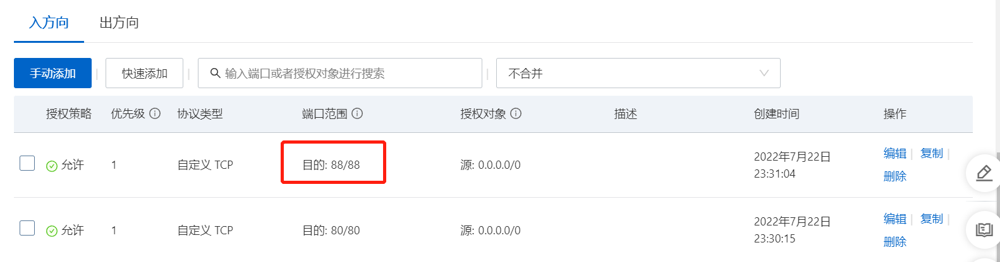
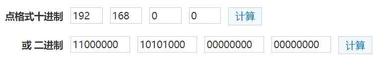
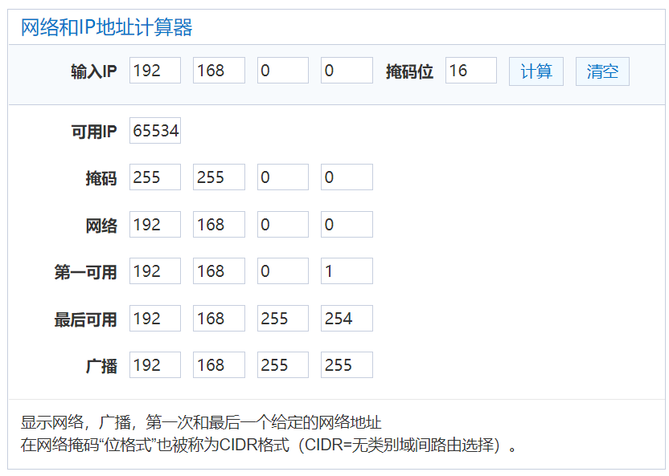

# 服务端相关

## 1 Maven

命令行创建项目：

```shell
mvn archetype:generate -DgroupId=com.how2java -DartifactId=j2se -DarchetypeArtifactId=maven-archetype-quickstart -DinteractiveMode=false
```

- `archetype:generate`，表示创建个项目；

- `-DgroupId=com.how2java`，表示项目包名是 com.how2java；

- `-DartifactId=j2se`，表示项目名称是 j2se；

- `-DarchetypeArtifactId=maven-archetype-quickstart`，表示项目类型是 maven-archetype-quickstart；

- `-DinteractiveMode=false`，表示参数已配置，无需再一个一个输入。

打包 Maven 项目，可以执行命令 `mvn package`（进入项目目录），这个命令做了这些事情：编译、测试、打包，最后会生成一个 jar 包，类似于 j2se-1.0-SNAPSHOT.jar。

打包出来的 jar 包是可以执行的（进入项目目录）：

```shell
# 方式一，适用于没有指定主函数的场景，推荐
java -classpath target/j2se-1.0-SNAPSHOT.jar com.how2java.App

# 方式二，适用于指定了主函数的场景
java -jar target/j2se-1.0-SNAPSHOT.jar
```

## 2 安装 Nginx

```shell
# 安装Nginx
yum install nginx

# 移除Nginx
yum remove nginx

# 启动Nginx
systemctl start nginx

# 重启Nginx
systemctl restart nginx

# 开机启动Nginx
systemctl enable nginx

# 查找Nginx
whereis nginx

# 用"test text"覆盖index.html中的内容
echo "test text" > index.html

# 查看index.html中的内容
cat index.html

# 访问地址
curl 127.0.0.1:88

# 查看Nginx服务情况
ps -ef | grep nginx

# 关闭服务
/usr/local/nginx/sbin/nginx -s quit

# 关闭自启动
chkconfig nginx off

# 搜索Nginx文件
find / -name nginx
```

## 3 安全组

**安全组**是指防火墙相关的端口设置。



## 4 VPC

VPC 可以称为**私有网络**或**专有网络**，在阿里云中，VPC 主要用来划分网段，并且 VPC 之间是隔离的。

192.168.0.0/16 网段如下：





掩码 16 表示，转换成二进制的 IP，前面 16 位保持不变，后面 16 位动态变化，也就是说，可用 IP 地址段是 192.168.0.0 - 192.168.255.255。

## 
