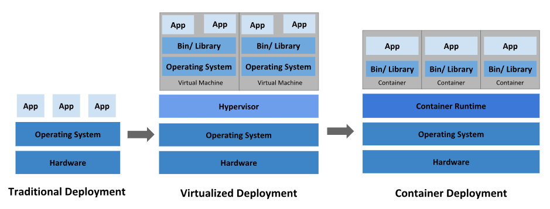
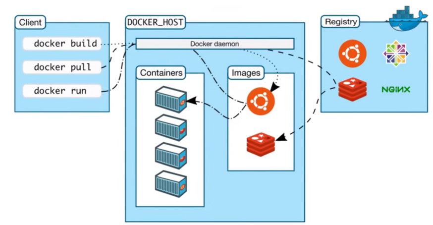
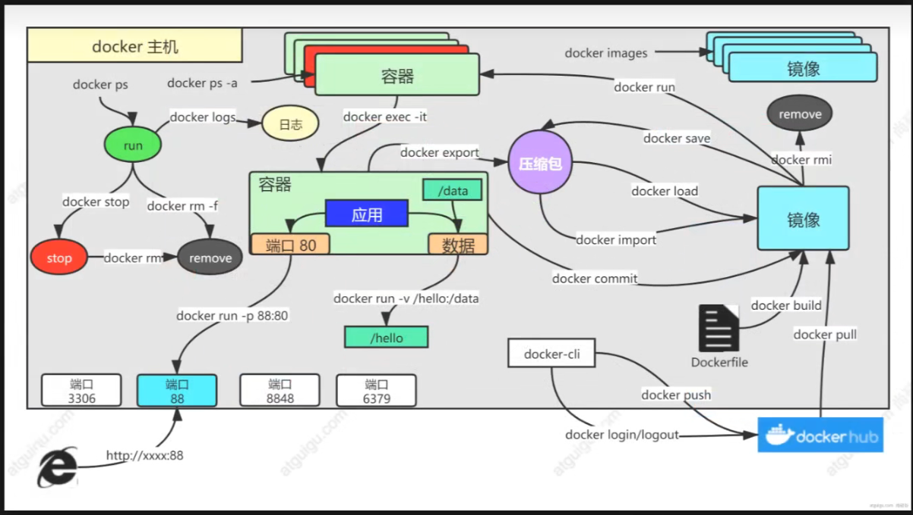
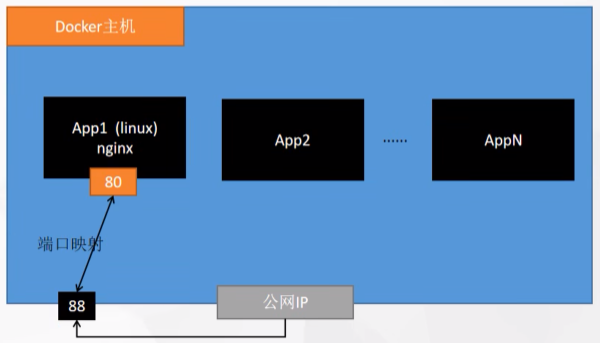
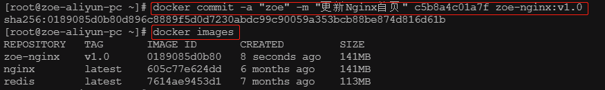
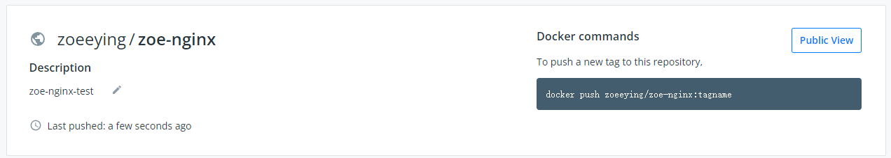
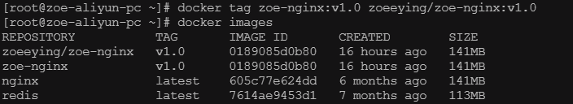
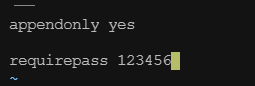

# Docker 学习笔记

### 部署历史



**传统部署时代**：早期，各机构是在物理服务器上运行应用程序，由于无法限制在物理服务器中运行的应用程序资源使用，因此会导致资源分配问题。

**虚拟化部署时代**：虚拟化技术允许在单个物理服务器的 CPU 上运行多台虚拟机（VM）。 虚拟化能使应用程序在不同 VM 之间被彼此隔离，且能提供一定程度的安全性。虚拟化技术缺点也较多，比如基础镜像很笨重（GB 级别），且创建使用较为复杂，启动速度慢，移植与分享不方便。

**容器化时代**：相较 VM，容器更轻量， 且与 VM 类似，每个容器都具有自己的文件系统、CPU、内存、进程空间等。 由于容器与基础架构分离，因此可以跨云和 OS 发行版本进行移植。容器化技术有诸多优点，比如基础镜像很轻量（MB 级别），创建简单，启动速度秒级，移植与分享方便。

Docker 的出现，开启了**容器化**时代。

Docker 是一个开源的应用容器引擎，让开发者可以打包他们的应用以及依赖包到一个**可移植的镜像**中，然后发布到任何流行的 Linux 或 Windows 操作系统的机器上，也可以实现虚拟化。容器是完全使用**沙箱**机制，相互之间不会有任何接口。

Docker 统一了应用构建、应用分享、应用运行等的标准，且 Docker 的资源隔离性很强，可以做到 CPU 资源、memory 资源、访问设备、网络、用户、用户组等之间的隔离与限制。

### Docker 架构




**DOCKER_HOST：** 安装 Docker 的主机；

**Docker daemon：** 运行在 Docker 主机上的 Docker 后台进程；

**Client：** 操作 Docker 主机的客户端，包括命令行、UI 等；

**Registry：** 镜像仓库，最常用的是 Docker Hub；

**Images：** 镜像，带环境打包好的程序，可以直接启动运行；

**Containers：** 容器，由镜像启动起来正在运行中的程序。

### 安装 Docker

**SUSE Linux 12 上以二进制方式安装 Docker：**

1、从官网下载 Docker 二进制软件包，比如 docker-18.06.3-ce.tgz：

https://download.docker.com/linux/static/stable/x86_64/

2、把软件包上传到服务器 /root 目录下，解压：

```shell
tar -zxvf docker-18.06.3-ce.tgz
```

3、root 用户，拷贝 Docker 命令到 /usr/bin 下：

```shell
cp docker/* /usr/bin/
```

4、启动 Docker：

```
dockerd &
```

5、完成安装

**CentOS 上安装 Docker：**

```shell
# 移除所有Docker相关包
yum remove docker*

# 安装yum工具
yum install -y yum-utils

# 配置yum源
yum-config-manager \
--add-repo \
https://download.docker.com/linux/centos/docker-ce.repo
```

后面的所有演示都是在 CentOS 7.9 系统上的操作。

docker-ce 是社区版的 Docker 服务器，docker-ce-cli 是操作 Docker 服务器的命令行工具，containerd.io 是 Docker 容器化运行环境。

```shell
# 安装Docker
yum install -y docker-ce docker-ce-cli containerd.io

# 开机启动Docker
systemctl enable docker --now

# 配置镜像加速器，生产环境核心配置
mkdir -p /etc/docker
tee /etc/docker/daemon.json <<-'EOF'
{
  "registry-mirrors": ["https://3vorqqsx.mirror.aliyuncs.com"],
  "exec-opts": ["native.cgroupdriver=systemd"],
  "log-driver": "json-file",
  "log-opts": {
    "max-size": "100m"
  },
  "storage-driver": "overlay2"
}
EOF
systemctl daemon-reload
systemctl restart docker
```

### Docker 常用命令



```shell
# 下载最新版本Nginx
docker pull nginx

# 下载固定版本Nginx
docker pull nginx:1.20.1

# 查看下载的所有镜像
docker images

# 移除指定镜像
docker rmi 镜像名:版本号/镜像ID
```

```shell
# 查看容器运行日志
docker logs 容器ID/容器名
docker logs -f 容器ID/容器名

# 把容器中的文件复制到主机中
docker cp 容器ID:/etc/nginx/nginx.conf /root/zhouying/nginx/nginx.conf

# 把主机中的文件复制到容器中
docker cp /root/zhouying/nginx/nginx.conf 容器ID:/etc/nginx/nginx.conf
```

### 启动容器

```shell
docker run [OPTIONS] IMAGE [COMMAND] [ARG...]
```

[OPTIONS] 是设置项；IMAGE 是镜像名；[COMMAND] 是镜像启动运行的命令，因为镜像中默认有，所以一般不用设置。

```shell
docker run --name=zoe-nginx -d nginx
```

`-d` 表示后台运行，如果不加 `-d`，docker 命令行会阻塞，一旦退出命令行，该容器也会停止。

```shell
# 查看正在运行的容器
docker ps

# 查看所有容器，包括停止的容器
docker ps -a

# 删除停止的容器
docker rm 容器ID/容器名

# 强制删除运行中的容器
docker rm -f 容器ID/容器名

# 停止容器
docker stop 容器ID/容器名

# 启动容器
docker start 容器ID/容器名

# 设置容器开机自启
docker update 容器ID --restart=always
```

### 端口映射



```shell
docker run --name=zoe-nginx -d --restart=always -p 88:80 nginx
```

启动 Nginx 容器，容器名是 zoe-nginx，并设置后台运行、开机自启，同时把主机的 88 端口映射到容器的 80 端口。

### 容器操作

```shell
# 进入容器
docker exec -it 容器ID /bin/bash
docker exec -it 容器ID /bin/sh

# 退出容器
exit
```

对于容器中的修改，比如 Nginx 欢迎页的修改，可以提交成一个新的镜像：

```shell
docker commit -a "zoeeying" -m "更新Nginx首页" 容器ID zoe-nginx:v1.0
```

`-a` 表示作者，`-m` 表示提交信息，`zoe-nginx:v1.0` 表示`镜像名:版本号`。



### 镜像传输

```shell
# 把镜像保存成压缩包
docker save -o zoe-nginx.tar zoe-nginx:v1.0

# 传输文件到另一台机器
scp zoe-nginx.tar root@IP:/root/

# 加载镜像
docker load -i zoe-nginx.tar
```

### 推送远程仓库

可以把本地镜像推送到远程仓库，方便在其它机器使用。

首先需要在 Docker Hub 创建一个 repository：



然后对本地镜像打标签，注意镜像名一定要跟远程的 repository 名称一样：

```shell
docker tag zoe-nginx:v1.0 zoeeying/zoe-nginx:v1.0
```



推送到远程仓库：

```shell
# 登录
docker login

docker push zoeeying/zoe-nginx:v1.0

# 登出
docker logout
```

### 挂载

Docker 挂载就是用本机文件或文件夹覆盖容器内的文件或文件夹。

```shell
docker run --name=zoe-nginx -d --restart=always -p 80:80 \
-v /root/zhouying/nginx/html:/usr/share/nginx/html:ro \
-v /root/zhouying/nginx/nginx.conf:/etc/nginx/nginx.conf nginx
```

上面的命令表示，启动 Nginx 容器，并且用主机上的 /root/zhouying/nginx/html 文件夹挂载容器中的 /usr/share/nginx/html 文件夹，用主机上的 /root/zhouying/nginx/nginx.conf 挂载容器中的 /etc/nginx/nginx.conf 配置文件。

`:ro` 表示容器中不能修改，只能在主机上修改；`:rw` 表示在容器中和主机上均可修改。

### 启动 Redis

使用自定义配置文件启动 Redis：

```shell
docker run -v /root/zhouying/redis/redis.conf:/etc/redis/redis.conf \
-v /root/zhouying/redis/data:/data \
-d --name zoe-redis \
-p 6379:6379 \
redis:latest redis-server /etc/redis/redis.conf
```

`redis-server /etc/redis/redis.conf` 是 Redis 自定义的启动命令，用来自定义配置文件。

配置文件如下：



### 部署 Java Web 应用

传统的部署方式，需要把应用打包成可执行的 jar 包，然后上传到服务器，并在服务器上执行 `java -jar`。这种部署方式，需要对环境做各种配置，比如配置 Java 运行环境等。

有了 Docker 后，我们只需要把应用打包成镜像，直接在机器上运行即可：

1、创建 Dockerfile 文件：

```dockerfile
FROM openjdk:8-jdk-slim
LABEL maintainer=zoeeying

COPY target/*.jar /app.jar

ENTRYPOINT ["java", "-jar", "/app.jar"]
```

2、把打包后的 target 目录以及 Dockerfile 文件上传到装有 Docker 的机器上；

3、执行 Docker 打包命令：

```shell
docker build -t java-demo:v1.0 -f Dockerfile .
```

4、启动容器：

```shell
docker run -d -p 8080:8080 --name zoe-java-demo-app java-demo:v1.0
```


