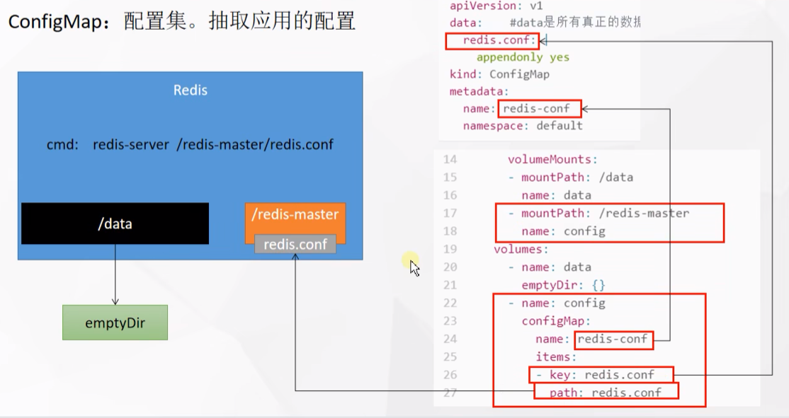

```

```

# K8s 学习笔记

Kubernetes 简称 K8s，是一个开源的，用于自动部署、扩展和管理容器化应用的容器编排系统。

在 Kubernetes 中，所有的容器均在 Pod 中运行，一个 Pod 可以承载一个或者多个相关的容器。同一个 Pod 中的容器会部署在同一个物理机器上并且能够共享资源。一个 Pod 也可以包含 0 个或者多个磁盘卷组（volumes），这些卷组将会以目录的形式提供给一个容器，或者被所有 Pod 中的容器共享。

Kubernetes 主要处理：服务发现和负载均衡，存储编排，自动部署和回滚，自动完成装箱计算，自我修复，密钥与配置管理。

Kubernetes 工作方式：Kubernetes Cluster = N Master Node + N Worker Node。

## 1 组件架构

一个 Kubernetes 集群是由一组被称作节点（node）的机器组成， 这些节点上会运行由 Kubernetes 所管理的容器化应用，且每个集群至少有一个工作节点。

Kubernetes 集群的组件：


### 控制平面组件（Control Plane Components）

控制平面组件会为集群做出全局决策。控制平面组件可以在集群中的任何节点上运行， 但是为了简单起见，设置脚本通常会在同一个计算机上启动所有控制平面组件，并且不会在此计算机上运行用户容器。

#### kube-apiserver

API 服务器是 Kubernetes 控制平面的前端，负责公开 Kubernetes API，并负责处理接受请求的工作。Kubernetes API 服务器的主要实现是 kube-apiserver。可以通过部署多个实例来对 kube-apiserver 进行扩缩。

#### etcd

etcd 是兼顾一致性与高可用性的键值数据库，可以作为保存 Kubernetes 所有集群数据的后台数据库。

#### kube-scheduler

kube-scheduler  负责监视新创建的、未指定运行节点的 Pods，并选择节点来让 Pod 在上面运行。调度决策考虑的因素包括单个 Pod 及 Pods 集合的资源需求、软硬件及策略约束、亲和性及反亲和性规范、数据位置、工作负载间的干扰及最后时限。

#### kube-controller-manager

kube-controller-manager 负责运行控制器进程。从逻辑上讲，每个控制器都是一个单独的进程，但是为了降低复杂性，它们都被编译到同一个可执行文件，并在同一个进程中运行。

这些控制器包括：

1、节点控制器（Node Controller），负责在节点出现故障时进行通知和响应；

2、任务控制器（Job Controller），监测代表一次性任务的 Job 对象，然后创建 Pods 来运行这些任务直至完成；

3、端点控制器（Endpoints Controller），填充端点（Endpoints）对象，即加入 Service 与 Pod；

4、服务帐户和令牌控制器（Service Account & Token Controllers），为新的命名空间创建默认帐户和 API 访问令牌。

#### cloud-controller-manager

cloud-controller-manager 是指嵌入特定云的控制逻辑的控制平面组件。

#### Node 组件

节点组件会在每个节点上运行，负责维护运行的 Pod 并提供 Kubernetes 运行环境。

#### kubelet

kebelet 会在集群中每个节点上运行，它接收一组通过各类机制提供给它的 PodSpecs，确保这些 PodSpecs 中描述的容器处于运行状态，且是健康的。kubelet 不会管理不是由 Kubernetes 创建的容器。

#### kube-proxy

kube-proxy 维护节点上的一些网络规则，这些网络规则会允许从集群内部或外部的网络会话与 Pod 进行网络通信。如果操作系统提供了可用的数据包过滤层，则 kube-proxy 会通过它来实现网络规则，否则，kube-proxy 仅做流量转发。

#### 容器运行时

容器运行环境是负责运行容器的软件，比如 Docker。

## 2 集群搭建

K8s 实战，至少需要准备三台服务器。


### 基础环境

设置主机名，需要注意的是，集群中的主机名不能重复：

```shell
hostnamectl set-hostname k8s-master
hostnamectl set-hostname k8s-node-01
hostnamectl set-hostname k8s-node-02
```

禁用交换分区，Swap 必须都是 0：


允许 iptables 检查桥接流量：

```shell
cat <<EOF | sudo tee /etc/modules-load.d/k8s.conf
br_netfilter
EOF

cat <<EOF | sudo tee /etc/sysctl.d/k8s.conf
net.bridge.bridge-nf-call-ip6tables = 1
net.bridge.bridge-nf-call-iptables = 1
EOF
sudo sysctl --system
```

### 安装 Docker

```shell
# 安装yum工具
yum install -y yum-utils

# 配置Docker的yum源
yum-config-manager \
--add-repo \
https://download.docker.com/linux/centos/docker-ce.repo

# 安装指定版本Docker
yum install -y docker-ce-20.10.7 docker-ce-cli-20.10.7 containerd.io-1.4.6

# 开机启动Docker
systemctl enable docker --now

# 配置镜像加速器以及生产环境核心配置
mkdir -p /etc/docker
tee /etc/docker/daemon.json <<-'EOF'
{
  "registry-mirrors": ["https://3vorqqsx.mirror.aliyuncs.com"],
  "exec-opts": ["native.cgroupdriver=systemd"],
  "log-driver": "json-file",
  "log-opts": {
    "max-size": "100m"
  },
  "storage-driver": "overlay2"
}
EOF
systemctl daemon-reload
systemctl restart docker
```

`https://3vorqqsx.mirror.aliyuncs.com` 是阿里云个人镜像加速器地址。

### 安装 kubelet、kubeadm、kubectl

```shell
cat <<EOF | sudo tee /etc/yum.repos.d/kubernetes.repo
[kubernetes]
name=Kubernetes
baseurl=https://mirrors.aliyun.com/kubernetes/yum/repos/kubernetes-el7-x86_64
enabled=1
gpgcheck=0
repo_gpgcheck=0
gpgkey=http://mirrors.aliyun.com/kubernetes/yum/doc/yum-key.gpg
   http://mirrors.aliyun.com/kubernetes/yum/doc/rpm-package-key.gpg
exclude=kubelet kubeadm kubectl
EOF

sudo yum install -y kubelet-1.20.9 kubeadm-1.20.9 kubectl-1.20.9 --disableexcludes=kubernetes
sudo systemctl enable --now kubelet
```

### 下载必要的镜像

```shell
sudo tee ./images.sh <<-'EOF'
#!/bin/bash
images=(
kube-apiserver:v1.20.9
kube-proxy:v1.20.9
kube-controller-manager:v1.20.9
kube-scheduler:v1.20.9
coredns:1.7.0
etcd:3.4.13-0
pause:3.2
)
for imageName in ${images[@]} ; do
docker pull registry.cn-hangzhou.aliyuncs.com/lfy_k8s_images/$imageName
done
EOF
```

```shell
chmod +x ./images.sh && ./images.sh
```

shell 脚本中下载的镜像版本是固定的，且使用的是雷丰阳老师提供的的阿里云镜像仓库。

**拓展：** 将本地镜像推送到阿里云镜像仓库：

```shell
docker tag 5ef66b403f4f registry.cn-hangzhou.aliyuncs.com/zoe_k8s_images/calico-node:v3.20.0
docker push registry.cn-hangzhou.aliyuncs.com/zoe_k8s_images/calico-node:v3.20.0
```

### 初始化 Master 节点

在所有机器上添加主节点域名映射，并且需要能 ping 通 cluster-endpoint：

```shell
echo "172.31.0.1 cluster-endpoint" >> /etc/hosts
ping cluster-endpoint
```

`172.31.0.1` 是主节点的私有 IP。

主节点初始化：

```shell
kubeadm init \
--apiserver-advertise-address=172.31.0.1 \
--control-plane-endpoint=cluster-endpoint \
--image-repository=registry.cn-hangzhou.aliyuncs.com/lfy_k8s_images \
--kubernetes-version=v1.20.9 \
--service-cidr=10.96.0.0/16 \
--pod-network-cidr=192.168.0.0/16
```

主节点初始化时，所有网络范围不能重叠。

主节点初始化成功提示：

```shell
Your Kubernetes control-plane has initialized successfully!

To start using your cluster, you need to run the following as a regular user:

  mkdir -p $HOME/.kube
  sudo cp -i /etc/kubernetes/admin.conf $HOME/.kube/config
  sudo chown $(id -u):$(id -g) $HOME/.kube/config

Alternatively, if you are the root user, you can run:

  export KUBECONFIG=/etc/kubernetes/admin.conf

You should now deploy a pod network to the cluster.
Run "kubectl apply -f [podnetwork].yaml" with one of the options listed at:
  https://kubernetes.io/docs/concepts/cluster-administration/addons/

You can now join any number of control-plane nodes by copying certificate authorities
and service account keys on each node and then running the following as root:

  kubeadm join cluster-endpoint:6443 --token lutxr2.kd9w7lxb95gdm8es \
    --discovery-token-ca-cert-hash sha256:a16a588bf802fe432035e908c4992d0e7042df433343bfea2d14818aa7e8c14c \
    --control-plane 

Then you can join any number of worker nodes by running the following on each as root:

kubeadm join cluster-endpoint:6443 --token lutxr2.kd9w7lxb95gdm8es \
    --discovery-token-ca-cert-hash sha256:a16a588bf802fe432035e908c4992d0e7042df433343bfea2d14818aa7e8c14c
```

执行上面成功提示中的命令：

```shell
mkdir -p $HOME/.kube
sudo cp -i /etc/kubernetes/admin.conf $HOME/.kube/config
sudo chown $(id -u):$(id -g) $HOME/.kube/config

export KUBECONFIG=/etc/kubernetes/admin.conf
```

如果集群没有完全正常运行，或者有问题，可以重新初始化：

```shell
kubeadm reset
rm -rf $HOME/.kube /etc/kubernetes
```

### 网络组件 Calico

```shell
# 下载网络组件Calico的配置文件并安装，版本是v3.20
curl https://docs.projectcalico.org/v3.20/manifests/calico.yaml -O

# 下载最新版本Calico配置文件
curl https://docs.projectcalico.org/manifests/calico.yaml -O
```

```shell
kubectl apply -f calico.yaml
```

**注意事项：Calico 版本必须与 K8s 版本相匹配。**

可以在 Calico 官网查看不同 Calico 版本对应的 K8s 版本：

https://projectcalico.docs.tigera.io/archive/v3.20/getting-started/kubernetes/requirements

v3.20 会对应到最新的小版本，比如截止 2022/8/7，最新的小版本是 v3.20.6。本项目使用的固定小版本是 v3.20.0，所以需要修改 calico.yaml，把 v3.20.6 都改成 v3.20.0。

### Worker 节点

对于 Worker 节点，执行下面的命令，加入集群：

```shell
kubeadm join cluster-endpoint:6443 --token lutxr2.kd9w7lxb95gdm8es \
    --discovery-token-ca-cert-hash sha256:a16a588bf802fe432035e908c4992d0e7042df433343bfea2d14818aa7e8c14c
```

成功加入集群后，在 Master 节点上执行命令，查看所有节点以及 Pods 状态：


Worker 节点加入集群需要令牌，初始化 Master 节点生成的令牌有效期是 24 小时，如果令牌过期了，可以在 Master 节点上生成新的令牌：

```shell
kubeadm token create --print-join-command
```

把主节点设置成工作节点：

```shell
kubectl taint nodes --all node-role.kubernetes.io/master-
```

### 部署 Dashboard

```shell
kubectl apply -f https://raw.githubusercontent.com/kubernetes/dashboard/v2.3.1/aio/deploy/recommended.yaml
```

如下图，把 `type: ClusterIP` 改成 `type: NodePort`：

```shell
kubectl edit svc kubernetes-dashboard -n kubernetes-dashboard
```


上面的操作会把 K8s Dashboard 页面的端口号暴露到机器上。

```shell
kubectl get svc -A |grep kubernetes-dashboard
```


访问 `https://集群任意节点公网IP:32524`，即可打开 Dashboard 页面：


登录 K8s Dashboard，需要创建访问账号。

首先，需要准备一个 YAML 文件：

```yaml
# dashboard-adminuser.yaml
apiVersion: v1
kind: ServiceAccount
metadata:
  name: admin-user
  namespace: kubernetes-dashboard
---
apiVersion: rbac.authorization.k8s.io/v1
kind: ClusterRoleBinding
metadata:
  name: admin-user
roleRef:
  apiGroup: rbac.authorization.k8s.io
  kind: ClusterRole
  name: cluster-admin
subjects:
- kind: ServiceAccount
  name: admin-user
  namespace: kubernetes-dashboard
```

```shell
kubectl apply -f dashboard-adminuser.yaml

# 获取访问令牌
kubectl -n kubernetes-dashboard get secret $(kubectl -n kubernetes-dashboard get sa/admin-user -o jsonpath="{.secrets[0].name}") -o go-template="{{.data.token | base64decode}}"
```

把生成的令牌复制到页面中，即可登录 K8s Dashboard。

## 3 资源

在 K8s 中创建资源，可以使用命令行、YAML 的方式。

### Namespace

**Namespace：** 名称空间，用来对**集群资源**进行隔离划分。默认只隔离资源，不隔离网络。

对于名称空间的一些命令行操作：

```shell
# 查看集群中的名称空间
kubectl get ns

# 创建名称空间
kubectl create ns hello

# 删除名称空间，且会删除该名称空间下所有的资源
kubectl delete ns hello
```

对于 Namespace，也可以通过 YAML 的方式进行创建和删除：

```yaml
# namespace.yaml
apiVersion: v1
kind: Namespace
metadata:
  name: hello
```


### Pod

Pod 是指运行中的**一组容器**，Pod 是 K8s 中应用的**最小单位**。


**命令行方式创建 Pod**

```shell
# 创建Pod
kubectl run mynginx --image=nginx

# 查看default名称空间下的Pod
kubectl get pods

# describe某个Pod，查看Pod底层处理情况
kubectl describe pod mynginx

# 删除Pod
kubectl delete pod mynginx
```

describe Pod，查看事件：


**YAML 方式创建 Pod**

```yaml
# pod.yaml
apiVersion: v1
kind: Pod
metadata:
  labels:
    run: mynginx
  name: mynginx
  namespace: default
spec:
  containers:
  - image: nginx
    name: mynginx
```

```yaml
# 包含多个容器的Pod
apiVersion: v1
kind: Pod
metadata:
  labels:
    run: myapp
  name: myapp
spec:
  containers:
  - image: nginx
    name: nginx
  - image: tomcat:8.5.68
    name: tomcat
```

一个 Pod 中的容器，共享网络空间、共享存储，互相访问可以通过 127.0.0.1。一个 Pod 中的多个容器，不能使用相同的端口，否则 Pod 会出错。

根据 YAML 配置文件，创建 Pod：

```shell
kubectl apply -f pod.yaml
```

使用配置文件，删除 Pod：

```shell
kubectl delete -f pod.yaml
```

**可视化方式创建 Pod**


其它命令：

```shell
# 查看所有名称空间下的应用
kubectl get pods -A

# 监控查看Pod，如果某个Pod发生问题，会显示Pod状态变化过程
kubectl get pods -w

# 每隔一秒执行查看Pods命令
watch -n 1 kubectl get pods

# 查看指定名称空间下的应用
kubectl get pods -n kubernetes-dashboard

# 查看Pod运行日志：
kubectl logs mynginx

# 阻塞式追踪查看日志
kubectl logs -f mynginx

# 进入Pod
kubectl exec -it mynginx -- bash
```

每个 Pod，K8s 都会分配一个 IP，使用 Pod 的 IP + Pod 中运行的容器的端口，即可访问：

```shell
kubectl get pod -owide
curl 192.168.154.199:80
```

集群中的任意一个机器、任意一个应用都能通过 Pod 分配的 IP 来访问这个 Pod。注意，这个 IP 只能在集群中访问。

### Deployment

Deployment 控制 Pod，使得 Pod 具有多副本、自愈、扩缩容等能力。

```shell
# 创建部署
kubectl create deployment mytomcat --image=tomcat:8.5.68

# 查看部署
kubectl get deploy

# 以YAML的形式查看Deployment
kubectl get deploy mytomcat -oyaml
kubectl get deploy mytomcat -oyaml|grep image

# 删除部署
kubectl delete deploy mytomcat
```

创建应用部署，删除 Pod，Pod 会自愈：


#### 多副本

```shell
kubectl create deployment mynginx --image=nginx --replicas=3
```

```yaml
# deploy.yaml
apiVersion: apps/v1
kind: Deployment
metadata:
  labels:
    app: my-dep
  name: my-dep
spec:
  replicas: 3
  selector:
    matchLabels:
      app: my-dep
  template:
    metadata:
      labels:
        app: my-dep
    spec:
      containers:
      - image: nginx
        name: nginx
```

#### 扩缩容

```shell
kubectl scale deploy my-dep --replicas=5
```

编辑 Deployment，修改 YAML 中的 replicas，也可以进行扩缩容：

```shell
kubectl edit deploy my-dep
```


#### 自愈&故障转移

如果 Pod 出现问题，比如容器故障，K8s 会自动重启容器，如果无法重启，会重新创建一个 Pod，最终会保证用户需要的副本数。

#### 滚动更新

滚动更新 Deployment 中的 Nginx 镜像版本：

```shell
kubectl set image deploy/my-dep nginx=nginx:1.16.1 --record

# 查看Deployment状态
kubectl rollout status deployment/my-dep
```

#### 版本回退

```shell
# 查看历史记录
kubectl rollout history deployment/my-dep

# 回退到版本1，也是以滚动更新的形式
kubectl rollout undo deploy/my-dep --to-revision=1
```


#### 工作负载

除了 Deployment，还有 StatefulSet、DaemonSet、Job 等类型的资源，我们都称之为**工作负载**。有状态应用使用 StatefulSet 部署，无状态应用使用 Deployment 部署。


## 4 Service

Service 是将运行在一组 Pods 上的应用程序公开为网络服务的抽象方法。

#### ClusterIP 模式


**Service 域名**规则是 `服务名.所在名称空间.svc`，示例：`my-dep.default.svc`。Service 域名只能在**应用内部**（进入 Pod）访问，在**节点**上无法访问。

```shell
# 暴露Deploy，会创建Service资源，只会在集群中有效
kubectl expose deploy my-dep --port=8000 --target-port=80 --type=ClusterIP

# 查看Service资源
kubectl get service

# 删除Service
kubecel delete service my-dep

# 使用标签检索Pod
kubectl get pods -l app=my-dep

# 查看Pod，并显示标签
kubectl get pods --show-labels
```

扩缩容，Pod 会自动加入和离开该 Service。

负载均衡地访问：


暴露 Deploy 也可以使用 YAML 的方式：

```yaml
apiVersion: v1
kind: Service
metadata:
  labels:
    app: my-dep
  name: my-dep
spec:
  selector:
    app: my-dep
  ports:
  - port: 8000
    protocol: TCP
    targetPort: 80
```

#### NodePort 模式

NodePort 模式既会生成 ClusterIP，也会在每个 Node 上暴露同一个端口号，这样，该 Service 在集群外也可以被访问。

```shell
kubectl expose deploy my-dep --port=8000 --target-port=80 --type=NodePort
```


NodePort 范围在 30000-32767 之间。


## 5 Ingress

Ingress 是 Service 的统一网关入口。


官网地址：https://kubernetes.github.io/ingress-nginx

**安装 Ingress：**

```shell
# 下载YAML文件
wget https://raw.githubusercontent.com/kubernetes/ingress-nginx/controller-v0.46.0/deploy/static/provider/baremetal/deploy.yaml

# 修改镜像，将image改成如下值：
registry.cn-hangzhou.aliyuncs.com/lfy_k8s_images/ingress-nginx-controller:v0.46.0

# 安装
kubectl apply -f deploy.yaml

# 检查安装的结果
kubectl get pod,svc -n ingress-nginx
```


**配置 Ingress 规则：**

```yaml
apiVersion: networking.k8s.io/v1
kind: Ingress
metadata:
  name: ingress-host-bar
spec:
  ingressClassName: nginx
  rules:
  - host: "demo.zoe.com"
    http:
      paths:
      - pathType: Prefix
        path: "/"
        backend:
          service:
            name: nginx-demo
            port:
              number: 8000
```

```shell
# 查看Ingress规则
kubectl get ingress

# 修改Ingress规则
kubectl edit ingress ingress-host-bar
```

上面的 Ingress 规则，如果把 `demo.zoe.com` 中的 `path` 改成 `/nginx`，那么访问 `http://demo.zoe.com/31007`、`http://demo.zoe.com/31007/xxx`，Ingress 层会返回 404，原因是没有对应的 Ingress 规则；如果访问 `http://demo.zoe.com/31007/nginx`，Ingress 层会根据规则把请求交给 nginx-demo 进行处理，如果 nginx-demo 对应的 Pod 无法处理 `/nginx`，就会返回 404。

**Ingress 路径重写：**

```yaml
apiVersion: networking.k8s.io/v1
kind: Ingress
metadata:
  name: ingress-rewrite-path
  annotations:
    nginx.ingress.kubernetes.io/rewrite-target: /$2
spec:
  ingressClassName: nginx
  rules:
  - host: "demo.zoe.com"
    http:
      paths:
      - pathType: Prefix
        path: "/nginx(/|$)(.*)"
        backend:
          service:
            name: nginx-demo
            port:
              number: 8000
```

Ingress 路径重写，需要注意上面的 annotations 以及 path。

**Ingress 流量限制：**

```yaml
apiVersion: networking.k8s.io/v1
kind: Ingress
metadata:
  name: ingress-limit-rate
  annotations:
    nginx.ingress.kubernetes.io/limit-rps: "1"
spec:
  ingressClassName: nginx
  rules:
  - host: "hello.zoe.com"
    http:
      paths:
      - pathType: Exact
        path: "/"
        backend:
          service:
            name: nginx-demo
            port:
              number: 8000
```

**K8s 网络模型：**


## 6 存储抽象

本节介绍 NFS 网络文件系统。

```shell
# 所有机器安装
yum install -y nfs-utils
```

**主节点：**

```shell
# 暴露/nfs/data目录，其它机器可以以非安全、读写的方式同步该目录
echo "/nfs/data/ *(insecure,rw,sync,no_root_squash)" > /etc/exports

mkdir -p /nfs/data
systemctl enable rpcbind --now
systemctl enable nfs-server --now

# 配置生效
exportfs -r
```


**客户端节点：**

```shell
# 查看该机器上可以挂载的目录
showmount -e 172.31.0.1

# 挂载NFS服务器上的共享目录到本机的/nfs/data目录
mkdir -p /nfs/data
mount -t nfs 172.31.0.1:/nfs/data /nfs/data

# 写入一个测试文件，进行测试
echo "hello nfs server" > /nfs/data/test.txt
```

### 原生方式数据挂载

```yaml
apiVersion: apps/v1
kind: Deployment
metadata:
  labels:
    app: nginx-pv-demo
  name: nginx-pv-demo
spec:
  replicas: 2
  selector:
    matchLabels:
      app: nginx-pv-demo
  template:
    metadata:
      labels:
        app: nginx-pv-demo
    spec:
      containers:
      - image: nginx
        name: nginx
        volumeMounts:
        - name: html
          mountPath: /usr/share/nginx/html
      volumes:
        - name: html
          nfs:
            server: 172.31.0.1
            path: /nfs/data/nginx-pv
```

原生方式数据挂载有一些弊端，比如 nginx-pv 目录需要手动创建，并且，如果 Pod 删除了，nginx-pv 目录以及目录中的内容不会自动清理。

### PV & PVC

PV，Persistent Volume，持久卷，将应用需要持久化的数据保存到指定位置。

PVC，Persistent Volume Claim，持久卷申明，申明需要使用的持久卷规格。

下面演示**静态供应**形式的 PV & PVC 实战。

1、创建 PV 池：

```shell
# NFS主节点
mkdir -p /nfs/data/01
mkdir -p /nfs/data/02
mkdir -p /nfs/data/03
```

2、创建 PV：

```yaml
apiVersion: v1
kind: PersistentVolume
metadata:
  name: pv01-10m
spec:
  capacity:
    storage: 10M
  accessModes:
    - ReadWriteMany
  storageClassName: nfs
  nfs:
    path: /nfs/data/01
    server: 172.31.0.1
---
apiVersion: v1
kind: PersistentVolume
metadata:
  name: pv02-1gi
spec:
  capacity:
    storage: 1Gi
  accessModes:
    - ReadWriteMany
  storageClassName: nfs
  nfs:
    path: /nfs/data/02
    server: 172.31.0.1
---
apiVersion: v1
kind: PersistentVolume
metadata:
  name: pv03-1gi
spec:
  capacity:
    storage: 1Gi
  accessModes:
    - ReadWriteMany
  storageClassName: nfs
  nfs:
    path: /nfs/data/03
    server: 172.31.0.1
```

```shell
# 查看PV
kubectl get pv
```

3、创建 PVC：

```yaml
kind: PersistentVolumeClaim
apiVersion: v1
metadata:
  name: nginx-pvc
spec:
  accessModes:
    - ReadWriteMany
  resources:
    requests:
      storage: 200Mi
  storageClassName: nfs
```

storageClassName 必须与上面 PV 中的 storageClassName 保持一致。

```shell
# 查看PVC
kubectl get pvc
```

4、创建 Pod 绑定 PVC：

```yaml
apiVersion: apps/v1
kind: Deployment
metadata:
  labels:
    app: nginx-deploy-pvc
  name: nginx-deploy-pvc
spec:
  replicas: 2
  selector:
    matchLabels:
      app:  nginx-deploy-pvc
  template:
    metadata:
      labels:
        app: nginx-deploy-pvc
    spec:
      containers:
      - image: nginx
        name: nginx
        volumeMounts:
        - name: html
          mountPath: /usr/share/nginx/html
      volumes:
        - name: html
          persistentVolumeClaim:
            claimName: nginx-pvc
```


### ConfigMap

ConfigMap 是一种 API 对象，用于将非加密数据保存到键值对中，Pods 使用时可以将其用作环境变量、命令行参数或者存储卷中的配置文件。ConfigMap 可以将环境变量配置信息与容器镜像解耦，便于应用配置的修改。

下面通过一个实战来学习 ConfigMap：

首先，创建 Redis 配置文件 redis.conf，增加一个配置项 `appendonly true`（Redis 数据持久化存储），执行下面的命令，把该配置文件创建为**配置集**：

```shell
kubectl create cm redis-conf --from-file=redis.conf

# 查看配置集
kubectl get cm
kubectl get cm redis-conf -oyaml

# 修改配置集
kubectl edit cm redis-conf
```

**配置集存储在 etcd 中。**

创建出来的配置集的 YAML 形式如下：

```yaml
apiVersion: v1
data:
  redis.conf: |
    appendonly true
kind: ConfigMap
metadata:
  name: redis-conf
  namespace: default
```

创建好配置集后，创建一个 Redis Pod，并引用该配置集（这个 Pod 启动失败，原因未知）：

```yaml
apiVersion: v1
kind: Pod
metadata:
  name: redis
spec:
  containers:
  - name: redis
    image: redis
    command:      
      - redis-server
      - "/redis-master/redis.conf" # 容器中的路径
    ports:
    - containerPort: 6379
    volumeMounts:
    - mountPath: /data
      name: data
    - mountPath: /redis-master
      name: config
  volumes:
    - name: data
      emptyDir: {}
    - name: config
      configMap:
        name: redis-conf
        items:
        - key: redis.conf
          path: redis.conf
```



检查 Redis 配置：

```shell
kubectl exex -it redis -- redis-cli

127.0.0.1:6379 > CONFIG get appendonly
```

如果修改了 ConfigMap，Pod 里的配置文件会跟着变化，但是配置值并不会生效。如果想让配置值生效，需要重启 Pod，让 Pod 重新加载配置文件后，才能从关联的 ConfigMap 中获取更新后的配置值。

### Secret

Secret 对象类型用来保存敏感信息，比如密码、OAuth 令牌和 SSH 密钥等。

下面看个常见的使用场景。

如果拉取 Docker Hub 私有镜像，需要输入用户名密码，比较麻烦。

可以把 Docker Hub 用户名密码创建成密钥 zoe-docker：

```shell
kubectl create secret docker-registry zoe-docker \
    --docker-username=用户名 \
    --docker-password=密码
```

然后使用密钥，来创建 Pod：

```yaml
apiVersion: v1
kind: Pod
metadata: 
  name: zoe-private-nginx
spec:
  containers:
  - name: zoe-private-nginx
    image: zoeeying/zoe-nginx:v1.0
  imagePullSecrets:
  - name: zoe-docker
```

这样，创建的 Pod 在拉取镜像的时候，会使用密钥 zoe-docker 中的信息。

## 7 Helm 应用包管理器

K8s 中的应用对象都是由特定的资源描述组成，保存在 YAML 配置文件中，通过 `kubectl apply -f` 进行部署。如果要部署大量的应用，或者应用有更新、回滚的需求，可能就需要维护和修改大量的资源配置文件，导致力不从心。Helm 应运而生。

Helm 是 K8s 的包管理器，类似于 Ubuntu 的 apt-get，CentOS 的 yum 等，可以很方便地将打包好的 YAML 文件部署到 K8s 上。

**Helm 中 3 个重要的概念：**

- **helm：** 命令行客户端工具，用于 K8s 应用 Chart 的创建、打包、发布和管理；

- **Chart：** 应用描述，是一系列描述 K8s 资源文件的集合；

- **Release：** 基于 Chart 的部署实体，一个 Chart 被 Helm 运行后将会生成一个对应的 Release。

#### 部署 Helm 客户端

Helm 客户端下载地址：https://github.com/helm/helm/releases

```
wget https://get.helm.sh/helm-v3.9.3-linux-amd64.tar.gz
tar zxvf helm-v3.9.3-linux-amd64.tar.gz
mv linux-amd64/helm /usr/bin/
```

#### 配置 Chart 仓库

```shell
helm repo add stable http://mirror.azure.cn/kubernetes/charts
helm repo add aliyun https://kubernetes.oss-cn-hangzhou.aliyuncs.com/charts

# 更新Charts列表
helm repo update
```

```shell
# 查看仓库
helm repo list
helm search repo aliyun
```

```shell
# 移除仓库
helm repo remove 仓库名
```

#### 安装 Chart 示例

```shell
helm install stable/mysql --generate-name

# 查看Chart基本信息
helm show chart stable/mysql

# 查看Chart所有信息
helm show all stable/mysql
```

每次执行 `helm install`，都会创建一个新的发布版本，所以一个 Chart 在同一个集群里面可以被安装多次，每次安装都可以被独立管理和升级。

卸载：


