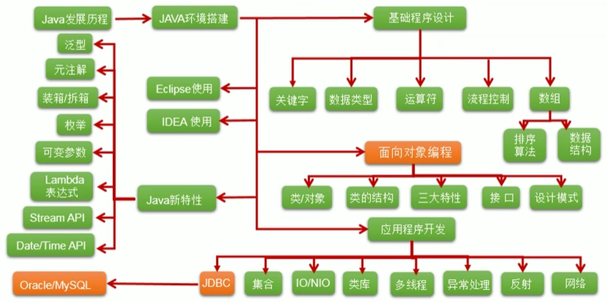

# Java 学习笔记



## 1. bit 与 byte

一个 0 或 1 存储为一个比特（bit），是计算机中**最小的存储单位**。

计算机中**最基本的存储单元**是字节（byte），每个字节由 8 个比特构成。

一个程序和它的数据在被 CPU 执行前，必须移到计算机的内存中。

## 2. 基本类型

在 Java 中，一共有 8 种基本类型，其中有 4 种整型、2 种浮点类型、1 种用于表示 Unicode 编码的字符单元的字符类型 char 和 1 种用户表示真值得 boolean 类型。

基本类型之间的运算规则（不包含 boolean 类型）：

**（1）自动类型提升**

当**容量小的类型**的变量与**容量大的类型**的变量做运算，结果自动提升为**容量大的类型**。

```
byte/char/short < int < long < float < double
```

byte、char、short 三种类型的变量，互相做运算或者同种类型变量做运算，结果至少是 int 类型。

容量大小是指数值的范围大小。

**（2）强制类型转换**

自动类型提升运算的**逆运算**。强制类型转换，可能导致精度损失。

```java
double d = 12.9;
int i = (int) d; // 截断操作，返回12
```

```java
int i = 128;
byte b = (byte) i; // 返回-128
```

注意事项：

```java
long l1 = 123321; // 不加L，会当做int类型，赋值给long类型，类型自动提升了
long l2 = 7893760276934276903; // 编译失败，过大的整数
long l3 = 7893760276934276903L;

float f1 = 12.3; // 编译失败，double转float失败
float f2 = 12.3F;
float f3 = (float) 12.3;
```

整型常量，默认类型为 int，浮点型常量，默认类型为 double：

```java
byte b = 12;
byte b1 = b + 1; // 编译失败，int转byte失败
float f = b + 12.3; // 编译失败，double转float失败
```

## 3. 数组

静态初始化：

```java
int[] arr = new int[]{ 0, 1 };
// 省去new的简化写法
int[] arr = {0,1};
// 不常用
int arr[] = new int[]{ 0, 1 }
```

动态初始化：

```java
String [] arr = new String[5];
int[] arr = new int[4]
```

数组元素根据**类型**不同，默认的初始化值也不同：

| 数组元素类型                      | 默认初始化值                                                 |
| --------------------------------- | ------------------------------------------------------------ |
| 整型，包括 byte、int、short、long | 0                                                            |
| 浮点型，包括 float、double        | 0.0                                                          |
| char 类型                         | `0` 或 `'\u000'`，而非 `'0'`，打印出来，是一个空格的效果。用默认初始化值与 0 判断是否相等，返回 true。 |
| 布尔类型                          | false                                                        |
| 引用类型                          | null                                                         |

**java.util.Arrays** 类是操作数组的工具类，包含了操作数组的各种方法（排序、搜索等）：

| 方法                                 | 描述                                 |
| ------------------------------------ | ------------------------------------ |
| `boolean equals(int[] a, int[] b)`   | 判断两个数组是否相等                 |
| `String toString(int[] a)`           | 输出数组信息                         |
| `void fill(int[] a, int val)`        | 将指定值填充到数组中                 |
| `void sort(int[] a)`                 | 对数组进行排序                       |
| `int binarySearch(int[] a, int key)` | 对排序后的数组进行二分法检索指定的值 |

`Arrays.asList()` 可以把数组转换成集合。

```java
Arrays.asList(new int[]{123, 456}); // 转换成的集合中只有一个元素
// 正确写法
Arrays.asList(new Integer[]{123, 456});
Arrays.asList(123, 456);
```

## 4. 比较器

Java 实现**对象排序**的方式有两种：

（1）自然排序，java.lang.Comparable

```java
String[] arr = new String[]{"DD", "AA", "BB", "CC"};

// 从小到大排序，因为String实现了Comparable接口
// 重写了compareTo(obj)方法，给出了比较两个String对象大小的方式
Arrays.sort(arr);
```

对于自定义类，如果需要排序，可以让自定义类实现 Comparable 接口，重写 `compareTo(obj)` 方法。

（2）定制排序，java.util.Comparator

```java
String[] arr = new String[]{"DD", "AA", "BB", "CC"};
// 字符串按照从大到小排序
Arrays.sort(arr, new Comparator() {

    @Override
    public int compare(Object o1, Object o2) {
        if (o1 instanceof String && o2 instanceof String) {
            String s1 = (String) o1;
            String s2 = (String) o2;
            return -s1.compareTo(s2);
        }
        throw new RuntimeException("输入的数据类型不是String");
    }
});
```

## 5. 注解

注解（Annotation）也叫元数据（MetaData）。

Annotation 可以像修饰符一样被使用，可用于修饰包、类、构造器、方法、成员变量、参数、局部变量的声明，这些信息被保存在 Annotation 的 `name=value` 对中。

Annotation 其实就是代码里的特殊标记，这些标记可以在编译、类加载、运行时被读取，并执行相应的处理。

一定程度上可以说：`框架 = 注解 + 反射 + 设计模式`。

**注解的使用示例：**

- 生成文档相关的注解
- 在编译时进行格式检查，使用 JDK 内置的基本注解，@Override、@Deprecated、@SuppressWarnings
- 跟踪代码依赖性，实现替代配置文件功能

**元注解：** 对于现有注解进行修饰的注解。JDK 提供了 4 种元注解：@Retention、@Target、@Documented、@Repeatable、@Inherited。

**自定义注解**必须配上注解的信息处理流程才有意义（使用反射）。如果自定义注解没有成员，表示是一个标识作用。

```java
@Inherited
@Retention(RetentionPolicy.RUNTIME)
@Target({TYPE, FIELD, METHOD, PARAMETER, CONSTRUCTOR, LOCAL_VARIABLE})
public @interface AnnotationDemo {
    String value() default "hello"; // 不是方法，是属性
}
```

读取注解，需要使用反射 API。

```java
// 判断注解是否存在，存在就读取
Class cls = Person.class;
if (cls.isAnnotationPresent(Report.class)) {
    Report report = cls.getAnnotation(Report.class);
    // ...
}
```

```java
// 直接读取注解，不存在就返回null
Class cls = Person.class;
Report report = cls.getAnnotation(Report.class);
if (report != null) {
   // ...
}
```

## 6. Lambda 表达式

Lambda 是一个匿名函数，可以把 Lambda 表达式理解为一段可以传递的代码。

在 Java 中，Lambda 表达式的本质就是**函数式接口的实例**。

使用**匿名实现类**表示的都可以用 Lambda 表达式来写。

```java
Runnable r1 = new Runnable() {
    @Override
    public void run() {
        System.out.println("Hello!");
    }
};
r1.run();

// 使用Lambda表达式进行改写
Runnable r2 = () -> System.out.println("Hello!");
r2.run();
```

```java
Comparator<Integer> com1 = new Comparator<Integer>() {
    @Override
    public int compare(Integer o1, Integer o2) {
        // return Integer.compare(o1, o2);
        return o1.compareTo(o2);
    } 
};
System.out.println(com1.compare(12, 21));

// 使用Lambda表达式进行改写
Comparator<Integer> com2 = (o1, o2) -> Integer.compare(o1, o2);
System.out.println(com2.compare(21, 12));
```

## 7. 函数式接口

只包含一个抽象方法的接口，称为函数式接口。

自定义函数式接口：

```java
@FunctionalInterface
public interface MyFunctionalInterface {
    void method();
}
```

## 8. Stream API

Stream API 可以对**集合数据**执行非常复杂的查找、过滤和映射数据等操作。

Collection 是一种静态的**内存**数据结构；而 Stream 是对数据进行运算，与 CPU 相关。

**下面介绍四种创建 Stream 的方式：**

1、通过 Collection 接口的默认方法 stream

```java
List<Employee> employees = EmployeeData.getEmployees();
// 顺序流
Stream<Employee> stream = employees.stream();
// 并行流
Stream<Employee> parallelStream = employees.parallelStream();
```

2、通过 Arrays 工具类中的静态方法 stream

```java
int[] arr = new int[]{ 1, 2, 3 };
IntStream stream = Arrays.stream(arr);

Employee[] arr2 = new Employee[]{ e1, e2 };
Stream<Employee> stream2 = Arrays.stream(arr2); 
```

3、通过 Stream 类的静态方法 of

```java
// 把传入的整型数据看作是包装类
Stream<Integer> stream = Stream.of(1, 2, 3, 4);
```

4、创建无限流

```java
// 迭代，遍历前十个偶数
Stream.iterate(0, t -> t + 2).limit(10).forEach(System.out::println);

// 生成
Stream.generate(Math::random).limit(10).forEach(System.out::println);
```

多个**中间操作**可以连接起来形成一个流水线，除非流水线上触发终止操作，否则中间操作不会执行任何处理。而在终止操作时，一次性全部处理，称为**惰性求值**。

**下面 3 种中间操作：**

1、筛选与切片

```java
List<Employee> list = EmployeeData.getEmployees();

// filter，接收Lambda，从流中排除某些元素
list.stream().filter(e -> e.getSalary() > 10000).forEach(System.out::println);

// limit，截断流，使其元素不超过给定数量
list.stream().limit(3).forEach(System.out::println);

// skip，跳过元素，返回一个扔掉了前n个元素的流，若流中元素不足n个，则返回一个空流
list.stream().limit(3).forEach(System.out::println);

// distinct，筛选，通过流所生成元素的hashCode、equals去除重复元素
list.stream().distinct().forEach(System.out::println);
```

2、映射

map：接收一个函数作为参数，该函数会被应用到每个元素上，并将其映射成一个新的元素。

flatMap：接收一个函数作为参数，将流中的每个值都转换成另一个流，然后将所有流连接成一个流。

```java
List<Employee> employees = EmployeeData.getEmployees();

// map
Stream<String> namesStream = employees.stream().map(Employee::getName);
namesStream.filter(name -> name.length > 3).forEach(System.out::println);
```

```java
public class StreamAPITest {
    @Test
    public void test1() {
        List<String> list = Arrays.asList("aa", "bb", "cc", "dd");
        // map写法
        Stream<Stream<Character>> streamStream = list.stream().map(StreamAPITest::fromStringToStream);
        streamStream.forEach(s -> {
            s.forEach(System.out::println);
        });

        System.out.println();

        // flatMap写法
        Stream<Character> characterStream = list.stream().flatMap(StreamAPITest::fromStringToStream);
        characterStream.forEach(System.out::println);
    }


    public static Stream<Character> fromStringToStream(String str) {
        ArrayList<Character> list = new ArrayList<>();
        for (Character c : str.toCharArray()) {
            list.add(c);
        }
        return list.stream();
    }
}
```

3、排序

```java
// 自然排序
List<Integer> list = Arrays.asList(12, 32, 76, -3, 98, 102, -1, 0);
list.stream().sorted().forEach(System.out::println);
```

```java
// 定制排序
List<Employee> employees = EmployeeData.getEmployees();
employees.stream().sorted((e1, e2) -> {
    int ageVal = Integer.compare(e1.getAge(), e2.getAge());
    if (ageVal != 0) {
        return ageVal;
    } else {
        return Double.compare(e1.getSalary(), e2.getSalary);
    }
}).forEach(System.out::println);
```

**终止操作分成 3 种类型：**

1、匹配与查找

allMatch、anyMatch、noneMatch、findFirst、findAny、count、max、min、forEach

forEach 是**内部迭代**（使用 Collection 接口需要用户去做迭代，称为外部迭代），Stream API 使用内部迭代（它帮我们把迭代做了）。

```java
List<Employee> employees = EmployeeData.getEmployees();
// Optional类型
Optional<Employee> employee = empolyees.stream().findFirst();

// 流中元素的个数
long count = empolyees.stream().count();

// 流中最大值
Stream<Double> salaryStream = employees.stream().map(e -> e.getSalary());
Optional<Double> maxSalary = salaryStream.max(Double::compare);
```

2、归约

reduce，可以将流中元素反复结合起来，得到一个值。

```java
List<Integer> list = Arrays.asList(1, 2, 3, 4, 5, 6, 7, 8, 9, 10);
Integer sum = list.stream().reduce(0, Integer::sum);
```

```java
List<Employee> employees = EmployeeData.getEmployees();
Stream<Double> salaryStream = employees.stream().map(Employee::getSalary);
// Optional<Double> sumMoney = salaryStream.reduce(Double::sum);
Optional<Double> sumMoney = salaryStream.reduce((d1, d2) -> d1 + d2);
```

3、收集

collect，将流转换成其它形式。接收一个 Collector 接口的实现，用于给 Stream 中元素做汇总的方法。Collector 接口中方法的实现决定了如何对流执行收集的操作，比如收集到 List、Set、Map 等。

```java
List<Employee> employees = EmployeeData.getEmployees();
List<Employee> employeeList = employees.stream()
    .filter(e -> e.getSalary() > 6000).collect(Collectors.toList());
```

## 9. Optional 类

`Optional<T>` 类（java.util.Optional）是一个容器类，它可以保存类型 T 的值，代表这个值存在，或者仅仅保存 null，表示这个值不存在。可以避免空指针异常。

Optional 类的 JavaDoc 描述如下：这是一个可以为 null 的容器对象，如果值存在则 isPresent 方法会返回 true，调用 get 方法会返回该对象。

```java
Girl girl = null;
// ofNullable(T t)，t可以为null
Optional<Girl> optionalGirl = Optional.ofNullable(girl);
// orElse(T t)
Girl girl1 = optionalGirl.orElse(new Girl("Lucy"));
```

## 10. 方法引用

当要传递给 Lambda 体的操作，已经有实现的方法了，可以使用**方法引用**。

**方法引用**可以看做是 Lambda 表达式深层次的表达，换句话说，方法引用就是 Lambda 表达式，也就是函数式接口的一个实例，通过方法的名字来指向一个方法，可以认为是 Lambda 表达式的一个语法糖。

方法引用要求，实现接口的抽象方法的参数列表和返回值类型，必须与方法引用的方法的参数列表和返回值类型保持一致（不适用于情境 3）！使用的时候，用操作符 `::` 将类/对象与方法名分隔开来。

**方法引用的 3 种情境：**

1、对象::实例方法名

```java
Consumer<String> con1 = str -> System.out.println(str);
con1.accept("11");

// Consumer中的void accept(T t)、PrintStream中的void println(T t)
Consumer<String> con2 = System.out::println;
con2.accept("22");
```

```java
Employee emp = new Employee(1001, "Zoe", 18, 20000);
Supplier<String> sup1 = () -> emp.getName();
sup1.get();

// Supplier中的T get()、Employee中的String getName()
Supplier<String> sup2 = emp::getName;
sup2.get();
```

2、类::静态方法名

```java
Comparator<Integer> com1 = (t1, t2) -> Integer.compare(t1, t2);
System.out.println(com1.compare(12, 21));

// Comparator中的int compare(T t1, T t2)、Integer中的int compare(T t1, T t2)
Comparator<Integer> com2 = Integer::compare;
System.out.println(com2.compare(21,12));
```

```java
Function<Double, Long> func = new Function<Double, Long>() {
    @Override
    public Long apply(Double d) {
        return Math.round(d);
    }
};
System.out.println(func.apply(12.3));

Function<Double, Long> func1 = d -> Math.round(d);
System.out.println(func.apply(12.3));

// Function中的R apply(T t)、Math中的Long round(Double d)
Function<Double, Long> func2 = Math::round;
System.out.println(func.apply(12.3));
```

3、类::实例方法名

```java
Comparator<String> com1 = (s1, s2) -> s1.compareTo(s2);
System.out.println(com1.compare("abc", "abd"));

// Comparator中的int compare(T t1, T t2)、String中的int t1.compareTo(t2)
Comparator<String> com2 = String::compareTo;
System.out.println(com2.compare("abc", "abd"));
```

```java
BiPredicate<String, String> pre1 = (s1, s2) -> s1.equals(s2);
System.out.println(pre1.test("abc", "abd"));

// BiPredicate中的boolean test(T t1, T t2)、String中的boolean t1.equals(t2)
BiPredicate<String, String> pre2 = String::equals;
System.out.println(pre2.test("abc", "abc"));
```

```java
Employee employee = new Employee(1001, "Zoe", 18, 20000);
Function<Employee, String> func1 = e -> e.getName();
System.out.println(func1.apply(employee));

// Function中的R apply(T t)、Employee中的String getName()
Function<Employee, String> func2 = Employee::getName;
System.out.println(func2.apply(employee));
```

**构造器引用**与方法引用类似，函数式接口的抽象方法的形参列表和构造器的形参列表一致，抽象方法的返回值类型即为构造器所属的类的类型。

```java
Supplier<Employee> sup = new Supplier<Employee>() {
 @Override
 public Employee get() {
  return new Employee();
 }
}
sup.get();

Supplier<Employee> sup1 = () -> new Empolyee();
sup1.get();

Supplier<Employee> sup2 = Empolyee::new;
sup2.get();
```

**数组引用**，可以把数组看做是一个特殊的类，写法与构造器引用一致。

```java
Function<Integer, String[]> func1 = length -> new String[length];
String[] arr1 = func1.apply(5);

Function<Integer, String[]> func2 = String[]::new;
String[] arr2 = func2.apply(8);
```

## 11. 权限修饰符

Java 封装性的体现，需要权限修饰符来配合。

Java 提供了 4 种**权限修饰符**来修饰**类及类的内部结构**，体现类及类的内部结构在被调用时可见性的大小。

4 种权限修饰符（从小到大）：private、(缺省)、protected、public。

对于**类**的权限修饰，只能使用 public 和 (缺省)。

对于**类的内部结构**（属性、方法、构造器、内部类）的权限修饰，4 种权限修饰符都可以使用。

| 修饰符    | 类内部 | 同一个包 | 不同包的子类 | 同一个工程 |
| --------- | ------ | -------- | ------------ | ---------- |
| private   | yes    |          |              |            |
| (缺省)    | yes    | yes      |              |            |
| protected | yes    | yes      | yes          |            |
| public    | yes    | yes      | yes          | yes        |

## 12. static、final

用 static 修饰的变量，无论 new 了多少个实例，该变量只创建一次；用 final 修饰表示常量，不可修改。

final 可以用来修饰类、方法、属性、局部变量。

1、修饰类，表示此类不能被其它类所继承，比如 String、System、StringBuffer。

2、修饰方法，表示此方法不可以被重写，比如 Object 类中的 getClass 方法。

3、修饰属性，可以显式初始化、在代码块中初始化、在构造器中初始化。

4、修饰局部变量，比如方法形参，表示在方法体中不能对该形参进行重新赋值。

static final 用来修饰属性，表示全局常量。

## 13. 泛型

泛型，就是允许在定义类、接口时，通过一个标识来表示类中某个属性的类型或者某个方法的返回值及参数类型。这个类型参数将在使用时确定。

## 14. 其它

JDK 包含 JRE，JRE 包含 JVM。

**元数据：** 对现有数据进行修饰的数据。

基本数据类型、包装类与 String 三者之间如何转换？

在 Javabean 中，要求提供一个 public 的空参构造器，原因是：

- 便于通过反射，创建运行时类的对象。
- 便于子类继承此运行类时，默认调用 super 方法。

把 source 中的每个属性拷贝到 target 中：

```
BeanUtils.copyProperties(source, target)
```

Java 判空：

```java
ObjectUtils.isEmpty()
```

获取 [a, b] 范围的随机数：

```java
(int)(Math.random() * (b - a + 1) + a);
```

JavaBean 是一种 Java 语言写成的可重用组件。

所谓 JavaBean，是指符合如下标准的 Java 类：类是公共的；有一个无参的公共的构造器；有属性，且属性有对应的 get、set 方法。

用户可以使用 JavaBean 将功能、处理、值、数据库访问和其它任何可以用 Java 代码创造的**对象**进行打包，并且其他的开发者可以通过内部的 JSP 页面、Servlet、其它的 JavaBean、applet 程序或者应用来使用这些**对象**。用户可以认为 JavaBean 提供了一种随时随地的复制和粘贴的功能，而不用关心任何改变。

## 疑问

可变形参？

同步监视器？

共享数据？
