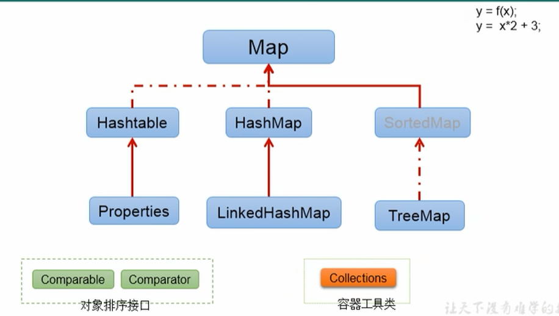

## Java 集合

集合、数组都是对多个数据进行存储的操作的结构，简称 Java 容器。

在 Java 中，**集合类**通常属于 java.util 包中。

Java 集合主要由 2 大体系构成，分别是 **Collection 体系**和 **Map 体系**，其中 Collection 和 Map 分别是 2 大体系中的**顶层接口**。

**Collection 接口**，单列数据，定义了存取一组对象的方法的集合，List、Set 是 Collection 的子接口。

- List，有序、可重复的集合，主要实现类有 ArrayList、LinkedList、Vector。

- Set，无序、不可重复的集合，主要实现类有 HashSet、LinkedHashSet、TreeSet。

**Map 接口**，双列数据，保存具有映射关系的 **key-value 对**的集合，其中 key 必须唯一，主要实现类有 HashMap、LinkedHashMap、TreeMap、HashTable、Properties。




## 1. Collection 接口常用方法

- `add(Object obj)`：将元素添加到当前集合中。
- `addAll(Collection coll)`：将 coll 中的元素添加到当前集合中。
- `size()`：获取当前集合中元素的个数。
- `clear()`：清空当前集合中的所有元素。
- `isEmpty()`：判断当前集合是否为空，即当前集合中元素的个数是否为 0。
- `contains(Object obj)`：判断当前集合中是否包含 obj，会调用 obj 所在类的 equals 方法。
- `containsAll(Collection coll)`：判断形参 coll 中的所有元素是否都存在于当前集合中。
- `remove(Object obj)`：从当前集合中移除 obj，会调用 obj 所在类的 equals 方法。
- `removeAll(Collection coll)`：从当前集合中移除 coll 中的所有元素。
- `retainAll(Collection coll)`：获取当前集合与 coll 的交集元素。
- `equals(Object obj)`：比较两个集合是否相等，相等的前提是集合中的所有元素都相等。
- `hashCode()`：返回当前对象的哈希值。
- `toArray()`：把集合转换成数组。
- `iterator()`：返回迭代器 Iterator 接口的实例，用于遍历集合元素。

**向 Collection 接口的实现类对象中添加 obj，要求 obj 所在类重写 equals 方法。**

## 2. Iterator 迭代器接口

Iterator 对象称为迭代器（设计模式的一种），主要用于遍历 Collection 集合中的元素。

GOF 给迭代器模式的定义为：提供一种方法访问一个容器对象中各个元素，而又不需暴露该对象的内部细节。迭代器模式，就是为容器而生。

Collection 接口继承了 java.lang.Iterable 接口，该接口有一个 `iterator()` 方法，那么所有实现了 Collection 接口的集合类都有一个 `iterator()` 方法，用于返回一个实现了 Iterator 接口的对象。

集合对象每次调用 `iterator()` 方法，都得到一个全新的迭代器对象，默认游标都在集合的第一个元素之前。

Iterator 接口内部定义了 `remove()` 方法，可以在遍历的时候，删除集合中的元素。注意，此方法不同于集合直接调用 `remove()` 方法。

```java
Collection coll = new ArrayList();
coll.add(123);
coll.add(456);
coll.add(new String("Zoe"));
coll.add(false);

Iterator iterator = coll.iterator();

while (iterator.hasNext()) {
    Object obj = iterator.next();
    if ("Zoe".equals(obj)) {
        iterator.remove();
    }
}

iterator = coll.iterator();
while (iterator.hasNext()) {
    System.out.println(iterator.next());
}
```

**增强 for 循环**也叫 foreach 循环，内部调用了迭代器，可以遍历集合和数组。

```java
for (Object obj : coll) {
    System.out.println(obj);
}
```

```java
int[] arr = new int[]{1, 2, 3, 4, 5};
for (int i : arr) {
    System.out.println(i);
}List
```

## 3. List 接口

List 接口是 Collection 接口的子接口，用于存储有序、可重复的数据，主要实现类有 ArrayList、LinkedList、Vector。

- ArrayList 是 List 接口的主要实现类，线程不安全，执行效率高。底层使用 `Object[]` elementData 存储。
- LinkedList 底层使用双向链表存储，对于频繁的插入、删除操作，执行效率比 ArrayList 高。
- Vector 是 List 接口的古老实现类，线程安全的，执行效率低。底层使用 `Object[]` elementData 存储。

List 接口常用方法：

- `void add(int index, Object ele)`：在 index 位置插入 ele 元素。
- `boolean addAll(int index, Collection eles)`：从 index 位置开始将 eles 中所有元素添加到当前集合中。
- `Object get(int index)`：获取指定 index 位置的元素。
- `int indexOf(Object obj)`：返回 obj 在集合中首次出现的位置，如果不存在，返回 -1。
- `int lastIndexOf(Object obj)`：返回 obj 在集合中末次出现的位置，如果不存在，返回 -1。
- `Object remove(int index)`：移除指定 index 位置的元素，并返回此元素。
- `Object set(int index, Object ele)`：设置指定 index 位置的元素为 ele。
- `List subList(int fromIndex, int toIndex)`：返回从 fromIndex 到 toIndex 位置的左闭右开区间的子集合。

## 4. Set 接口

Set 接口是 Collection 的子接口，用于存储无序、不可重复的数据，主要实现类有 HashSet、LinkedHashSet、TreeSet。

- HashSet：是 Set 接口的主要实现类，线程不安全，可以存储 null。
- LinkedHashSet：是 HashSet 的子类。在添加数据时，每个数据维护了两个引用，记录此数据的前后数据，所以可以按照添加的顺序遍历其内部数据。对于频繁的遍历操作，其效率高于 HashSet。
- TreeSet：可以按照添加对象的指定属性，进行排序。

Set 接口没有提供额外的方法，使用的都是 Collection 接口中的方法。

**Set 用于存储无序、不可重复的数据，怎么理解？以 HashSet 为例进行说明。**

- 无序性：不等同于随机性。存储的数据在底层数组中并非按照数组索引的顺序进行添加，而是根据数据的哈希值决定其添加顺序的。
- 不可重复：保证添加的元素按照 `equals()` 判断时，不能返回 true，即相同的元素只能添加一个。

**Set 添加元素的过程是怎样的？以 HashSet 为例进行说明。**

HashSet 底层：数组 + 链表的结构。


向 Set 中添加的数据，其所在的类一定要重写 `hashCode()` 和 `equals()` 方法，以实现对象相等规则，即**相等的对象必须具有相等的散列码。**


