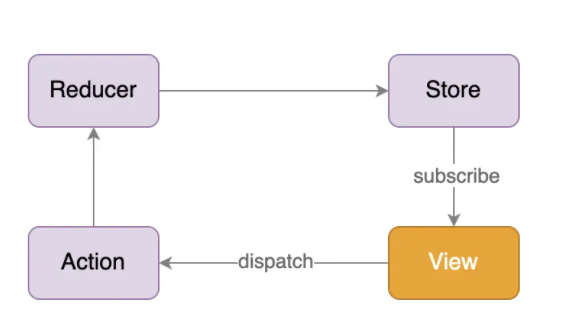

# react-redux 用法学习

react-redux 的作用是建立一个桥梁，让 React 和 Redux 实现互通。

在 react-redux 的实现中，为了确保需要绑定的组件能够访问到全局唯一的 Redux Store，利用了 React 的 Conext 机制去存放 Store 信息，通常会将这个 Context 作为整个 React 应用程序的根节点。

在 React 中使用 Redux 的单向数据流：



## 1 理解

react-redux 将所有组件分为两大类：

#### (1) UI 组件

UI 组件只负责 UI 的呈现，不带任何业务逻辑，通过 props 接收数据（一般数据和函数），不使用 Redux 的 API，一般保存在 components 文件夹下。如下面案例中的 Counter 组件。

#### (2) 容器组件

负责管理数据和业务逻辑，不负责 UI 的呈现，使用 Redux 的 API，一般保存在 containers 文件夹下，如下面案例中的 App 组件。

## 2 相关 API

#### (1) Provider

让所有组件都可以得到 state 数据：

```jsx
<Provider store={store}>
  <App />
</Provider>
```

#### (2) connect

用于包装 UI 组件生成容器组件：

```jsx
import { connect } from 'react-redux'

connect(
  mapStateToProps,
  mapDispatchToProps,
)(Counter)
```

#### (3) mapStateToProps

将外部的数据（即 state 对象）转换为 UI 组件的标签属性：

```jsx
const mapStateToProps = state => ({ count: state })
```

#### (4) mapDispatchToProps

将分发 action 的函数转换为 UI 组件的标签属性，简洁语法可以直接指定为 actions 对象或包含多个 action 方法的对象。

## 3 使用步骤

1、下载依赖包：

```bash
npm install --save react-redux
npm install --save prop-types
npm install --save redux-thunk
```

2、在 redux 文件夹中新建 action-types.js、actions.js、reducers.js、store.js 文件：

```jsx
// store.js
import { createStore, applyMiddleware } from 'redux'
import thunk from 'redux-thunk'
import { counter } from './reducers' 

// 生成一个store对象
const store = createStore(
  counter,
  applyMiddleware(thunk), // 应用异步的中间件
) // 内部会第一次调用reducer函数得到初始state
export default store
```

```jsx
// action-types.js
// 包含所有action type的常量字符串
export const INCREMENT = 'INCREMENT'
export const DECREMENT = 'DECREMENT'
```

```jsx
// actions.js
/**
 * 同步的action返回一个对象
 * 异步的action返回一个函数
 **/
import { INCREMENT, DECREMENT } from './action-types'

export const increment = (number) => ({ type: INCREMENT, data: number })
export const decrement = (number) => ({ type: DECREMENT, data: number })
/**
 * 异步action
 * 在store.js中应用异步的中间件applyMiddleware(thunk)，才可以返回一个函数，默认只能返回对象
 */
export const incrementAsync = (number) => (
  dispatch => {
    // 异步的代码
    setTimeout(() => {
      // 1秒后才去分发一个同步的action
      dispatch(increment(number))
    }, 1000)
  }
)
```

```jsx
// reducers.js
// 包含n个reducer函数的模块
// 根据老的state和action返回一个新的state
import { combineReducers } from 'redux'
import { ADD_COMMENT, DELETE_COMMENT, RECEIVE_COMMENTS, INCREMENT, DECREMENT } from './action-types'

function counter(state = 0, action) {
  switch (action.type) {
    case INCREMENT:
      return state + action.data
    case DECREMENT:
      return state - action.data
    default:
      return state
  }
}

function comments(state = [], action) {
  switch (action.type) {
    case ADD_COMMENT:
      return [action.data, ...state]
    case DELETE_COMMENT:
      return state.filter((item, key) => action.data !== key)
    case RECEIVE_COMMENTS:
      return action.data
    default: // 进来第一次会走default
      return state
  }
}

export default combineReducers({ counter, comments })

// 如果不止一个reducer，redux向外暴露的state的数据结构？
// { counter: 12, comments: [] }
```

3、在主组件中，比如本案例 index.js 中，从 react-redux 中引入组件 Provider，把 App 组件包起来，同时把 store 对象传给组件 Provider：

```jsx
import React from 'react'
import ReactDOM from 'react-dom'
import { Provider } from 'react-redux'

import App from './containers/App'
import store from './redux/store'

ReactDOM.render((
  <Provider store={store}>
    <App />
  </Provider>
), document.getElementById('root'))
```

4、在子组件中，比如本案例 Counter.js 中，通过 props 获取状态和 actions：

```jsx
import PropTypes from 'prop-types'

export default class Counter extends Component {
  static propTypes = {
    count: PropTypes.number.isRequired,
    increment: PropTypes.func.isRequired,
    decrement: PropTypes.func.isRequired,
    incrementAsync: PropTypes.func.isRequired,
  }

  incrementAsync = () => {
    const num = this.refs.numSelect.value * 1
    this.props.incrementAsync(num) // 异步操作放在Redux中
    // setTimeout(() => {
    //   this.props.increment(num)
    // }, 1000)
  }
  ...
}
```

5、新建一个 containers 文件夹，在文件夹中新建文件 App.js，在 App.js 中引入 react-redux 中的 connect 方法，引入 actions、Counter 组件，用 connect 方法把 Counter 组件包装一下（把状态和 actions 注入 Counter 组件），然后暴露出去：

```jsx
import { connect } from 'react-redux'

import { increment, decrement, incrementAsync } from '../redux/actions'
import Counter from '../components/Counter'

export default connect(
  state => ({ count: state }), // state就是一个count数字
  { increment, decrement, incrementAsync }
)(Counter)
```

## 4 在函数组件中使用 Redux

完成上面的步骤 3 之后，就可以在函数组件使用 Redux 了。

需要利用 react-redux 提供的两个 Hooks：useSelector 和 useDispatch。

useSelector 可以让一个组件能够在 Store 中的某些数据发生变化时重新 render。

下面是一个例子：

```react
import React from 'react'
import { useSelector, useDispatch } from 'react-redux'

export function Counter() {
  // 从state中获取当前的计数值
  const count = useSelector(state => state.value)

  // 获得当前store的dispatch方法
  const dispatch = useDispatch()

  // 在按钮的click时间中去分发action来修改 store
  return (
    <div>
      <button onClick={() => dispatch({ type: 'INCREMENT' })}>+</button>
      <span>{count}</span>
      <button onClick={() => dispatch({ type: 'DECREMENT' })}>-</button>
    </div>
  )
}
```

## 5 异步 action

Redux 默认是不能处理异步逻辑的，如果需要在 Redux 中执行异步任务（Ajax、定时器等），需要用到 Redux 提供的 middleware 机制。

利用 middleware 机制，Redux 提供了 redux-thunk 这样一个中间件，它如果发现接受到的 action 是一个函数（同步 action 是对象），那么就不会传递给 reducer，而是执行这个函数，并把 dispatch 作为参数传给这个函数，因此在这个函数中，我们可以自由决定何时、如何发送 action。

比如，通常可以 dispatch 一个函数来发送请求：

```javascript
import { useDispatch } from 'react-redux'

function fetchData() {
  return dispatch => {
    dispatch({ type: 'FETCH_DATA_BEGIN' })
    fetch('/some-url')
      .then(res => {
        dispatch({ type: 'FETCH_DATA_SUCCESS', data: res })
      })
      .catch(err => {
        dispatch({ type: 'FETCH_DATA_FAILURE', error: err })
      })
  }
}

function DataList() {
  const dispatch = useDispatch()
  // dispatch了一个函数由redux-thunk中间件去执行
  // 这里fetchData后面应该不能有括号吧？？？
  dispatch(fetchData())
}
```

异步 action 并不是一个具体的概念，而可以把它看作是 Redux 的一个使用模式，它通过组合使用同步 action ，在没有引入新概念的同时，用一致的方式提供了处理异步逻辑的方案。

## 6 使用 Redux 调试工具

1、安装 Chrome 浏览器插件

2、下载工具依赖包

```bash
npm install --save-dev redux-devtools-extension
```

3、在 store.js 中使用插件把中间件包起来

```jsx
import { createStore, applyMiddleware } from 'redux'
import { composeWithDevTools } from 'redux-devtools-extension'
import thunk from 'redux-thunk'

import { counter } from './reducers'
// 生成一个store对象
const store = createStore(
  counter,
  composeWithDevTools(applyMiddleware(thunk)), // 应用异步的中间件
) // 内部会第一次调用reducer函数得到初始state
export default store
```
