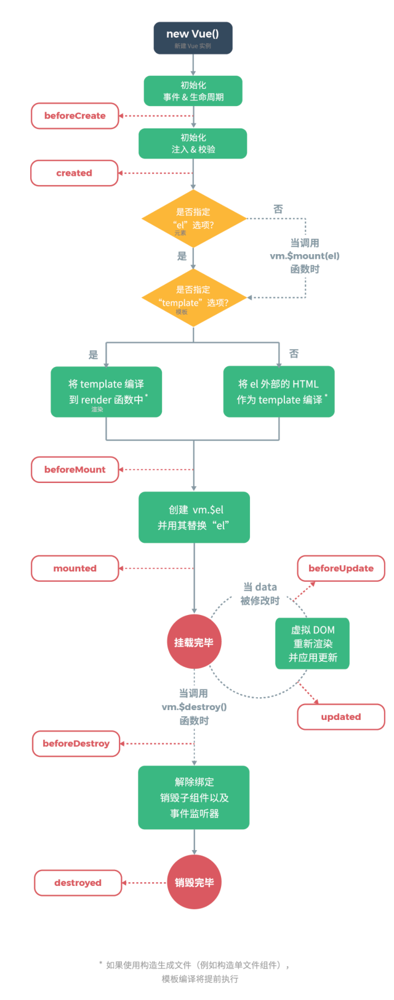

# Vue 核心

代码地址：<https://github.com/zoeeying/vue-learning>

## 1 模板语法

双大括号的文本插值语法也叫 **Mustache 语法**。使用 `v-once` 指令，可以执行一次性的插值，即数据改变的时候，插值处的内容不会改变，但要注意这会影响到该节点上的其它数据绑定。

```vue
<span v-once>这个将不会改变: {{ msg }}</span>
```

## 2 全局 API

全局 API 是指在构造器外部用 Vue 提供给我们的 API 函数定义新的功能。

### 2.1 Vue.directive

Vue.directive 用于注册或获取全局指令。

```vue
<div id="app">
  <div v-zoe="color">{{num}}</div>
  <p>
    <button @click="add">增加</button>
  </p>
</div>
<p>
  <button onclick="unbind()">解绑</button>
</p>
<script type="text/javascript">
  // 销毁不能使用Vue的方法，需要使用原生的onclick以及定义函数的方式，且按钮要写在id为app的div外边
  function unbind() {
    app.$destroy() // 销毁
  }

  // Vue.directive('zoe', function (el, binding, vnode) {
  //   // el是dom元素，这里将会被bind和update调用
  //   el.style = "color:" + binding.value
  //   console.log(binding)
  // })

  Vue.directive('zoe', {
    bind: function (el, binding) {
      console.log('1 - bind')
      el.style = "color:" + binding.value
    },
    inserted: function () {
      console.log('2 - inserted')
    },
    update: function () {
      console.log('3 - update')
    },
    componentUpdated: function () {
      console.log('4 - componentUpdated')
    },
    unbind: function () {
      console.log('5 - unbind')
    }
  })

  // getter，返回已注册的指令
  // var myDirective = Vue.directive('zoe')

  var app = new Vue({
    el: '#app',
    data: {
      num: 1,
      color: 'red'
    },
    methods: {
      add: function () {
        this.num++
      }
    }
  })
</script>
```

#### (1) binding 对象

Vue.directive 中传递的回调函数中的 binding 对象：

```javascript
{
  def: {bind: ƒ, update: ƒ}
  expression: "color" // 表达式
  modifiers: {}
  name: "zoe" // 自定义指令名称
  rawName: "v-zoe"
  value: "red"
}
```

#### (2) 自定义指令的生命周期

自定义指令有五个生命周期函数，也叫作钩子函数：

**bind：** 指令第一次绑定到元素上时调用，只调用一次，这个钩子函数可以定义一个绑定时执行一次的初始化动作；bind 时父节点为 null；在 DOM 树绘制之前调用。

**inserted：** 被绑定元素插入父节点时调用；inserted 时父节点必须存在；在 DOM 树绘制之前调用；inserted 在 bind 之后。

**update：** 被绑定元素所在模板更新时调用，通过比较更新前后的绑定值，可以忽略不必要的模板更新。

**componentUpdated：** 被绑定元素所在模板完成一次更新周期后调用；componentUpdated 在 update 之后。

**unbind：** 只调用一次，指令与元素解绑时调用。

### 2.2 Vue.extend

Vue.extend 使用基础 Vue 构造器，创建一个**子类**，参数是一个包含组件选项的对象。`data` 选项是特例，需要注意，在 `Vue.extend()` 中它必须是函数。

```vue
<div id="zoe"></div>
<zoe></zoe>
<script type="text/javascript">
// 创建构造器
var zoeExtend = Vue.extend({
  template: "<p><a :href='zoeUrl'>{{zoeName}}</a></p>",
  data: function () {
    return {
      zoeUrl: 'https://zoeeying.github.io',
      zoeName: '小畅叙',
    }
  },
})
// 创建zoeExtend实例，并挂载到一个元素上
new zoeExtend().$mount('#zoe') // 挂载到id为zoe的div元素上，推荐使用
new zoeExtend().$mount('zoe') // 挂载到自定义的zoe元素上
</script>
```

### 2.3 Vue.set

`Vue.set(target, propertyName/index, value)` 向**响应式对象**中添加一个属性，并确保这个新属性同样是响应式的，且触发视图更新。它必须用于向响应式对象上添加新属性，因为 Vue 无法探测普通的新增属性。返回设置的值。注意对象不能是 Vue 实例，或者 Vue 实例的根数据对象。

**构造器外部数据**是指在构造器外部声明，然后被构造器内部的 data 引用。

```vue
<div id="app">
  <p>{{count}}</p>
  <ul>
    <li v-for="item in arr">{{item}}</li>
  </ul>
</div>
<p><button onclick="add()">增加数字</button></p>
<p><button onclick="change()">改变数组中第一个元素</button></p>
<script type="text/javascript">
function add() {
  // count是基本类型，这些方法都能实现改变count的目的
  // Vue.set(outData, 'count', 2)
  // Vue.set(app, 'count', 2)
  // app.count++
  outData.count++
}

function change() {
  // 如果数据是引用类型的，比如数组，那么只是改变数组中某个元素，需要使用Vue.set，页面才会更新
  // app.arr[1] = 'bbb'
  // outData.arr[1] = 'bbb'
  // Vue.set(outData.arr, 1, 'bbb')
  Vue.set(app.arr, 1, 'bbb')
}

var outData = {
  count: 1,
  arr: ['111', '222', '333'],
}

var app = new Vue({
  el: '#app',
  data: outData,
})
</script>
```

## 2 Lifecycle 生命周期

Vue 的生命周期函数（钩子函数）是在某些特定阶段会被自动触发的函数，我们可以利用这些函数在 Vue 的不同阶段操作数据或者改变内容。

```vue
<div id="app">
  <div>{{count}}</div>
  <p><button @click="add">增加</button></p>
</div>
<button onclick="app.$destroy()">销毁</button>
<script type="text/javascript">
  var app = new Vue({
    el: '#app',
    data: {
      count: 1
    },
    methods: {
      add: function () {
        this.count++
      }
    },
    beforeCreate: function () {
      console.log('1-beforeCreate 创建之前');
    },
    created: function () {
      // 用来在一个实例被创建之后执行代码
      // data准备好了，可以在这里加载loading动画
      console.log('2-created 创建完成');
    },
    beforeMount: function () {
      console.log('3-beforeMount 被挂载之前');
    },
    mounted: function () {
      // 可以在这里结束loading动画，显示正常页面
      // 虚拟DOM挂载完毕
      console.log('4-mounted 被挂载之后');
    },
    beforeUpdate: function () {
      console.log('5-beforeUpdate 更新前');
    },
    updated: function () {
      console.log('6-updated 更新后');
    },
    beforeDestroy: function () {
      console.log('9-beforeDestroy 销毁之前');
    },
    destroyed: function () {
      // 解除绑定，销毁子组件以及事件监听器
      console.log('10-destroyed 销毁之后')
    }
  })
</script>
```



## 3 Template 模板

#### (1) 在构造器的选项中创建模板

适用于模板代码比较少的情况。

```vue
<div id="app"></div>
<script type="text/javascript">
var app = new Vue({
  el: '#app',
  template: `<h2 style="color:blue">在构造器中创建模板</h2>`,
})
</script>
```

#### (2) 在 template 标签中创建模板

```vue
<div id="app"></div>
<template id="templateId">
  <!-- 需要包一层div -->
  <div>
    <h2 style="color:blue">在template标签中创建模板</h2>
  </div>
</template>
<script type="text/javascript">
kjjjjj,
 var app = new Vue({
   el: '#app',
   template: '#templateId'
 })
</script>
```

#### (3) 使用 script 标签创建模板

可以通过 script 标签的 src 属性进行外部引用。

```vue
<div id="app"></div>
<script type="x-template" id="scriptId">
<div>
  <h2 style="color:blue">使用script标签创建模板</h2>
</div>
</script>
<script type="text/javascript">
var app = new Vue({
  el: '#app',
  template: '#scriptId',
})
</script>
```

## 4 Component 组件

组件系统是 Vue 的一个重要概念，因为它是一种抽象，允许我们使用小型、独立和通常可复用的组件构建大型应用，几乎任意类型的应用界面都可以抽象为一个组件树。在 Vue 里，一个组件本质上是一个拥有**预定义选项**的一个 **Vue 实例**。

从使用的角度来说，组件其实就是我们自定义的标签，这些标签在 HTML 中是没有的。需要与自定义指令区分开。

### 4.1 全局组件

如下，zoe 就是我们定义的全局组件，必须在 Vue 的作用域内使用。所谓的**全局**体现在在 id 为 app 和 id 为 app2 的 div 中都能使用。

```vue
<div id="app">
  <zoe></zoe>
</div>
<div id="app2">
  <zoe></zoe>
</div>
<!-- 无效 -->
<!-- <zoe></zoe> -->
<script type="text/javascript">
Vue.component('zoe', {
  template: `<h4 style="color:green">全局的zoe组件</h4>`,
})
var app = new Vue({
  el: '#app',
})
var app2 = new Vue({
  el: '#app2',
})
</script>
```

### 4.2 局部组件

```vue
<div id="app">
  <panda></panda>
</div>
<script type="text/javascript">
var app = new Vue({
  el: '#app',
  components: {
    panda: {
      template: `<h4 style="color:blue">局部的panda组件</h4>`,
    },
  },
})
</script>
```

```vue
<!-- 在构造器外部写局部组件 -->
<div id="app">
  <panda></panda>
</div>
<script type="text/javascript">
var pandaComponent = {
  template: `<h4 style="color:blue">局部的panda组件</h4>`,
}
var app = new Vue({
  el: '#app',
  components: {
    panda: pandaComponent,
  },
})
</script>
```

### 4.3 props 属性设置

标签中如果有 aa-aaa 形式的属性，在构造器中必须写成小驼峰形式 aaAaa。标签中的属性也可以用 v-bind 绑定 data 中的数据。

```vue
<div id="app">
  <panda here="中国" from-here="四川" :adj="adj"></panda>
</div>
<script type="text/javascript">
var app = new Vue({
  el: '#app',
  data: {
    adj: '非常可爱',
  },
  components: {
    panda: {
      template: `<h2 style="color:red">熊猫来自于{{here}}{{fromHere}}，{{adj}}</h2>`,
      props: ['here', 'fromHere', 'adj'], // 使用props选项注册属性
    },
  },
})
</script>
```

### 4.4 父子组件关系

父组件通过 props 向子组件传值。

```vue
<!DOCTYPE html>
<html lang="en">
  <head>
    <meta charset="UTF-8" />
    <meta name="viewport" content="width=device-width, initial-scale=1.0" />
    <meta http-equiv="X-UA-Compatible" content="ie=edge" />
    <title>组件3</title>
    <script type="text/javascript" src="../assets/js/vue.js"></script>
  </head>

  <body>
    <h1>组件3</h1>
    <hr />
    <div id="app">
      <parent></parent>
    </div>
    <script type="text/javascript">
      var child = {
        template: `
          <h3 style="color:green">我是子组件，我接收了父组件传过来的值{{username}}</h3>
        `,
        props: ['username'],
      }
      var parent = {
        template: `
          <div>
            <h1 style="color:blue">我是父组件</h1>
            <child v-bind:username="username"></child>
          </div>
        `,
        data() {
          return {
            username: 'zoeeying',
          }
        },
        components: { child },
      }

      var app = new Vue({
        el: '#app',
        components: { parent },
      })
    </script>
  </body>
</html>
```

### 4.5 component 标签

component 标签是 Vue 内置的，可以根据 data 中的值动态地展示不同的组件。

```vue
<div id="app">
  <component :is="which"></component>
  <button @click="changeComponent">改变组件</button>
</div>
<script type="text/javascript">
var aaa = {
  template: `<h3 style="color:green">我是aaa组件</h3>`,
}
var bbb = {
  template: `<h3 style="color:red">我是bbb组件</h3>`,
}
var ccc = {
  template: `<h3 style="color:blue">我是ccc组件</h3>`,
}
var app = new Vue({
  el: '#app',
  data: {
    which: 'aaa',
    count: 1,
  },
  components: {
    aaa: aaa,
    bbb: bbb,
    ccc: ccc,
  },
  methods: {
    changeComponent: function () {
      let arr = ['aaa', 'bbb', 'ccc']
      this.which = arr[this.count % 3]
      this.count += 1
    },
  },
})
</script>
```

## 5 插槽

slot 是标签的内容扩展，也就是说使用 slot，可以在自定义组件的时候给组件传递内容，组件接收内容并输出。

```vue
<div id="app">
  <zoe>
    <template v-slot:url>
      <span>{{blogData.url}}</span>
    </template>
    <template v-slot:name>
      <span>{{blogData.name}}</span>
    </template>
    <template v-slot:description>
      <span>{{blogData.description}}</span>
    </template>
    其它信息
  </zoe>
</div>
<template id="myBlog">
  <div>
    <p>
      <span>博客地址：</span>
      <!-- 接收并显示值 -->
      <slot name="url"></slot>
    </p>
    <p>
      <span>博客名称：</span>
      <slot name="name"></slot>
    </p>
    <p>
      <span>博客描述：</span>
      <slot name="description"></slot>
    </p>
    <p>
      <span>其他信息：</span>
      <slot></slot>
    </p>
  </div>
</template>
<script type="text/javascript">
var app = new Vue({
  el: '#app',
  data: {
    blogData: {
      url: 'http://zoeeying.github.io',
      name: '小畅叙的博客',
      description: '黑客与画家',
    },
  },
  components: {
    zoe: {
      template: '#myBlog',
    },
  },
})
</script>
```

上面的例子中，我们在 zoe 组件中放了四个插槽，前三个是**具名**的（为 slot 标签添加了 name 属性），最后一个是默认的（name 属性值默认为 default）。在向具名插槽提供内容的时候，可以在 template 标签上使用 v-slot 指令。现在 template 标签中的所有内容都将会被传入相应的插槽。任何没有被包裹在 template 标签中的内容都会被视为默认插槽的内容。

#### (1) 作用域插槽

有的时候，我们需要让**插槽内容**能够访问子组件中才有的数据。直接看下面的例子吧。

```vue
<div id="app">
  <zoe>
    <template v-slot:default="slotProps">
      <span>{{blogData.description}}{{slotProps.others}}</span>
    </template>
  </zoe>
</div>

<template id="myBlog">
  <div>
    <span>博客描述：</span>
    <slot v-bind:others="others"></slot>
  </div>
</template>

<script type="text/javascript">
var app = new Vue({
  el: '#app',
  data: {
    blogData: {
      description: '黑客与画家',
    },
  },
  components: {
    zoe: {
      data() {
        return {
          // 注意一下是怎么在插槽内容中访问这个others数据的
          others: '，小畅叙的学习笔记',
        }
      },
      template: '#myBlog',
    },
  },
})
</script>
```

#### (2) 实例属性 $slots 和 $scopedSlots

在使用渲染函数书写一个组件时最有帮助。

**$slots：** 用来访问被**插槽分发**的内容。每个**具名插槽**有其相应的属性，比如 `v-slot:foo` 中的内容将会在 `vm.$slots.foo` 中被找到。`vm.$slots.default` 包括了所有没有被包含在具名插槽中的节点或 `v-slot:default` 中的内容。

**$scopedSlots：** 用来访问作用域插槽。对于包括默认 slot 在内的每一个插槽，该对象都包含一个返回相应 VNode 的函数。

## 6 渲染函数

Vue 推荐在绝大多数情况下使用模板来创建 HTML。然而在一些场景中，我们需要 JavaScript 的完全编程的能力，这时可以使用**渲染函数（render 函数）**，它比模板更接近编译器。

render 函数可以用 JS 来描述一个标签。

### 6.1 了解 render 函数

#### (1) 使用模板创建 HTML

```vue
<div id="app">
  <zoe></zoe>
</div>
<script type="text/javascript">
Vue.component('zoe', {
  template: `<h4>ZOE</h4>`,
})
var app = new Vue({
  el: '#app',
})
</script>
```

#### (2) 使用 render 函数改写上面的例子

事实上，编译的时候，会把 template 编译成 render 函数。

```vue
<div id="app">
  <zoe></zoe>
</div>
<script type="text/javascript">
// h是一个创建标签的函数
Vue.component('zoe', {
  render(h) {
    return h(
      'h4',
      {
        style: { color: 'green' },
      },
      'ZOE'
    )
  },
})
var app = new Vue({
  el: '#app',
})
</script>
```

#### (3) render 函数中传入自定义组件

如下例子所示，tyler 可以是一个组件，也可以是一个对象。

```vue
<div id="app">
  <zoe></zoe>
</div>
<script type="text/javascript">
// const tyler = Vue.component('tyler', {
//   template: '<input/>'
// })
const tyler = {
  template: '<input/>',
}
Vue.component('zoe', {
  render: h => h(tyler),
})
var app = new Vue({
  el: '#app',
})
</script>
```

### 6.2 利用 JavaScript 编程能力

有的情况下，使用 render 函数，利用 JavaScript 完全编程能力，可以避免写很多重复的代码。

#### (1) 不使用 render 函数

下面的例子，我们需要根据 zoe 组件中传入的不同的 level，来决定使用哪个标签。可以发现，我们写了很多重复的代码。

**注意：** level 属性需要通过 v-bind 绑定。

```vue
<div id="app">
  <zoe url="http://baidu.com" :level="1">百度</zoe>
</div>
<script type="text/javascript">
Vue.component('zoe', {
  props: ['url', 'level'],
  template: `
      <div>
        <h1 v-if="level===1">
          <a :href="url">
            <slot></slot>
          </a>
        </h1>
        <h2 v-if="level===2">
          <a :href="url">
            <slot></slot>
          </a>
        </h2>
        <h3 v-if="level===3">
          <a :href="url">
            <slot></slot>
          </a>
        </h3>
      </div>
    `,
})
var app = new Vue({
  el: '#app',
})
</script>
```

#### (2) 使用 render 函数

我们可以使用 render 函数改写上面的例子，同时扩展一下功能。

我们可以看到 h 函数的第二个参数是一个数组，我们可以通过循环的方式生成这个数组，再传递给 h 函数，从而实现 v-for 的效果，充分利用了 JavaScript 的编程能力。

```vue
<div id="app">
  <zoe url="http://baidu.com" level="1" val="我是输入框中的内容">百度</zoe>
</div>
<script type="text/javascript">
Vue.component('iii', {
  props: ['val'],
  template: '<input v-model="val"/>',
})
Vue.component('zoe', {
  props: ['url', 'level', 'val'],
  // 注意这里不要使用箭头函数，因为要使用this
  // 为什么使用this.level呢？？？
  render(h) {
    return h('h' + this.level, [
      h(
        'a', // 标签名称，可以使用拼接字符串
        {
          style: { color: 'red' },
          domProps: { href: this.url },
        },
        // this.$slots表示所有插槽
        // this.$slots.default表示子节点数组
        // 组件中传递不带v-slot指令的子节点时，这些子节点被存储在组件实例中的$slots.default中
        [
          h('button', this.$slots.default),
          h('iii', {
            props: {
              // 这里不能把插槽通过props传递给iii组件
              val: this.val,
            },
          }),
        ]
      ),
    ])
  },
})
var app = new Vue({
  el: '#app',
})
</script>
```

### 6.3 深入理解 render 函数

我们把上面例子中的 render 函数拿下来。

```javascript
render(h) {
  return h(
    'h4',
    {
      style: { color: 'green' }
    },
    'ZOE'
  )
}
```

可以看出，h 函数会返回 createNodeDescription（节点及其子节点的描述信息），即**虚拟节点（VNode）**。而**虚拟 DOM**是对由 Vue 组件树建立起来的整个 VNode 树的称呼。

#### (1) h 函数参数

**第一个参数：** 一个 HTML 标签名（String）、组件选项对象（Object）或者一个 async 函数（Function，可以 resolve 一个 HTML 标签或者组件选项对象），数据类型是 String、Object 或者 Function，必选参数。

**第二个参数：** 一个与模板中属性对应的数据对象，数据类型是 Object，可选参数。

**第三个参数：** 可以是由 h 函数生成的子级虚拟节点，放在**数组**中，也可以使用**字符串**来生成**文本虚拟节点**，数据类型是 Array 或者 String，可选参数。

#### (2) h 函数第二个参数

第二个参数是一个与模板中属性对应的数据对象。对象中的属性如下：

| 属性        | 描述                                                                               |
| ----------- | ---------------------------------------------------------------------------------- | --------------- |
| class       | 与 `v-bind:class` 的 API 相同，接受一个字符串、对象或者字符串和对象组成的数组      |
| style       | 与 `v-bind:style` 的 API 相同，接受一个字符串、对象或者对象组成的数组              |
| attrs       | 普通的 HTML attribute                                                              |
| props       | 组件 props                                                                         |
| domProps    | DOM 属性，与上面的 attrs 要区分开                                                  |
| on          | 里面可以放事件监听器，比如 click 等                                                |
| nativeOn    | 仅用于组件，用于监听原生事件，而不是组件内部使用 `vm.$emit` 触发的事件             |
| directives  | 自定义指令                                                                         |
| scopedSlots | 作用域插槽，格式为 `{ name: props => VNode                                         | Array<VNode> }` |
| slot        | 如果组件是其它组件的子组件，需为通过 slot 为插槽指定名称                           |
| key、ref    | 特殊顶层属性                                                                       |
| refInFor    | 如果在渲染函数中给多个元素都应用了相同的 ref 名，那么 `$refs.myRef` 会变成一个数组 |

#### (3) h 函数第三个参数

可以是通过 `this.$slots` 访问的静态插槽的内容，每个插槽都是一个 VNode 数组。

可以是通过 `this.$scopedSlots` 访问的作用域插槽，每个作用域插槽都是一个返回若干 VNode 的函数。

需要注意的是，子级虚拟节点不能重复。

```javascript
// 错误写法
render: function (h) {
  var myVNode = h('p', 'hi')
  return h('div', [
    myVNode, myVNode
  ])
}

// 正确写法
render: function (h) {
  return h('div',
    Array.apply(null, { length: 20 }).map(function () {
      return h('p', 'hi')
    })
  )
}
```

### 6.4 在 render 函数中使用 JSX

在 Vue 中使用 JSX 语法，我们必须要使用一个 Babel 插件。

首先安装 Babel 插件：

```bash
npm install @vue/babel-preset-jsx @vue/babel-helper-vue-jsx-merge-props
```

把 Babel 插件添加到 .babelrc：

```javascript
{
  "presets": ["@vue/babel-preset-jsx"]
}
```

然后，我们就可以在 render 函数中使用 JSX 了：

```vue
import Zoe from './Zoe.vue' new Vue({ el: '#app', render: function (h) { //
如果使用的Babel插件版本在3.4.0及以上，可以去掉这个h参数 return (
<Zoe level="{1}">
        <span>Hello</span> zoe!
      </Zoe>
) } })
```

## 7 过滤器

Vue.js 可以自定义过滤器，用于一些常见的**文本格式化**。

过滤器可以用在两个地方：双花括号插值和 `v-bind` 表达式。

```vue
<!-- 在双花括号中 -->
{{ message | myFilter }}

<!-- 在v-bind中 -->
<div v-bind:id="rawId | myFilter"></div>
```

message 和 rawId 就是过滤器函数中的 value。

**定义过滤器有两种方法：**

1、在组件的选项中通过 filters（filters 选项包含 Vue 实例可用过滤器的哈希表） 定义局部过滤器。

```javascript
filters: {
  myFilter: function (value) {
    // 返回处理后的值
  }
}
```

2、在创建 Vue 实例之前全局定义过滤器。

```javascript
// 注册过滤器
Vue.filter('myFilter', function (value) {
  // 返回处理后的值
})

// getter获取过滤器，返回已注册的过滤器
var myFilter = Vue.filter('myFilter')
```

当全局过滤器和局部过滤器重名时，会采用局部过滤器。
