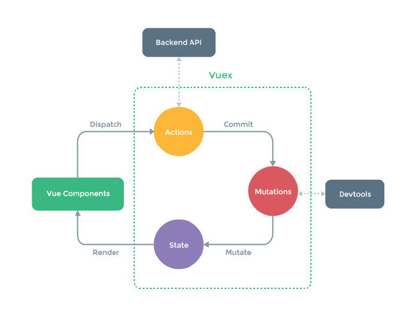

# Vuex

Vuex 是一个专为 Vue.js 应用程序开发的状态管理模式，它采用集中式存储管理应用的所有组件的状态，并以相应的规则保证状态以一种可预测的方式发生变化。

简单的**单向数据流**是指用户访问 View，View 发出用户交互的 Actions，在 Action 中对 State 进行相应更新，State 更新后会触发 View 更新，这样数据总是清晰地单向流动，便于维护并且可以预测。

* **State：** 驱动应用的数据源。

* **View：** 以**声明方式**将 State 映射到视图。

* **Actions：** 响应在 View 上的用户输入导致的状态变化。

但是，当我们的应用遇到**多个组件共享状态**时，单向数据流的简洁性很容易被破坏：

* 多个视图依赖于同一状态。
* 来自不同视图的行为需要变更同一状态。

可以考虑把组件的共享状态抽取出来，以一个全局单例模式管理，在这种模式下，我们的组件树构成了一个巨大的**视图**，不管在树的哪个位置，任何组件都能获取状态或者触发行为。



每一个 Vuex 应用的核心就是 store（仓库），**store** 基本上就是一个容器，它包含着应用中大部分的**状态（state）**。Vuex 和单纯的全局对象有以下**两点不同**：Vuex 的状态存储是响应式的；不能直接改变 store 中的状态（比如 `store.state.count = 21`，是不允许的），需要显式地**提交 mutation**。

通过如下命令安装 Vuex：

```bash
npm install vuex --save
```

## 1 入门

通过一个计数器小案例，简单认识一下 Vuex。

在项目根目录下新建文件夹 vuex，在 vuex 文件夹中新建文件 store.js，用于管理状态：

```javascript
import Vue from 'vue'
import Vuex from 'vuex'
Vue.use(Vuex)

// state是状态对象
const state = {
  count: 250
}

// 修改状态数据的方法
const mutations = {
  // 传递参数，第一个参数是固定的state对象，后面可以传递自定义的参数
  add(state, n) {
    state.count += n
  },
  reduce(state) {
    state.count--
  }
}

export default new Vuex.Store({ state, mutations })
```

在组件中显示状态、修改状态：

```vue
<template>
  <div>
    <h2>{{ msg }}</h2>
    <p>
      <!-- 第一个参数是方法名，后面可以传入自定义的参数 -->
      <!-- 可以在组件的methods中提交mutation来修改store中的state -->
      <button @click="$store.commit('add', 10)">+</button>
      <button @click="$store.commit('reduce')">-</button>
    </p>
    <!-- 可以通过在计算属性中返回，来调用store中的状态 -->
    <div>{{ $store.state.count }}</div>
  </div>
</template>
<script>
  import store from '@/vuex/store'
  export default {
    data() {
      return {
        msg: 'Hello Vuex'
      }
    },
    // 真正开发中，可以只给根组件添加store选项
    store
  }
</script>
```

**补充：** 单文件组件和全局的 component 方法定义组件，data 属性是一个函数，并且该函数返回了一个对象，为什么不能直接把对象赋值给 data 呢？

> 当一个组件被定义，data 必须声明为返回一个初始数据对象的函数，因为组件可能被用来创建多个实例。如果 data 仍然是一个纯粹的对象，则所有的实例将共享引用同一个数据对象！通过提供 data 函数，每次创建一个新实例后，我们能够调用 data 函数，从而返回初始数据的一个全新副本数据对象。

使用一个函数来返回一个对象可以保证每个组件实例中的 data 都是独立的。

## 2 state

Vuex 通过 `store` 选项，提供了一种机制将状态从根组件**注入**到每一个子组件中（需调用 `Vue.use(Vuex)`），子组件能通过 `this.$store` 访问到。

```javascript
const app = new Vue({
  el: '#app',
  // 把store对象提供给store选项，可以把store的实例注入所有的子组件
  store,
  components: { Counter },
  template: `
    <div class="app">
      <counter></counter>
    </div>
  `
})
```

```javascript
const Counter = {
  template: `<div>{{ count }}</div>`,
  computed: {
    count () {
      return this.$store.state.count
    }
  }
}
```

```javascript
// 当一个组件需要获取多个状态时候，将这些状态都声明为计算属性会有些重复和冗余，可以使用mapState辅助函数帮助我们生成计算属性
// 在单独构建的版本中辅助函数为Vuex.mapState
import { mapState } from 'vuex'

export default {
  // ...
  computed: mapState({
    count: state => state.count,

    // 传字符串参数'count'等同于state => state.count
    countAlias: 'count',

    // 为了能够使用this获取局部状态，必须使用常规函数
    countPlusLocalState (state) {
      return state.count + this.localCount
    }
  })
}
```

当映射的计算属性的名称与 state 的子节点名称相同时，我们也可以给 `mapState` 传一个字符串数组：

```javascript
computed: mapState([
  // 映射this.count为store.state.count
  'count'
])
```

## 3 mutation

更改 Vuex 的 store 中的状态的唯一方法是提交 mutation。Vuex 中的 mutation 非常类似于事件：每个 mutation 都有一个字符串的**事件类型（type）**和一个**回调函数（handler）**。这个回调函数就是我们实际进行状态更改的地方，并且它会接受 state 作为第一个参数：

```javascript
const store = new Vuex.Store({
  state: {
    count: 1
  },
  mutations: {
    increment (state) {
      // 变更状态
      state.count++
    }
  }
})
```

```javascript
// 提交mutation
store.commit('increment')
```

可以向 `store.commit` 传入额外的参数，即 mutation 的**载荷（payload，载荷应该是一个对象）**：

```javascript
// ...
mutations: {
  increment (state, payload) {
    state.count += payload.amount
  }
}
```

```javascript
store.commit('increment', {
  amount: 10
})
// 改写成对象形式，整个对象都作为载荷传给 mutation 函数
store.commit({
  type: 'increment',
  amount: 10
})
```

真正开发中，我们应该使用常量替代 Mutation 事件类型：

```javascript
// mutation-types.js
export const SOME_MUTATION = 'SOME_MUTATION'
```

```javascript
// store.js
import Vuex from 'vuex'
import { SOME_MUTATION } from './mutation-types'

const store = new Vuex.Store({
  state: { ... },
  mutations: {
    // 我们可以使用ES2015风格的计算属性命名功能来使用一个常量作为函数名
    [SOME_MUTATION] (state) {
      // mutate state
    }
  }
})
```

在组件中 commit mutation：

```javascript
import { mapMutations } from 'vuex'

export default {
  // ...
  methods: {
    ...mapMutations([
      'increment', // 将this.increment()映射为this.$store.commit('increment')
      // mapMutations也支持载荷：
      'incrementBy' // 将this.incrementBy(amount)映射为this.$store.commit('incrementBy', amount)
    ]),
    ...mapMutations({
      add: 'increment' // 将this.add()映射为this.$store.commit('increment')
    })
  }
}
```

## 4 getter

Vuex 允许我们在 store 中定义 getter（可以认为是 store 的计算属性）。就像计算属性一样，getter 的返回值会根据它的依赖被**缓存**起来，且只有当它的依赖值发生了改变才会被重新计算。

store.js 中，加上 getters：

```javascript
const store = new Vuex.Store({
  state: {
    todos: [
      { id: 1, text: '...', done: true },
      { id: 2, text: '...', done: false }
    ]
  },
  getters: {
    // getter接受state作为其第一个参数
    doneTodos: state => {
      return state.todos.filter(todo => todo.done)
    }
  }
})
```

#### (1)  通过属性访问

getter 在通过属性访问时是作为 Vue 的响应式系统的一部分**缓存**其中的。

getter 会暴露为 store.getters 对象，可以以属性的形式访问这些值：

```javascript
store.getters.doneTodos // => [{ id: 1, text: '...', done: true }]
```

getter 也可以接受其他 getter 作为第二个参数：

```javascript
getters: {
  // ...
  doneTodosCount: (state, getters) => {
    return getters.doneTodos.length
  }
}
```

```javascript
store.getters.doneTodosCount // => 1
```

在组件中使用 getter：

```javascript
computed: {
  doneTodosCount () {
    return this.$store.getters.doneTodosCount
  }
}
```

#### (2) 通过方法访问

getter 在通过方法访问时，每次都会去进行调用，而**不会缓存结果**。

可以通过让 getter 返回一个函数，来实现给 getter 传参：

```javascript
getters: {
  // ...
  getTodoById: (state) => (id) => {
    return state.todos.find(todo => todo.id === id)
  }
}
```

```javascript
store.getters.getTodoById(2) // => { id: 2, text: '...', done: false }
```

#### (3) mapGetters 辅助函数

`mapGetters` 辅助函数仅仅是将 store 中的 getter 映射到局部计算属性：

```javascript
import { mapGetters } from 'vuex'

export default {
  // ...
  computed: {
  // 使用对象展开运算符将getter混入computed对象中
    ...mapGetters([
      'doneTodosCount',
      'anotherGetter',
      // ...
    ])
  }
}
```

如果想为一个 getter 属性另取一个名字，可以使用对象形式：

```js
...mapGetters({
  // 把this.doneCount映射为this.$store.getters.doneTodosCount
  doneCount: 'doneTodosCount'
})
```

## 5 action

action 类似于 mutation，不同在于：

* action 提交的是 mutation，而不是直接变更状态。
* action 可以包含任意异步操作。

```js
const store = new Vuex.Store({
  state: {
    count: 0
  },
  mutations: {
    increment (state) {
      state.count++
    }
  },
  actions: {
    // 也可以使用对象解构，{ commit }
    increment (context) {
      context.commit('increment')
    }
  }
})
```

action 函数接受一个与 store 实例具有相同方法和属性的 context 对象，因此可以调用 `context.commit` 提交一个 mutation，或者通过 `context.state` 和 `context.getters` 来获取 state 和 getters。注意，context 并不是 store 实例本身。

action 通过 `store.dispatch` 方法触发：

```javascript
store.dispatch('increment')
```

action 内部可以执行异步操作：

```javascript
actions: {
  incrementAsync ({ commit }) {
    setTimeout(() => {
      commit('increment')
    }, 1000)
  }
}
```

```javascript
// 以载荷形式分发
store.dispatch('incrementAsync', {
  amount: 10
})

// 以对象形式分发
store.dispatch({
  type: 'incrementAsync',
  amount: 10
})
```

通过官方的购物车案例，学习一下**调用异步 API** 和**分发多重 mutation**，通过提交 mutation 来记录 action 产生的副作用（即状态变更）：

```javascript
actions: {
  checkout ({ commit, state }, products) {
    // 把当前购物车的物品备份起来
    const savedCartItems = [...state.cart.added]
    // 发出结账请求，然后乐观地清空购物车
    commit(types.CHECKOUT_REQUEST)
    // 购物API接受一个成功回调和一个失败回调
    shop.buyProducts(
      products,
      // 成功操作
      () => commit(types.CHECKOUT_SUCCESS),
      // 失败操作
      () => commit(types.CHECKOUT_FAILURE, savedCartItems)
    )
  }
}
```

在组件中分发 action：

```javascript
import { mapActions } from 'vuex'

export default {
  // ...
  methods: {
    ...mapActions([
      'increment', // 将this.increment()映射为this.$store.dispatch('increment')

      // mapActions也支持载荷：
      'incrementBy' // 将this.incrementBy(amount)映射为this.$store.dispatch('incrementBy', amount)
    ]),
    ...mapActions({
      add: 'increment' // 将this.add()映射为this.$store.dispatch('increment')
    })
  }
}
```

组合 action：

```javascript
// 假设getData()和getOtherData()返回的是Promise
actions: {
  async actionA ({ commit }) {
    commit('gotData', await getData())
  },
  async actionB ({ dispatch, commit }) {
    await dispatch('actionA') // 等待actionA完成
    commit('gotOtherData', await getOtherData())
  }
}
```

一个 `store.dispatch` 在不同模块中可以触发多个 action 函数。在这种情况下，只有当所有触发函数完成后，返回的 Promise 才会执行。

## 6 module

由于使用单一状态树，应用的所有状态会集中到一个比较大的对象，当应用变得非常复杂时，store 对象就有可能变得相当臃肿。

为了解决以上问题，Vuex 允许我们将 store 分割成**模块（module）**，每个模块拥有自己的 state、mutation、action、getter、甚至是嵌套子模块：

```javascript
const moduleA = {
  state: { ... },
  mutations: { ... },
  actions: { ... },
  getters: { ... }
}

const moduleB = {
  state: { ... },
  mutations: { ... },
  actions: { ... }
}

const store = new Vuex.Store({
  modules: {
    a: moduleA,
    b: moduleB
  }
})

store.state.a // => moduleA的状态
store.state.b // => moduleB的状态
```


