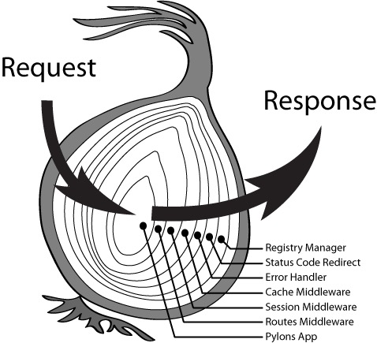

# Koa2 入门

Node.js 是一个异步的世界，官方 API 支持的都是 callback 异步编程模式，这会带来许多问题：callback 嵌套问题（回调地狱）；异步函数中可能同步调用 callback 来返回数据，带来不一致性。

而 Koa 解决了上面的问题。

Koa 是一个新的 Web 框架，由 Express 幕后的原班人马打造，致力于成为 Web 应用和 API 开发领域中的一个更小、更富有表现力、更健壮的基石。通过利用 async 函数，Koa 让我们**避免了回调地狱（异步嵌套）**，并有力地增强错误处理。Koa 并没有捆绑任何中间件，而是提供了一套优雅的方法，帮助我们快速而愉快地编写服务端应用程序。

代码地址：<https://github.com/zoeeying/koa2-learning>

## 1 环境搭建

1、新建一个项目目录，在目录下打开命令行，通过命令 `npm init -y` 初始化项目，生成 package.json 文件。

2、执行命令 `cnpm install --save koa`，安装 Koa。

3、新建一个 index.js 文件，代码如下，在命令行中使用命令 `node index.js` 运行该文件，访问地址 `127.0.0.1:3000`，可以在页面上看到 Hello Zoe。

```javascript
const Koa = require('koa')
const app = new Koa()
app.use(async ctx => {
  // ctx相当于上下文对象
  ctx.body = 'Hello Zoe' // 在页面上输出信息，服务端渲染的
})
// 监听端口
app.listen(3000, () => {
  console.log('server is started at port 3000')
})
```

## 2 Promise 和 async&await

在学习 Koa2 之前，我们需要知道怎么使用 ES6 语法取代 callback 来进行异步编程。

#### (1) callback 异步编程模式

```javascript
function getData(callback) {
  setTimeout(() => {
    let name = 'zoeeying'
    callback(name)
  }, 1000)
}
// 通过回调函数获取异步方法里面的数据
getData(data => {
  console.log(data) // zoeeying
})
```

#### (2) Promise 处理异步

```javascript
// 方法1
var p = new Promise((resolve, reject) => {
  setTimeout(() => {
    let name = 'zoeeying'
    resolve(name)
  }, 1000)
})
p.then(data => console.log(data))
```

```javascript
// 方法2
function getData(resolve, reject) {
  setTimeout(() => {
    let name = 'zoeeying'
    resolve(name)
  }, 1000)
}
var p = new Promise(getData)
p.then(data => console.log(data))
```

#### (3) async&await

async 是异步的简写，而 await 是 async wait 的简写。async 用于声明一个异步函数，而 await 用于等待一个异步方法执行完成。

await 会阻塞程序的执行，把异步变成同步。

```javascript
function getSomething() {
  return 'something'
}
async function testAsync() {
  return 'Hello Async'
}
function takeLongTime() {
  return new Promise(resolve => {
    setTimeout(() => resolve('after a long time'), 3000)
  })
}
async function test() {
  // await必须在async函数中使用
  const v1 = await getSomething() // 使用await调用普通函数（返回字符串值）
  const v2 = await testAsync() // 使用await调用async函数
  const v3 = testAsync() // 不使用await调用async函数，返回Promise对象
  const v4 = await takeLongTime() // 使用await调用普通函数（返回Promise对象）,可以模拟异步
  // 三秒钟后下面的代码才会执行
  console.log(v1) // something
  console.log(v2) // Hello Async
  console.log(v3) // Promise对象
  console.log(v4) // after a long time
}
test()
```

## 3 路由

路由（Route）是由一个 URI（或者叫路径）和一个特定的 HTTP 方法（GET、POST 等）组成的，涉及到应用如何响应客户端对某个网站节点的访问。通俗来说，路由是根据不同的 URL 地址，加载不同的页面实现不同的功能。

### 3.1 原生路由

我们可以从原理的角度自己实现路由功能。这里的路由并不是前端的页面跳转，而是页面上渲染了后端返回的 HTML 字符串。

```javascript
const Koa = require('koa')
const app = new Koa()
const fs = require('fs')

const render = page => {
  return new Promise((resolve, reject) => {
    let pageUrl = `./pages/${page}`
    fs.readFile(pageUrl, 'utf-8', (err, data) => {
      if (err) {
        reject(err)
      }
      resolve(data)
    })
  })
}

const route = async url => {
  let page = '404.html'
  switch (url) {
    case '/':
    case '/index':
      page = 'index.html'
      break
    case '/todo':
      page = 'todo.html'
      break
    case '/404':
      page = '404.html'
      break
    default:
      break
  }
  return await render(page)
}

app.use(async ctx => {
  let url = ctx.url
  ctx.body = await route(url)
})

// 监听端口...
```

### 3.2 koa-router

实际开发过程中，我们一般不会手写路由，而是使用中间件，比如 koa-router。

```bash
npm install koa-router -S # 安装
```

#### (1) 简单使用

```javascript
const Koa = require('koa')
const app = new Koa()
const router = require('koa-router')()

// 配置路由
// ctx表示上下文对象，包含了request和response等信息
router
  .get('/', async (ctx, next) => {
    // 返回数据，相当于原生的res.writeHead()和res.end()
    ctx.body = 'This is index page'
  })
  .get('/todo', async (ctx, next) => {
    ctx.body = 'This is todo page'
  })

app
  .use(router.routes()) // 启动路由
  .use(router.allowedMethods()) // 如果前面没有设置响应头，这里会设置对应的响应头，这个可以不用配置，但是官方建议配置上

// 监听端口...
```

#### (2) GET 请求

在 Koa2 中，GET 请求传值通过 request 接收，接收的方法有两种：

**query：** 返回格式化好的参数对象

**querystring：** 返回请求字符串

```javascript
const Koa = require('koa')
const app = new Koa()
const router = require('koa-router')()

// 地址栏输入http://localhost:3000/?name=zoe&age=18
router.get('/', async (ctx, next) => {
  // 从ctx.request中获取GET传值
  let req_query = ctx.request.query
  let req_querystring = ctx.request.querystring

  // 从ctx中获取GET传值
  let ctx_query = ctx.query
  let ctx_querystring = ctx.querystring

  ctx.body = {
    req_query,
    req_querystring,
    ctx_query,
    ctx_querystring
  }
})

// 配置动态路由，接收参数
// 地址栏输入http://localhost:3000/detail/122，id是122
router.get('/detail/:id', async (ctx, next) => {
  // 获取动态路由的传值
  ctx.body = ctx.params
})

// 动态路由里面可以传多个值
// router.get('/detail/:id/:name', async (ctx, next) => {
//   ctx.body = ctx.params
// })

app.use(router.routes()).use(router.allowedMethods())

// 监听端口...
```

## 4 中间件

中间件是指匹配路由之前或匹配路由完成后做的一系列操作。在 Express 中，中间件是一个函数，它可以访问请求对象、响应对象，可以处理 Web 应用中请求-响应循环流程，一般被命名为 next，在 Koa 中的中间件和 Express 中的类似。

**中间件的功能包括：**

* 执行任何代码

* 修改请求和响应对象

* 终结请求-响应循环

* 调用堆栈中的下一个中间件

**中间件的执行流程：**

跟 Express 不同，Koa 中间件选择了洋葱模型。



`app.use()` 无论放在 `router.get()` 上面还是下面，都是先执行的，这一点跟 Express 不同。

访问 `127.0.0.1:3000/todo` 的流程如下：

```javascript
const Koa = require('koa')
const app = new Koa()
const router = require('koa-router')()

app.use(async (ctx, next) => {
  console.log('流程1')
  await next()
  console.log('流程5')
})

app.use(async (ctx, next) => {
  console.log('流程2')
  // await next()写在console语句上面，表示先去下面匹配路由，匹配路由完成后（无论是否匹配到）再回来执行下面的console.lo语句
  await next()
  console.log('流程4')
})

router
  .get('/', async (ctx, next) => {
    ctx.body = 'This is index page'
  })
  .get('/todo', async (ctx, next) => {
    console.log('流程3')
    ctx.body = 'This is todo page'
  })

app.use(router.routes()).use(router.allowedMethods())

// 监听端口...
```

#### (1) 应用级中间件

匹配路由之前做的一系列操作。

```javascript
const Koa = require('koa')
const app = new Koa()
const router = require('koa-router')()

app.use(async (ctx, next) => {
  console.log('中间件')
  // 中间件通过next来实现
  // 先匹配所有路由，打印“中间件”，再往下匹配其它路由
  // 如果不写await next()，路由会终止，不会往下匹配了
  await next()
})

router
  .get('/', async (ctx, next) => {
    ctx.body = 'This is index page'
  })
  .get('/todo', async (ctx, next) => {
    ctx.body = 'This is todo page'
  })

app.use(router.routes()).use(router.allowedMethods())

// 监听端口...
```

#### (2) 路由级中间件

匹配到某个路由之前做的一系列操作。

```javascript
router
  .get('/', async (ctx, next) => {
    ctx.body = 'This is index page'
  })
  // 匹配到/todo后，打印一句话，再往下匹配路由
  .get('/todo', async (ctx, next) => {
    console.log('一句话')
    await next()
  })
  .get('/todo', async (ctx, next) => {
    ctx.body = 'This is todo page'
  })
```

#### (3) 错误处理中间件

匹配所有路由之前进行错误处理。

```javascript
app.use(async (ctx, next) => {
  console.log('中间件')
  await next()
  if (ctx.status === 404) {
    ctx.status = 400
    ctx.body = '404 Page'
  } else {
    console.log(ctx.url)
  }
})
```

#### (4) 第三方中间件

koa-views、koa-static、koa-bodyparser 等。

## 5 ejs 模板引擎

ejs 模板引擎可以把 Node.js 后台的数据渲染到对应的静态页面上。

#### (1) 简单使用

1、安装

```bash
npm install -S koa-views # 中间件
npm install -S ejs # 模板引擎
```

2、新建一个 index.ejs 文件，用来写 ejs 模板

```ejs
<!DOCTYPE html>
<html lang="en">
  <head>
    <meta charset="UTF-8" />
    <meta name="viewport" content="width=device-width, initial-scale=1.0" />
    <title></title>
  </head>
  <body>
    <h3>EJS简单使用</h3>
    <!-- title是从后台传递过来的值，也可以叫作模板中的变量 -->
    <p><%= title %></p>
  </body>
</html>
```

3、写 Koa 程序来渲染模板

```javascript
const Koa = require('koa')
const router = require('koa-router')()
const views = require('koa-views')
const app = new Koa()

// 配置模板引擎中间件（第三方中间件），下面两种方法都可以
// app.use(views('views', { map: { html: 'ejs' } })) // 模板后缀名必须是.html
app.use(
  views('views', {
    extension: 'ejs' // 应用ejs模板引擎，模板后缀名必须是.ejs
  })
)

router.get('/', async ctx => {
  // 把后台数据传到前台去渲染
  const title = 'ejs'
  // 这里必须加await
  await ctx.render('index', { title })
})

router.get('/news', async ctx => {
  ctx.body = '新闻页面'
})

app.use(router.routes()).use(router.allowedMethods())

// 监听端口...
```

#### (2) 模板中的语法

```ejs
<!-- 绑定数据 -->
<%=title%>

<!-- 循环 -->
<ul>
  <%for(var i=0; i<list.length; i++){%>
    <li><%=list[i]%></li>
  <%}%>
</ul>

<!-- 引入模块 -->
<%- include ('public/header.ejs') %>

<!-- 原文输出，会解析content中的HTML标签 -->
<%-content%>

<!-- 条件判断 -->
<%if(num > 100)else%>
```

#### (3) 公共数据

我们需要在每一个路由的 render 里面要渲染一个公共数据，让每个模板都能使用。

```javascript
app.use(async (ctx, next) => {
  ctx.state = {
    username: 'zoeeying',
    age: '18'
  }
  // 必须加上next，否则会报错
  await next()
})
```

## 6 art-template 模板引擎

art-template 是一个简约、超快的模板引擎，支持 ejs 语法，也支持类似于 angular 数据绑定的语法。

```bash
npm install -S art-template
npm install -S koa-art-template
```

#### (1) 简单使用

```javascript
const Koa = require('koa')
const router = require('koa-router')()
const path = require('path')
const render = require('koa-art-template')
const app = new Koa()

// 配置art-template模板引擎
render(app, {
  root: path.join(__dirname, 'views'), // 模板所在目录
  extname: '.html', // 模板后缀名
  debug: process.env.NODE_ENV !== 'production' // 是否开启调试模式
})

router.get('/', async ctx => {
  await ctx.render('index')
})

app.use(router.routes()).use(router.allowedMethods())

// 监听端口...
```

#### (2) 模板中的语法

```ejs
<!-- 引入模块 -->
<% include('./public/header.html') %>
{{include './public/header.html'}}

<!-- 绑定数据 -->
{{ data }}

<!-- 原文输出，会解析data.html中的HTML标签 -->
{{@ data.html }}

<!-- 循环 -->
<ul>
  {{each data.list}}
    <li>{{$index}}---{{$value}}</li>
  {{/each}}
</ul>

<!-- 条件判断 -->
{{if data.num>20}} 大于20 {{else}} 小于20 {{/if}}
```

## 7 POST 请求

如何获取 POST 请求提交的数据呢？

#### (1) 原生方法

1、新建 common 目录，在目录下新建 origin.js 文件

```javascript
exports.getPostData = ctx => {
  return new Promise((resolve, reject) => {
    try {
      let str = ''
      ctx.req.on('data', chunk => {
        str += chunk
      })
      ctx.req.on('end', chunk => {
        resolve(str)
      })
    } catch (err) {
      reject(err)
    }
  })
}
```

2、在 Koa 程序中接收数据

```javascript
const common = require('./common/origin')

// 使用原生的Node.js在Koa中获取POST提交的数据
router.post('/post', async ctx => {
  let data = await common.getPostData(ctx)
  ctx.body = data
})
```

#### (2) koa-bodyparser

1、安装

```bash
npm install koa-bodyparser -S
```

2、使用

```javascript
const bodyParser = require('koa-bodyparser')

// 配置中间件
app.use(bodyParser())

// 使用body-parser获取POST提交的数据，并且转换成了对象
router.post('/post', async ctx => {
  ctx.body = ctx.request.body
})
```

## 8 静态资源

在 Koa 中怎么处理静态资源（图片、CSS 和 JS）请求呢？

需要使用 koa-static 静态资源托管中间件（静态 Web 服务）：

```bash
npm install koa-static -S
```

```javascript
const static = require('koa-static')
// 静态资源放在static目录中
// 访问静态资源的时候，无需加上static目录，比如http://localhost:3000/css/basic.css
// 如果找不到静态资源的话，会执行next，继续向下匹配（底层封装好的，无需我们手动调用next方法）
// 两种写法都可，还可以配置多个目录
// app.use(static('./static'))
app.use(static(__dirname + '/static'))
```

**补充：** Koa 中中间件可以配置多个。

## 9 Cookie

HTTP 是无状态协议，也就是说，如果我们浏览一个页面，然后转到同一个网站的另一个页面，服务器无法认识到这是同一个浏览器在访问同一个网站，即每一次的访问，都是没有任何关系的。所以我们需要使用 Cookie。

Cookie 是存储于访问者的计算机中的变量，可以让我们用同一个浏览器访问同一个域名的时候共享数据。

通过使用 Cookie，我们可以实现这些功能：保存用户信息、10 天免登陆、保存浏览历史记录、多个页面之间传递数据等等。

Koa 中的 Cookie 使用方法如下：

```javascript
router.get('/', async ctx => {
  // 设置Cookie
  ctx.cookies.set('username', 'zoeeying', {
    // domain: '127.0.0.1', // Cookie域名，正常情况下不要设置，当有很多个子域名的时候可以设置成这这样.baidu.com，表示baidu.com下的子域名，比如a.baidu.com或者b.baidu.com都可以
    path: '/', // Cookie默认访问路径，默认是/，表示所有路由都可以访问
    maxAge: 1000 * 60 * 60 * 7, // Cookie有效时长，表示多少毫秒后过期
    expires: new Date('2020-03-10'), // Cookie失效时间
    httpOnly: true, // 是否只是服务器可访问Cookie, 默认是true，如果设置为false，表示Cookie既可以在浏览器中被访问，也可以在服务器上被访问
    secure: false, // 安全Cookie，默认false，设置成true表示只有https可以访问
    overwrite: false // 表示是否覆盖以前设置的同名的Cookie，默认是false
  })
  ctx.body = 'Cookie is ok'
})

router.get('/news', async ctx => {
  ctx.body = ctx.cookies.get('username')
    ? ctx.cookies.get('username') // 获取Cookie
    : 'No Cookie'
})
```

需要注意的是，在 Koa 中，无法直接设置 value 为中文的 Cookie，可以使用 Buffer 解决这个问题：

```javascript
router.get('/', async ctx => {
  const username = new Buffer('小畅叙').toString('base64')
  ctx.cookies.set('username', username, {
    maxAge: 1000 * 60 * 60 * 7
  })
  ctx.body = 'Cookie is ok'
})

router.get('/news', async ctx => {
  let response = 'No Cookie'
  if (ctx.cookies.get('username')) {
    let username = ctx.cookies.get('username')
    username = new Buffer(username, 'base64').toString()
    response = username
  }
  ctx.body = response
})
```

## 10 Session

Session 是另外一种记录客户状态的机制，不同的是 Cookie 可以保存在客户端浏览器中，而 Session 保存在服务器上，所以 Session 更安全。Node.js 中的 Session 是基于 Cookie 的。

**Session 工作流程：** 当浏览器访问服务器并发送第一次请求时，服务器会创建一个 Session 对象，生成一个类似于 key-value 的键值对，然后将 key（Cookie）返回到浏览器，浏览器下次再访问时，会携带这个 key（Cookie），在服务器上找到对应的 Session（value）。客户的信息都保存在 Session 中。

Koa 中的 Session 使用方法如下：

```bash
npm install koa-session -S
```

```javascript
const session = require('koa-session')

// 配置中间件
app.keys = ['some secret hurr'] // 默认
const CONFIG = {
  key: 'koa:sess', // 默认
  maxAge: 86400000, // 因为Koa中的Session是基于Cookie的，所以这里的过期时间是指Cookie的过期时间
  overwrite: true,
  httpOnly: true,
  signed: true, // 默认
  rolling: false, // 每次请求时是否强行设置Cookie（会重置Cookie过期时间），默认false
  renew: true // 是否在Cookie即将过期时更新Cookie，默认false
}
app.use(session(CONFIG, app))

router.get('/', async ctx => {
  // 获取Session
  ctx.body = ctx.session.username
})

router.get('/login', async ctx => {
  // 设置Session
  ctx.session.username = '小畅叙'
  ctx.body = '登录成功！'
})
```

## 11 操作 MongoDB 数据库

### 11.1 mongodb 驱动

mongodb 驱动是官方提供的用于操作 MongoDB 数据库的 Node.js 库（模块）。

首先，我们先学习一下如何使用 mongodb 驱动来操作 MongoDB 数据库。

```bash
npm install mongodb -S # 安装mongodb驱动
```

```javascript
const MongoClient = require('mongodb').MongoClient
const url = 'mongodb://localhost:27017'
const dbName = 'koa' // 数据库名称

console.time('test') // 用于测试耗时
// 连接数据库
MongoClient.connect(url, (err, client) => {
  if (err) {
    console.log(err)
    return
  }
  let db = client.db(dbName) // 数据库对象

  // 向user集合中增加数据
  db.collection('user').insertOne(
    {
      username: 'tyler',
      age: 28,
      sex: 'male',
      status: 1
    },
    (err, result) => {
      if (!err) {
        console.log('数据增加成功')
        console.timeEnd('test')
        client.close()
      }
    }
  )

  // 查询数据
  // var result = db.collection('user').find()
  // result.toArray((err, docs) => {
  //   console.log(docs)
  //   client.close()
  // })
})
```

### 11.2 封装 DB 库

基于官方的 mongodb 驱动（Node.js MongoDB  Driver），我们可以封装一个更小、更快、更灵活的 DB 库，实现更方便、更灵活地使用 Node.js 操作 MongoDB 数据库。

```javascript
// config.js
module.exports = {
  dbUrl: 'mongodb://localhost:27017',
  dbName: 'koa'
}

```

```javascript
// db.js
const { MongoClient, ObjectID } = require('mongodb')
const Config = require('./config')

class DB {
  // 单例模式，可以实现多次实例化实例共享
  static getInstance() {
    if (!DB.instance) {
      DB.instance = new DB()
    }
    return DB.instance
  }
  constructor() {
    this.dbClient = null
    this.connect() // 实例化的时候连接数据库
  }
  connect() {
    return new Promise((resolve, reject) => {
      // 数据库长连接，解决数据库多次连接的问题
      if (!this.dbClient) {
        MongoClient.connect(Config.dbUrl, (err, client) => {
          if (err) {
            reject(err)
            return
          }
          this.dbClient = client.db(Config.dbName)
          resolve(this.dbClient)
        })
      } else {
        resolve(this.dbClient)
      }
    })
  }
  find(collectionName, json) {
    return new Promise((resolve, reject) => {
      this.connect().then(db => {
        const result = db.collection(collectionName).find(json)
        result.toArray((err, docs) => {
          if (err) {
            reject(err)
            return
          }
          resolve(docs)
        })
      })
    })
  }
  insert(collectionName, json) {
    return new Promise((resolve, reject) => {
      this.connect().then(db => {
        db.collection(collectionName).insertOne(json, (err, result) => {
          if (err) {
            reject(err)
            return
          }
          resolve(result)
        })
      })
    })
  }
  update(collectionName, json1, json2) {
    return new Promise((resolve, reject) => {
      this.connect().then(db => {
        db.collection(collectionName).updateOne(
          json1,
          { $set: json2 },
          (err, result) => {
            if (err) {
              reject(err)
              return
            }
            resolve(result)
          }
        )
      })
    })
  }
  delete(collectionName, json) {
    return new Promise((resolve, reject) => {
      this.connect().then(db => {
        db.collection(collectionName).removeOne(json, (err, result) => {
          if (err) {
            reject(err)
            return
          }
          resolve(result)
        })
      })
    })
  }
  getObjectId(id) {
    // 把字符串id转换成对象id，用于根据_id查询文档
    return new ObjectID(id)
  }
}

module.exports = DB.getInstance()
```

### 11.3 操作数据库

然后我们就可以在 Koa 程序中使用上面封装好的 DB 库来操作 MongoDB 数据库了：

```javascript
const Koa = require('koa')
const render = require('koa-art-template')
const router = require('koa-router')()
const bodyparser = require('koa-bodyparser')
const path = require('path')
const DB = require('./module/db') // 引入的是实例
const app = new Koa()

app.use(bodyparser())

// 配置art-template模板引擎
render(app, {
  root: path.join(__dirname, 'views'),
  extname: '.html',
  debug: process.env.NODE_ENV !== 'production'
})

router
  .get('/', async (ctx, next) => {
    const data = await DB.find('user')
    await ctx.render('home', { data })
  })
  .get('/add', async (ctx, next) => {
    await ctx.render('add')
  })
  // 往数据库增加用户
  .post('/addUser', async (ctx, next) => {
    const data = await DB.insert('user', ctx.request.body)
    try {
      if (data.result.ok) {
        ctx.redirect('/')
      }
    } catch (err) {
      console.log(err)
      ctx.redirect('/add')
    }
  })
  .get('/edit', async (ctx, next) => {
    // 根据传递过来的id获取用户信息
    const { id } = ctx.query
    const data = await DB.find('user', { _id: DB.getObjectId(id) })
    await ctx.render('edit', { data: data[0] })
  })
  .post('/editUser', async (ctx, next) => {
    const { id, username, age, sex } = ctx.request.body
    const data = await DB.update(
      'user',
      { _id: DB.getObjectId(id) },
      { username, age, sex }
    )
    try {
      if (data.result.ok) {
        ctx.redirect('/')
      }
    } catch (err) {
      console.log(err)
      ctx.redirect('/add')
    }
  })
  .get('/delete', async (ctx, next) => {
    const { id } = ctx.query
    const data = await DB.delete('user', { _id: DB.getObjectId(id) })
    try {
      if (data.result.ok) {
        ctx.redirect('/')
      }
    } catch (err) {
      console.log(err)
      ctx.redirect('/')
    }
  })

app.use(router.routes()).use(router.allowedMethods())

app.listen(3000, () => {
  console.log('server is started at port 3000')
})
```

## 12 脚手架工具

通过 Koa 脚手架工具（应用生成器），可以快速创建一个 Koa2 项目。

1、全局安装

```bash
npm install koa-generator -g
```

2、创建项目

```bash
koa koa_demo
```

3、安装依赖

```bash
cd koa_demo
npm install
```

4、启动项目

```bash
npm start
```

## 13 模块化

整个项目分为前台、后台、api，模块化的方法都是一样的。

#### (1) 路由模块化

实现路由模块化也叫实现路由的层级。

1、在项目根目录下新建 routes 目录，在 routes 目录中新建 api.js 文件，用来写接口

```javascript
const router = require('koa-router')()

router.get('/', async ctx => {
  ctx.body = { title: '这是一个api接口' }
})
router.get('/newslist', async ctx => {
  ctx.body = { title: '这是一个新闻列表接口' }
})
router.get('/focusList', async ctx => {
  ctx.body = { title: '这是一个轮播图列表接口' }
})

module.exports = router.routes() // 暴露出去的就是启动好的路由
```

2、在项目根目录下新建 app.js 文件

```javascript
const Koa = require('koa')
const router = require('koa-router')()
const render = require('koa-art-template')
const path = require('path')
const app = new Koa()

// 配置art-template模板引擎
// 然后子路由模块中就可以直接使用await ctx.render()渲染模板了
render(app, {
  root: path.join(__dirname, 'views'),
  extname: '.html',
  debug: process.env.NODE_ENV !== 'production'
})

// 引入子路由模块
const index = require('./routes/index') // 前台
const admin = require('./routes/admin/index') // 后台
const api = require('./routes/api') // 接口

// 配置子路由（层级路由）
router.use(index)
router.use('/admin', admin)
router.use('/api', api)

app.use(router.routes()).use(router.allowedMethods())

app.listen(3000, () => {
  console.log('server is started at port 3000')
})
```

当然，我们还可以继续往下嵌套子路由，实现整个项目的路由模块化。

#### (2) 视图模块化

在项目根目录下新建 views 目录，然后在 views 目录中新建各个模块的目录，通过目录层级实现视图的模块化。

## 14 前后端分离

学习一下如何使用 Koa2 为单页面应用写接口，同时处理一下跨域问题，实现前后端分离。

### 14.1 写接口

```javascript
const router = require('koa-router')()
const DB = require('../module/db')

router.get('/', async ctx => {
  ctx.body = { title: '这是一个api接口' }
})
router.get('/userslist', async ctx => {
  const data = await DB.find('user')
  ctx.body = {
    data
  }
})
module.exports = router.routes()
```

```javascript
const api = require('./routes/api')
router.use('/api', api)
```

### 14.2 跨域问题

跨域问题是因为浏览器的同源策略导致的，域名、端口、协议只要有一个不同，就会存在跨域问题。我们可以使用下面的方案来解决跨域问题。

#### (1) JSONP

**原理：** 利用 script 标签 src 属性可以跨域的特性，在本地写一个回调函数，在远程执行这个回调函数，把远程的数据传到本地。

但是 JSONP 只能解决获取数据时候的跨域问题。

服务器要支持 JSONP，必须配置 koa-jsonp 中间件：

```javascript
const jsonp = require('koa-jsonp')
app.use(jsonp())
```

下面是两种 JSONP 的写法：

```html
<!-- 原生JS写法 -->
<script>
  // 本地的回调函数
  function fetchData(data) {
    console.log(data)
  }
</script>
<script src="http://localhost:3000/api/userlist?callback=fetchData"></script>
```

```html
<!-- jQuery写法 -->
<script>
  $(function() {
    var url = 'http://localhost:3000/api/userlist'
    $.ajax({
      url: url,
      dataType: 'jsonp', // 定义jsonp请求
      data: '', // get传值
      jsonp: 'callback', // 回调函数的参数
      success: function(data) {
        console.log(data)
      },
      timeout: 3000 // 超时时间
    })
  })
</script>
```

#### (2) koa2-cors

使用 koa2-cors 中间件来让后台允许跨域。后台允许跨域会引起安全性问题，可以使用签名验证来解决。

```bash
npm install koa2-cors -S
```

```javascript
const app = new Koa()
app.use(cors())
```

## 15 RESTful API

网络应用程序分为前端和后端两个部分，当前的发展趋势是前端设备层出不穷，因此必须有一种统一的机制，方便不同的前端设备与后端进行通讯，这导致 API 构架的流行，甚至出现 API First 的设计思想。RESTful API 是目前比较成熟的一套互联网应用程序 API 设计理论。

**设计 RESTful API 需要考虑的要点：**

建议使用更安全的 https 协议，小程序中必须使用 https 协议；尽量部署在专属域名下面，比如 api.xxx.com 而不是 www.xxx.com；应该将 API 的版本号放入网址中，比如 a1.xxx.com、a2.xxx.com 或者 a.xxx.com/api1/list、a.xxx.com/api2/list；在 RESTful 架构中，每个网址代表一种资源（resource），所以网址中建议不能有动词，只能是名词，而且所用的名词往往与数据库的表格名对应。一般来说，数据库中的表都是同种记录的集合（collection），所以 API 中的名词也应该是复数；

HTTP 请求数据的方式：

* GET（SELECT）：从服务器取出资源（一项或多项）
* POST（CRETE）：在服务器新建一个资源
* PUT（UPDATE）：在服务器更新资源（客户端提供改变后的完整资源）
* DELETE（DELETE）：从服务器删除资源
* HEAD：获取资源的元数据，不常用
* OPTIONS：获取信息，关于资源的哪些属性是客户端可以改变的，不常用
* PATCH（UPDATE）：在服务器更新资源（客户端提供改变的属性），不常用

还要考虑过滤方式（分页）、请求数据方式、返回数据的格式（建议 JSON）、安全性（加上一些验证）

```javascript
router.get('/userList', async ctx => {})
router.post('/addUser', async ctx => {})
router.put('/editUser', async ctx => {})
router.delete('/deleteUser', async ctx => {})
```

## 16 发布上线

#### (1) 购买域名和服务器

服务器可以是虚拟主机也可以是云服务器。如果要运行 Node.js 程序的话，建议购买云服务器，因为虚拟主机不支持 Node.js。

可以去万网购买域名。

#### (2) 把程序上传到服务器

ftp、直接复制、svn、git。

最简单的就是在本地复制项目文件夹，到服务器上某个目录下粘贴即可。

#### (3) 让服务器运行程序

在服务器上安装 Node.js 和 MongoDB => 使用命令行把程序跑起来 => 通过 ip 地址访问程序

#### (4) 关联域名和服务器

如何把域名和服务器关联起来呢？需要去购买域名的地方配置一下域名解析。

通过 ping 命令可以获悉当前域名指向的服务器的 ip 地址。

#### (5) 域名备案

刚买的域名没法直接解析到服务器，需要域名备案（管理局登记一下域名信息）。
