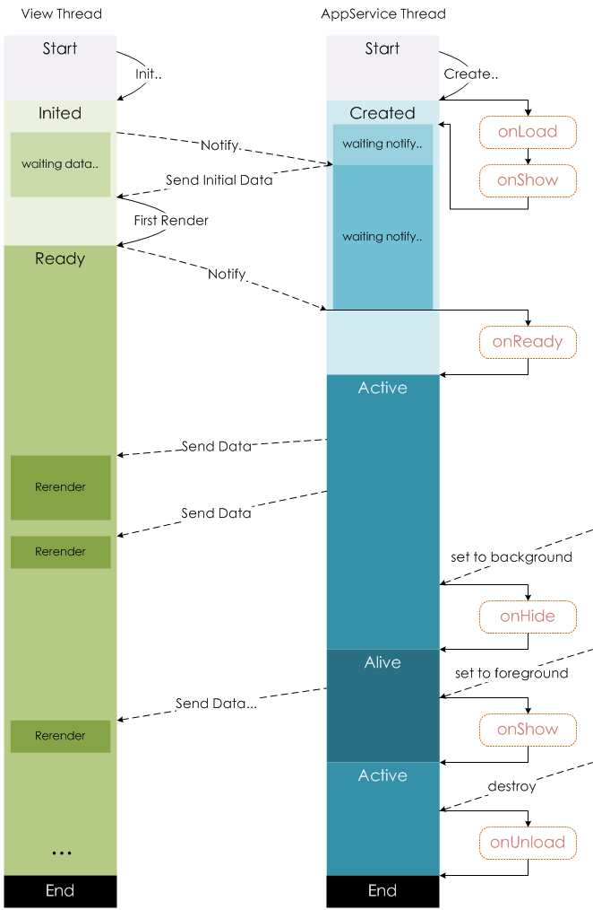

# uni-app 入门

uni-app 是基于 Vue.js 的前端跨端框架，只需开发一套代码，即可发布多平台。即使不跨端，uni-app 同时也是很好的小程序开发框架。

uni-app 将常用的组件和 api 进行了跨平台封装，可以覆盖大部分的业务需求，它的内置组件和 api 是以微信小程序为准的，它的扩展也都是跨平台的。

代码地址：<https://github.com/zoeeying/uni-app-learning>

## 1 环境搭建

如果我们的 uni-app 项目需要打包成微信小程序，必须安装微信开发者工具来预览项目。

uni-app 的环境搭建有下面两种方法：

#### (1) 使用命令行

1、全局安装脚手架

```bash
npm install -g @vue/cli
```

2、创建项目

```bash
vue create -p dcloudio/uni-preset-vue uni-app-demo
```

3、启动项目

```bash
npm run dev:mp-weixin #微信小程序
```

4、打开微信开发者工具，点击中间有 + 的矩形，选择导入项目，选择目录 uni-app-learning\dist\dev\mp-weixin，使用测试 AppID，点击导入

#### (2) 使用 HBuilderX

打开 HBuilderX，新建项目，选择 uni-app，输入项目名称，选择项目路径，选择默认模板，点击创建按钮，即可创建一个 uni-app 项目。

**使用微信开发者工具运行项目：** 打开微信开发者工具，点击设置图标，选择安全，开启服务端口。然后点击 HBuilderX 工具栏的运行，选择运行到小程序模拟器，选择微信开发者工具（如果是第一次使用微信开发者工具运行项目的话，需要配置一下微信开发者工具的路径），即可将项目运行在微信开发者工具中。

## 2 目录结构、开发规范

#### (1) 目录结构

**pages：** 所有的页面存放目录

**components：** 组件存放目录

**static：** 静态资源目录，比如图片、视频、字体图标等

**unpackage：** 打包目录，存放各个平台的打包文件

**App.vue：** 项目的根组件，所有页面都是在 App.vue 下进行切换的，是**页面入口文件**，可以调用**应用的生命周期函数**

**main.js：** **项目的入口文件**（项目加载的时候首先会加载该文件），主要作用是初始化 Vue 实例并使用需要的插件

**manifest.json：** 应用的配置文件，用于指定应用的名称、图标、权限等

**pages.json：** uni-app 全局配置文件，决定页面文件的路径、窗口样式（globalStyle）、原生的导航栏、底部的原生 tabBar 等

**uni.scss：** 内置的常用样式变量（sass 变量），主要为了方便整体控制应用的风格，比如按钮颜色、边框风格等

#### (2) 开发规范

为了实现多段兼容，综合考虑编译速度、运行性能等因素，我们在开发 uni-app 项目的时候，需要遵循一些开发规范：

- 页面文件需要遵循 Vue 单文件组件（SFC）规范
- 组件标签更接近小程序规范，详见 uni-app 组件规范
- api 更接近微信小程序规范，但需要将前缀 `wx.` 换成 `uni.`，详见 uni-app 接口规范
- 数据绑定及事件处理遵循 Vue.js 规范，同时补充了 App 及页面的生命周期
- 为兼容多端运行，建议使用 flex 布局

## 3 全局配置、页面配置

#### (1) 全局配置

在 pages.json 中通过 globalStyle 进行全局配置，用于设置应用的状态栏、导航条、标题、窗口背景颜色等。

下面列出一些常用的配置属性：

| 属性                         | 描述                                                                               |
| ---------------------------- | ---------------------------------------------------------------------------------- |
| navigationBarBackgroundColor | 导航栏和状态栏背景颜色，默认值 #f7f7f7                                             |
| navigationBarTextStyle       | 导航栏标题颜色及状态栏前景颜色，只支持 black/white，默认值 white                   |
| navigationBarTitleText       | 导航栏标题文字内容                                                                 |
| backgroundColor              | 窗口的背景颜色，开启下拉刷新才能看到，默认值 #ffffff                               |
| backgroundTextStyle          | 下拉 loading 的样式，仅支持 dark/light，默认值 dark                                |
| enablePullDownRefresh        | 是否开启下拉刷新，详见页面生命周期，默认值 false                                   |
| onReachBottomDistance        | 页面上拉触底事件触发时距页面底部的距离，单位仅支持 px，详见页面生命周期，默认值 50 |

#### (2) 页面配置

在 pages 目录中创建 message 文件夹，然后在 message 文件夹中创建 index.vue 文件。然后，在 pages.json 中的 pages 数组中配置这个新创建的页面的路径（path）及窗口表现（style，用于设置每个页面的状态栏、导航条、标题、窗口背景色等）。页面中的配置项会覆盖 globalStyle 中相同的配置项。

```json
{
  "pages": [
    {
      "path": "pages/index/index",
      "style": {}
    },
    {
      "path": "pages/login/login",
      "style": {}
    }
  ]
}
```

页面的窗口表现包括上面列出的 globalStyle 中的配置属性，具体的可以查看[官方文档](https://uniapp.dcloud.io/collocation/pages?id=pages)。

**注意：** pages 数组中第一项表示应用的启动页；应用中新增或者减少页面，都需要对 pages 数组进行修改；文件名不要写后缀名。

## 4 tabBar

如果应用是一个多 tab 应用，可以通过 pages.json 中的 tabBar 配置项指定 tab 栏的表现，以及 tab 切换时显示的对应页。

**注意：** 当设置 tabBar 的 position 为 top 时，将不会显示 icon；tabBar 中的 list 是一个数组，只能配置 2-5 个 tab，tab 按照数组的顺序排序；tabBar 切换第一次加载时可能渲染不及时，可以在每个 tabBar 页面的 onLoad 生命周期函数里里先弹出一个等待雪花；tabBar 的页面展现过一次后就保留在内存中，再次切换 tabBar 页面，只会触发每个页面的 onShow，不会再触发 onLoad。

下面列出了一些常用的属性：

| 属性            | 描述                                                                    |
| --------------- | ----------------------------------------------------------------------- |
| color           | tab 上的文字默认颜色，必填                                              |
| selectedColor   | tab 上的文字选中时的颜色，必填                                          |
| backgroundColor | tab 的背景颜色，必填                                                    |
| borderStyle     | tabBar 上边框的颜色，仅支持 black/white，默认值 black                   |
| list            | tab 的列表，最少 2 个，最多 5 个，必填                                  |
| position        | tabBar 的位置，仅支持 top/bottom，只有微信小程序支持 top，默认值 bottom |

list 接受一个数组，数组中的每一项都是一个对象，其属性值如下：

| 属性             | 描述                                                                                                                      |
| :--------------- | :------------------------------------------------------------------------------------------------------------------------ |
| pagePath         | 页面路径，必须在 pages 中先定义，必填                                                                                     |
| text             | tab 上按钮文字，在 App 和 H5 平台为非必填，比如中间可放一个没有文字的 + 图标                                              |
| iconPath         | 图片路径，icon 大小限制为 40kb，建议尺寸为 81px \* 81px，当 postion 为 top 时，此参数无效，不支持网络图片，不支持字体图标 |
| selectedIconPath | 选中时的图片路径，icon 大小限制为 40kb，建议尺寸为 81px \* 81px ，当 postion 为 top 时，此参数无效                        |

pages.json 中的 tabBar 配置如下：

```json
"tabBar": {
  "selectedColor": "#D4237A",
  "color": "#666666",
  "list": [
    {
      "text": "首页",
      "pagePath": "pages/index/index",
      "iconPath": "static/tabs/home.png",
      "selectedIconPath":"static/tabs/home_active.png"
    },
    {
      "text": "我的",
      "pagePath": "pages/mine/index",
      "iconPath": "static/tabs/mine.png",
      "selectedIconPath":"static/tabs/mine_active.png"
    }
  ]
}
```

## 5 condition 启动模式

启动模式配置，仅开发期间生效，用于模拟直达页面的场景。比如我们想直接打开详情页，而不是从列表页进入详情页。

在 pages.json 中配置 condition 如下：

```json
"condition": {
  "current": 0,
  "list": [{
    "name": "详情页",
    "path": "pages/detail/index",
    "query": "id=80"
  }]
}
```

current 表示当前激活的模式，即 list 数组中的索引；list 表示启动模式列表；name 表示启动模式名称；path 表示启动页面路径；query 表示启动参数，可在页面的 onLoad 函数中获得。

在微信开发者工具的顶部工具栏，找到编译，选择详情页，即可进入详情页。

## 6 样式、字体图标

#### (1) 样式

uni-app 中支持小程序的 rpx（响应式 px），一种根据屏幕宽度自适应的的动态单位，以 750 宽的屏幕为基准，750rpx 正好为整个屏幕宽度，屏幕变宽，rpx 实际显示效果会等比放大。rpx 不仅可以用来表示盒子尺寸，也可以用来表示字体大小。

uni-app 还支持 H5 的 vw、vh（rpx、vw、vh 都是相对宽度/高度单位）。

我么可以使用 @import 语句导入外联样式表，后跟需要导入的外联样式表的**相对路径**，以 ; 结尾，比如 `@import url("./a.css");`。

uni-app 中支持常用的选择器 class、id、element、伪类选择器等，不支持 \* 选择器，page 相当于 body 节点。

定义在 App.vue 中的样式为**全局样式**，作用于每一个页面，在 pages 目录下的 vue 文件中定义的样式为**局部样式**，只作用于当前页面，并会覆盖 App.vue 中相同的选择器的样式。

#### (2) sass

uni-app 中内置有 sass 的配置了，如果想使用 sass 语法，需要安装插件。

如果是使用命令创建的项目，可以通过命令 `npm install sass-loader node-sass -S` 来安装插件。

如果是使用 HBuilderX 创建的项目，可以选择工具栏中的工具，然后选择插件安装，找到 scss/sass 编译，点击安装。

然后在 Vue 组件中的 style 标签上加上 lang 属性 `<style lang="scss">`，即可在项目中使用 sass 语法了。

写 sass 样式的时候，我们也可以使用 uni.scss 中的 sass 变量。

```vue
<template>
  <view class="content">
    <view class="rpxClass">rpx演示</view>
    <view class="vwClass">vw演示</view>
    <view class="sassClass">sass演示</view>
  </view>
</template>

<style lang="scss">
.rpxClass {
  /* rpx是小程序中的单位，750rpx等于屏幕的宽度 */
  width: 750rpx;
  height: 100px;
  background-color: aqua;
}
.vwClass {
  /* vw和vh是H5中的单位，100vw等于屏幕的宽度，100vh等于屏幕的高度 */
  width: 50vw;
  height: 100px;
  background-color: tan;
}
.content {
  .sassClass {
    /* 使用uni.scss中的sass变量 */
    color: $uni-color-primary;
    background: pink;
  }
}
</style>
```

#### (3) 字体图标

uni-app 中支持使用字体图标，使用方式与普通的 Web 项目相同。但是需要注意，字体文件小于 40kb，uni-app 会自动将其转换为 base64 格式，如果字体文件大于等于 40kb，需要开发者自己转换，否则使用将不会生效。字体文件的引用路径推荐使用以 ~@ 开头的绝对路径。

1、在 iconfont 网站中找到合适的图标，加入项目，点击下载至本地，把后缀名为 .css、.eot、.svg、.ttf、.woff、.woff2 的文件拷贝到 static/fonts 中。

2、修改 iconfont.css 中字体图标的引入路径：

```css
@font-face {
  font-family: 'iconfont';
  src: url('~@/static/fonts/iconfont.eot?t=1584362498175');
  /* ...... */
}
```

3、在 App.vue 的 style 标签中**全局引入**字体图标：

```vue
<style>
@import url('./static/fonts/iconfont.css');
</style>
```

4、在页面中使用字体图标

```vue
<view class="iconfont icon-hot"></view>
```

## 7 基本语法

#### (1) 数据绑定

在页面中定义数据和 Vue 中一模一样，直接在 data 中定义数据即可。

渲染数据的话，可以使用插值表达式，在插值表达式中，还可以使用三元运算符，也可以做一些基本的运算：

```vue
<view>{{msg}}</view>
<view>{{9>10?'大于10':'小于等于10'}}</view>
<view>{{2+1}}</view>
```

可以使用 v-bind 指令动态绑定属性，即属性值是动态的，比如 data 中定义的数据：

```vue
<image v-bind:src="imgUrl"></image>
<!-- 简写 -->
<image :src="imgUrl"></image>

<!-- data-color是自定义属性，color是变量 -->
<view :data-color="color">标签的属性中使用了color变量</view>
```

可以使用 v-for 指令循环数据：

```vue
<view v-for="(item, index) in list" :key="item.id">
  {{index}}-{{item.text}}
</view>
```

**计算属性**可以理解为是对 data 中的数据做了加工或者过滤，通过 computed 来定义计算属性：

```javascript
// 计算属性，cnMoney和filterList可以被当成data中的数据一样来使用
computed: {
  cnMoney() {
    return `￥${this.money}`
  },
  filterList() {
    return this.list.filter(v => v.id <= 0)
  }
}
```

#### (2) 事件

在 uni-app 中，事件绑定和 Vue 中是一样的，都是使用 v-on 指令，可以简写为 @。

如果没有传递参数，事件监听函数的第一个形参为事件对象；如果传递了参数，事件监听函数的形参接收的是传递过来的对应的数据，如果想传递事件对象，需要手动把 $event 传递过去：

```vue
<!-- 自定义属性方式传参，需要把事件对象传递过去 -->
<view data-index="11" @click="handleClick('hello', $event)">点击我试试</view>
```

在 methods 中定义事件监听函数 handleClick（也叫事件回调函数）：

```javascript
methods: {
  // 通过event接收自定义属性传递过来的参数
  handleClick(index, event) {
    console.log(index)
    console.log(event.currentTarget.dataset.index)
  }
}
```

#### (3) v-if 和 v-show

```vue
<!-- v-if在隐藏标签的时候，是直接删除这个标签，而v-show是通过样式来隐藏标签的 -->
<view v-if="false">v-if</view>
<view v-show="true">v-show</view>
```

## 8 组件

uni-app 提供了丰富的基础组件给开发者使用，开发者可以像搭积木一样组合各种组件拼接成自己的应用。uni-app 中的组件，就像 HTML 中的 div、p、span 等标签的作用一样，用于搭建页面的基础结构。

### 8.1 常用组件

#### (1) text 组件

text 组件是文本组件，相当于行内标签，会在同一行显示。

text 组件的属性如下：

| 属性       | 描述                                                                                                                                                                                   |
| ---------- | -------------------------------------------------------------------------------------------------------------------------------------------------------------------------------------- |
| selectable | 文本是否可选，默认值 false                                                                                                                                                             |
| space      | 显示连续空格（如果在文字之间有多个空格，让多个空格都显示，而不是默认只显示一个空格），可选参数：ensp（中文字符空格一半大小）、emsp（中文字符空格大小）、nbsp（根据字体设置的空格大小） |
| decode     | 是否解码，可以解析 `&nbsp;`、`&lt;`、`&gt;`、`&amp;`、`&apos;`、`&ensp;`、`&emsp;`，默认值 true                                                                                        |

**注意：** text 组件内只支持嵌套 text，不支持其它组件或自定义组件，否则会引发在不同平台的渲染差异；支持 \n 方式换行；如果使用 span 组件，编译时会被转换为 text；除了文本节点以外的其它的节点都无法长按选中。

#### (2) view 组件

view 组件是视图容器组件，相当于 HTML 中的 div。

view 组件的属性如下：

| 属性                   | 描述                                                             |
| ---------------------- | ---------------------------------------------------------------- |
| hover-class            | 指定按下去的样式类，默认值 none（没有点击态效果）                |
| hover-stop-propagation | 指定是否阻止本节点的祖先节点出现点击态（类似冒泡），默认值 false |
| hover-start-time       | 按住后多久出现点击态，单位毫秒，默认值 50                        |
| hover-stay-time        | 手指松开后点击态保留时间，单位毫秒，默认值 400                   |

```vue
<view class="box1" hover-class="box1-active">
  <view
    class="box2"
    hover-class="box2-active"
    hover-stop-propagation
    :hover-start-time="2000"
  >
  我是一个大盒子</view>
</view>
```

**注意：** hover-start-time 属性前面加上冒号，它的值就会从普通字符串变成表达式，即上面的例子中，会把字符串 2000 变成数字 2000；如果使用 div 组件，编译时会被转换为 view；如果需要使用滚动视图，可以使用 scroll-view 组件。

#### (3) image 组件

image 组件默认宽度 300px、高度 240px，这会导致我们的图片出现压缩的问题，可以通过设置 image 的 mode 属性来解决此问题。

mode 属性用来设置图片裁剪、缩放的模式，默认值 scaleToFill，下面是几个 mode 属性值的介绍：

| 属性值      | 描述                                                                                                                                 |
| ----------- | ------------------------------------------------------------------------------------------------------------------------------------ |
| scaleToFill | 不保持纵横比**缩放**图片，使图片的宽高完全拉伸至填满 image 元素                                                                      |
| aspectFit   | 保持纵横比**缩放**图片，使图片的**长边**能完全显示出来，也就是说，可以完整地将图片显示出来                                           |
| aspectFill  | 保持纵横比**缩放**图片，只保证图片的**短边**能完全显示出来，也就是说，图片通常只在水平或垂直方向是完整的，另一个方向将会发生**截取** |

image 组件的 src 属性仅支持相对路径、绝对路径，支持 base64 码。

页面结构复杂，css 样式太多的情况，使用 image 可能导致样式生效较慢，出现**闪一下**的情况，此时可以通过设置 `image{ will-change: transform }` 优化此问题。

自定义组件里面使用 image 时，若 src 使用相对路径可能出现路径查找失败的情况，故建议使用绝对路径。

### 8.2 创建组件

在 uni-app 中，可以通过创建一个后缀名为 .vue 的文件来创建一个组件。在其它组件中，可以通过 import 的方式导入该组件，然后在 components 选项中注册一下，即可使用该组件。

1、在项目根目录下新建 components 文件夹，在该文件夹下新建 photo-frame.vue 文件

```vue
<template>
  <view class="content">
    <image :src="src" class="photo_frame" />
  </view>
</template>

<script>
export default {
  props: {
    src: String,
  },
}
</script>

<style>
.photo_frame {
  border-radius: 50%;
}
</style>
```

2、在 pages/picture/index.vue 页面中使用 photo-frame 组件

```vue
<template>
  <view>
    <!-- 不推荐小驼峰的写法 -->
    <!-- <photoFrame></photoFrame> -->
    <photo-frame :src="imgUrl"></photo-frame>
  </view>
</template>

<script>
import photoFrame from '@/components/photo-frame'
export default {
  data() {
    return {
      imgUrl: 'https://img3.sycdn.imooc.com/5e12e15309ff060712000676-360-202.png',
    }
  },
  // 注册组件
  components: {
    photoFrame,
  },
}
</script>
```

### 8.3 组件通讯

#### (1) 父组件向子组件传值

父组件通过**属性的方式**向子组件传值。

```vue
<!-- 父组件，src1是父组件data中的数据 -->
<photo-frame :src="src1"></photo-frame>
```

```vue
<!-- 子组件 -->
<template>
  <image :src="src" />
</template>

<script>
// 两种props的写法
export default {
  // props: {
  //   src: String
  // },
  props: ['src'],
}
</script>
```

#### (2) 子组件向父组件传值

子组件通过**触发事件的方式（通过 $emit 触发自定义事件）**向父组件传值。父组件通过**监听事件的方式**来接收数据。

```vue
<!-- 子组件 -->
<image @click="handleClick"></image>

methods: { handleClick() { // this.$emit('自定义事件名称', '要传递的数据') this.$emit('srcChange', this.src) } }
```

```vue
<!-- 父组件中要监听自定义事件 -->
<photo-frame @srcChange="handleSrcChange"></photo-frame>

methods: { handleSrcChange(e) { // console.log('自定义事件被触发了') console.log(e) // e就是传递过来的数据 } }
```

#### (3) 兄弟组件之间传值

兄弟组件之间传值可以使用 uni-app 提供的 API。

`uni.$emit(eventName, '参数')`：触发全局的自定义事件，附加参数都会传递给监听器的回调函数。

`uni.$on(eventName, callback)`：监听全局的自定义事件，事件可以由 `uni.$emit` 触发，回调函数会接收所有传入事件触发函数的额外参数。

我们定义两个组件，a-com 和 b-com，在首页中使用这两个组件，所以 a-com 组件和 b-com 组件是兄弟关系。

```vue
<!-- a-com组件 -->
<template>
  <view>
    <button @click="handleClick">修改b组件中的数据</button>
  </view>
</template>

<script>
export default {
  methods: {
    handleClick() {
      uni.$emit('changeNum', 10)
    },
  },
}
</script>
```

```vue
<!-- b-com组件 -->
<template>
  <view> b组件中的数据为：{{ num }} </view>
</template>

<script>
export default {
  data() {
    return {
      num: 0,
    }
  },
  created() {
    uni.$on('changeNum', num => {
      this.num += num
    })
  },
}
</script>
```

#### (4) 全局共享数据

**全局共享数据的方式有：**

- 通过 Vue 的原型共享数据
- 通过 globalData 共享数据（微信小程序独有的）
- Vuex
- 本地存储

```javascript
// 通过Vue的原型共享数据
// 在main.js中定义全局数据
Vue.prototype.blogUrl = 'zoeeying.github.io'

// 在组件中通过this.blogUrl获取数据
onLoad() {
  console.log(this.blogUrl)
}
```

```javascript
// 通过globalData共享数据
// 在App.vue中通过globalData选项定义全局数据
globalData: {
  msg: 'Hello Zoe'
}

// 在组件中获取数据
onLoad() {
  // getApp()可以获取到当前小程序的整个应用实例
  console.log(getApp().globalData.msg)
  // getApp().globalData.msg = 'Hello Tyler' // 也可以修改数据
}
```

### 8.3 插槽

标签其实也是数据的一种，想实现父组件动态地**给子组件传递标签**，可以使用插槽 slot。通过 slot 标签来实现占位符。

```vue
<!-- 父组件 -->
<my-form>
  <view>
    <input type="text" />
    <radio></radio>
    <checkbox></checkbox>
  </view>
</my-form>
```

```vue
<!-- 子组件 -->
<view class="form_content">
  <slot></slot>
</view>
```

## 9 生命周期

一个**对象**从创建、运行、销毁的整个过程被称为**生命周期**。在生命周期中，每个阶段会伴随着每个函数的触发，这些函数被称为**生命周期函数**，即会在特定时期执行的函数。

uni-app 框架的生命周期函数结合了 Vue 和微信小程序的生命周期函数，可以分为三大类：

#### (1) 应用的生命周期函数

在 App.vue 中写应用的生命周期函数。

| 函数名   | 描述                                                                         |
| -------- | ---------------------------------------------------------------------------- |
| onLaunch | 应用初始化完成时（启动完成时）触发，全局只触发一次，可以写一些全局要做的事情 |
| onShow   | 应用显示出来时（应用启动完成或者从后台进入前台）触发                         |
| onHide   | 应用隐藏掉时（应用从前台进入后台）触发                                       |
| onError  | 应用报错时触发，有个 error 形参，可以直接打印出来                            |

#### (2) 页面的生命周期函数

| 函数名            | 描述                                                                                   |
| ----------------- | -------------------------------------------------------------------------------------- |
| onLoad            | 监听页面加载，有个 options 形参（类型为 Object），是上个页面传递过来的数据，只触发一次 |
| onShow            | 监听页面显示，页面每次出现在屏幕上都触发，包括从下级页面点返回露出当前页面             |
| onReady           | 监听页面初次渲染完成，注意如果渲染速度快，会在页面进入动画完成前触发，只触发一次       |
| onHide            | 监听页面隐藏                                                                           |
| onUnload          | 监听页面卸载，只触发一次                                                               |
| onResize          | 监听窗口尺寸变化                                                                       |
| onPullDownRefresh | 监听用户下拉动作，一般用于下拉刷新                                                     |
| onReachBottom     | 监听页面滚动到底部（不是 scroll-view 滚到底），常用于加载下一页数据                    |

**微信小程序页面生命周期图：**



#### (3) 组件的生命周期函数

uni-app 组件支持的生命周期，与 Vue.js 标准组件的生命周期相同。在组件中无法使用 onLoad、onShow 等页面级的生命周期函数。

| 函数名        | 描述                                                                                                                                                                   |
| ------------- | ---------------------------------------------------------------------------------------------------------------------------------------------------------------------- |
| beforeCreate  | 在实例初始化之后被调用。在这个函数中拿不到 data 中的数据，即数据还没有初始化完成                                                                                       |
| created       | 在实例创建完成后被立即调用，可以在这个函数中初始化数据。在这个函数中，可以拿到 data 中的数据，也可以使用定义的方法，但是并不代表组件已经挂载到页面上                   |
| beforeMount   | 在挂载开始之前被调用                                                                                                                                                   |
| mounted       | 挂载到实例上去之后调用，可以在这个函数中操作 DOM。注意：此处并不能确定子组件被全部挂载，如果需要子组件完全挂载之后再执行操作，可以使用 $nextTick                       |
| beforeUpdate  | 数据更新时调用，发生在虚拟 DOM 打补丁之前，只有 H5 支持                                                                                                                |
| updated       | 由于数据更改导致的虚拟 DOM 重新渲染和打补丁，在这之后会调用该钩子，只有 H5 支持                                                                                        |
| beforeDestroy | 实例销毁之前调用。在这一步，实例仍然完全可用                                                                                                                           |
| destroyed     | Vue 实例销毁后调用。调用后，Vue 实例指示的所有东西都会被解绑，所有的事件监听器会被移除，所有的子实例也会被销毁。可以在这个函数中清除定时器 `clearInterval(this.timer)` |

## 10 下拉刷新、上拉加载

#### (1) 下拉刷新

一般我们不会开启全局的下拉刷新，而只是开启部分页面的下拉刷新。在 pages.json 中找到某个页面的 pages 节点，并在 style 选项中开启 enablePullDownRefresh，来开启该页面的下拉刷新。

在当前页面中使用页面的生命周期函数 onPullDownRefresh，来监听该页面用户下拉刷新事件。当处理完数据刷新后，使用 `uni.stopPullDownRefresh()` 方法停止当前页面的下拉刷新。

```javascript
onPullDownRefresh() {
  setTimeout(() => {
    console.log('触发了下拉刷新，可以做一些数据操作')
    uni.stopPullDownRefresh()
  }, 2000)
}
```

上面的方法已经实现了通过下拉来触发下拉刷新。但是，如果我们想实现通过点击按钮来触发下拉刷新，可以使用 `uni.startPullDownRefresh()` 方法。

```javascript
methods: {
  pullDown(){
    uni.startPullDownRefresh()
  }
}
```

#### (2) 上拉加载

通过利用上拉触底事件，可以实现上拉加载功能。

使用页面的生命周期函数 onReachBottom，来监听页面上拉触底事件。

可以通过在 pages.json 中配置 onReachBottomDistance，来配置页面上拉触底事件触发时距页面底部的距离，单位仅支持 px。

```javascript
onReachBottom() {
  console.log('页面滚动到底部了')
}
```

## 11 网络请求

在 uni-app 中，可以调用 uni.request 方法发起网络请求。

**注意：** 如果项目上线的话，在各个小程序平台运行时，网络相关的 API 在使用前需要配置域名白名单。

```javascript
fetchData(){
  // 默认是GET请求
  uni.request({
    url: 'http://localhost:3000/api/userlist',
    success(res) {
      console.log(res)
    }
  })
}
```

## 12 数据缓存

`uni.setStorage(Object)` 方法将数据存储在本地缓存中指定的 key 中，会覆盖掉原来该 key 对应的内容，这是一个异步接口。如果是浏览器的话，数据会存储在 localStorage 中。

`uni.getStorage(Object)` 方法从本地缓存中异步获取指定 key 对应的内容，这是一个异步接口。

`uni.removeStorage(Object)` 方法从本地缓存中异步移除指定 key，这是一个异步接口。

```javascript
uni.setStorage({
  key: 'username',
  data: '小畅叙',
  success() {
    console.log('数据存储成功！')
  },
})

uni.getStorage({
  key: 'username',
  success(res) {
    console.log('数据获取成功！', res)
  },
})

uni.removeStorage({
  key: 'username',
  success() {
    console.log('数据移除成功！')
  },
})
```

上面三个接口都是异步的，官方也提供了对应的同步接口：

```javascript
uni.setStorageSync('username', 'zoeeying')
uni.getStorageSync('username')
uni.removeStorageSync('username')
```

## 13 上传图片、预览图片

`uni.chooseImage(Object)` 方法用于从本地相册选择图片或使用相机拍照。

`uni.previewImage(Object)` 方法用于预览图片。

```vue
<template>
  <view>
    <button type="warn" @click="chooseImage">上传图片</button>
    <image v-for="(item, index) in images" :src="item" :key="index" @click="previewImage(item)"></image>
  </view>
</template>

<script>
export default {
  data() {
    return {
      images: [],
    }
  },
  methods: {
    chooseImage() {
      uni.chooseImage({
        count: 5,
        success: res => {
          // 成功则返回图片的本地文件路径列表tempFilePaths
          this.images = res.tempFilePaths
        },
      })
    },
    previewImage(current) {
      uni.previewImage({
        current,
        urls: this.images,
      })
    },
  },
}
</script>
```

## 14 条件编译实现跨端兼容

#### (1) 跨端兼容

uni-app 已将常用的组件、JS API 封装到框架中，开发者按照 uni-app 规范开发即可保证多平台兼容，大部分业务均可直接满足。

但每个平台有自己的一些特性，因此会存在一些无法跨平台的情况。如果大量写 if else 会造成代码执行性能低下和管理混乱；而且编译到不同的工程后二次修改，会让后续升级变得很麻烦。

通过**条件编译**，可以在一个工程里优雅地完成平台的个性化实现。

#### (2) 条件编译

条件编译是用特殊的注释作为标记，在编译时根据这些特殊的注释，将注释里面的代码编译到不同平台。

**写法：** 以 `#ifdef` 或 `#ifndef` 加 `%PLATFORM%` 开头，以 `#endif` 结尾，中间放需条件编译的代码。

`#ifdef`：if defined，仅在某平台存在，如果是多个平台的话，可以在平台名称之间加上 `||`

`#ifndef`：if not defined，除了某平台均存在，如果是多个平台的话，可以在平台名称之间加上 `||`

`%PLATFORM%`：平台名称，可取值如下

| 平台名称      | 平台                                                    |
| :------------ | :------------------------------------------------------ |
| APP-PLUS      | App                                                     |
| APP-PLUS-NVUE | App nvue                                                |
| H5            | H5                                                      |
| MP-WEIXIN     | 微信小程序                                              |
| MP-ALIPAY     | 支付宝小程序                                            |
| MP-BAIDU      | 百度小程序                                              |
| MP-TOUTIAO    | 头条小程序                                              |
| MP-QQ         | QQ 小程序                                               |
| MP            | 微信小程序/支付宝小程序/百度小程序/头条小程序/QQ 小程序 |

```vue
<!-- #ifdef H5 -->
<view>我只出现在H5页面中</view>
<!-- #endif -->
<!-- #ifdef MP-WEIXIN -->
<view>我只出现在微信小程序中</view>
<!-- #endif -->
```

```javascript
onLoad() {
  // #ifdef H5
  console.log('我只在H5页面中打印')
  // #endif
  // #ifdef MP-WEIXIN
  console.log('我只在微信小程序中打印')
  // #endif
}
```

```css
/* #ifdef H5 */
view {
  color: hotpink;
}
/* #endif */
/* #ifdef MP-WEIXIN */
view {
  color: #007aff;
}
/* #endif */
```

## 15 导航跳转和传参

#### (1) 声明式导航

声明式导航跳转是指通过组件（navigator）来跳转。

组件的属性如下：

| 属性      | 描述                                                                                                           |
| --------- | -------------------------------------------------------------------------------------------------------------- |
| url       | 应用内的跳转链接，值为相对路径或绝对路径，比如：`../first/first`、`/pages/first/first`，注意不能加 `.vue` 后缀 |
| open-type | 跳转方式，默认值 navigate                                                                                      |
| delta     | 当 open-type 为 navigateBack 时有效，表示回退的层数                                                            |

open-type 取值如下：

| 值           | 描述                                                                                    |
| :----------- | :-------------------------------------------------------------------------------------- |
| navigate     | 对应 uni.navigateTo 的功能，只能跳转普通页面                                            |
| redirect     | 对应 uni.redirectTo 的功能，关闭当前页面（会触发当前页面的 onUnload）再跳转到下一个页面 |
| switchTab    | 对应 uni.switchTab 的功能，可以跳转到 tabBar 页面                                       |
| navigateBack | 对应 uni.navigateBack 的功能                                                            |

```vue
<navigator url="/pages/list/index?id=99&age=18">跳转到列表页并传参</navigator>
<navigator url="/pages/picture/index" open-type="switchTab">跳转到图片页</navigator>
<navigator url="/pages/list/index" open-type="redirect">跳转到列表页并关闭当前页面</navigator>
```

```javascript
// 列表页接收上个页面传递过来的参数，在options中
onLoad(options) {
  console.log(options)
}
```

#### (2) 编程式导航

编程式导航跳转是指使用 JS API 进行跳转。

`uni.navigateTo(Object)`：保留当前页面，跳转到应用内的某个页面（普通页面，非 tabBar 页面），使用 `uni.navigateBack` 可以返回到原页面。

`uni.switchTab(Object)`：跳转到 tabBar 页面，并关闭其它所有非 tabBar 页面。

`uni.redirectTo(Object)`：关闭当前页面，跳转到应用内的某个页面。

```vue
<template>
  <view>
    <view>编程式导航跳转</view>
    <button type="primary" @click="goList">跳转到列表页并传参</button>
    <button type="primary" @click="goPicture">跳转到图片页</button>
    <button type="warn" @click="redirectList">跳转到列表页并关闭当前页面</button>
  </view>
</template>

<script>
export default {
  onUnload() {
    console.log('导航页面卸载了')
  },
  methods: {
    goList() {
      uni.navigateTo({
        url: '/pages/list/index?id=99&age=18', // 传递参数
      })
    },
    redirectList() {
      uni.redirectTo({
        url: '/pages/list/index',
      })
    },
    goPicture() {
      uni.switchTab({
        url: '/pages/picture/index',
      })
    },
  },
}
</script>
```

## 16 uni-ui

uni-ui 是 DCloud 提供的一个跨端 ui 库，它是基于 Vue 组件的、flex 布局的、无 DOM 的跨全端 ui 框架。uni-ui 不包括基础组件，它是基础组件的补充。

**安装方法如下：**

如果是使用命令行创建的项目，可以使用命令 `npm install @dcloudio/uni-ui -S` 安装 uni-ui；

如果是使用 HBuilderX 创建的项目，需要在[官网](https://uniapp.dcloud.io/component/README?id=uniui)中找到想使用的组件，点击打开，点击 `使用 HBuilderX 导入插件` 按钮，这时会打开 HBuilderX，同时会把插件下载到当前项目的 components 目录中。

**使用方法如下：**

```vue
<template>
  <view>
    <uni-calendar :insert="true" :lunar="true" :start-date="'2019-3-2'" :end-date="'2019-5-20'"></uni-calendar>
  </view>
</template>

<script>
import uniCalendar from '@/components/uni-calendar/uni-calendar.vue'
export default {
  components: {
    uniCalendar,
  },
}
</script>
```

## 17 封装请求

封装请求，有利于统一处理请求错误信息和管理请求地址。实际项目开发中，我们都会对请求进行二次封装。

在项目根目录中新建 utils 文件夹，在 utils 文件夹中新建 request.js 文件：

```javascript
const BASE_URL = 'http://localhost:3000'
export const xuRequest = options => {
  return new Promise((resolve, reject) => {
    uni.request({
      url: BASE_URL + options.url,
      method: options.method || 'GET',
      data: options.data || {},
      success: res => {
        if (res.data.status !== 200) {
          return uni.showToast({
            title: '数据获取失败！',
          })
        }
        resolve(res.data.data)
      },
      fail: err => {
        uni.showToast({
          title: '接口请求失败！',
        })
        reject(err)
      },
    })
  })
}
```

在 main.js 中，把我们封装的请求方法挂载到全局：

```javascript
import { xuRequest } from './utils/request.js'
Vue.prototype.$xuRequest = xuRequest
```

在页面中使用 $xuRequest：

```javascript
async fetchCarousels() {
  const res = await this.$xuRequest({
    url: '/api/carousels'
  })
  console.log(res)
}
```

## 18 补充

`uni.showToast(Object)` 用于显示消息提示框，可以像下面这样使用：

```javascript
if (res.data.status !== 200) {
  return uni.showToast({
    title: '数据获取失败！',
  })
}
```

```vue
<rich-text :nodes="content"></rich-text>
```

content 是一大段文本，中间有 HTML 元素，使用 rich-text 组件可以解析 HTML 元素。
