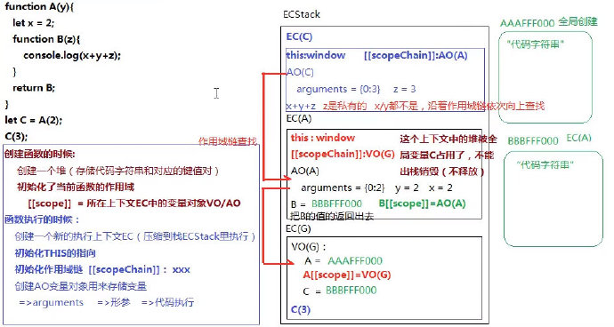
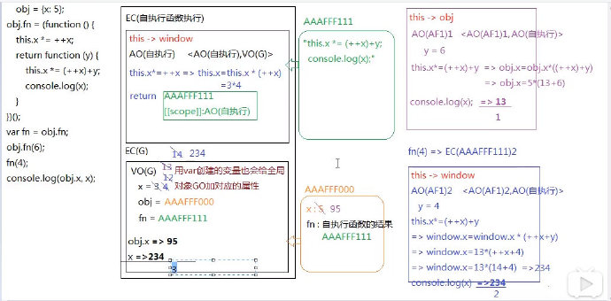
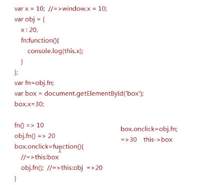

# JavaScript 堆栈内存运行机制

## 1 堆栈内存

JavaScript 引擎执行 JS 代码会先通过**编译器**进行词法解析，构建 AST 抽象语法树，最终生成计算机可执行的机器码并执行。目前比较流行的就是 V8 引擎，Chrome 浏览器和 Node.js 使用的引擎就是 V8 引擎。

V8 引擎执行 JavaScript 代码时，首先会创建一个**执行环境栈**（ECStack，Execution Context Stack，也叫栈内存，可以执行代码和存储基本类型值），然后针对每个作用域，都会创建执行环境（EC，Execution Context，也叫**执行上下文**），全局的执行上下文叫作 EC(G)，函数 fn 的执行上下文叫作 EC(fn)，然后把这些执行上下文压入栈内存（也叫进栈）来执行，执行完后，有的执行上下文就没有用了，会出栈，而有的执行上下文还有用，会被压缩到栈底，等待下次执行（也叫闭包）。

**声明和定义变量**包含了三步操作：声明变量 => 创建值 => 赋值（定义，指针）。创建值的时候，如果值是基本类型的，会直接保存在栈中，如果是引用类型的，会开辟一个内存空间（堆内存）来存储对象中的键值对以及函数中的代码，所有的堆内存都有一个可被后续查找的 16 进制地址，赋值的时候，是把堆内存的地址赋给变量的。

在全局执行上下文中有 GO 全局对象（浏览器端是 window）。

每个执行上下文中都有一个存放变量的**变量对象**，EC(G) 中的变量对象叫作 VO，EC(fn) 中的变量对象叫作 AO（A 表示 active，即活动的变量对象）。

在 EC(G) 中通过 let 声明的变量是全局变量，但并没有放到 window 对象（GO）中，而是放到了全局 VO 中；而通过 var 声明的变量会放到 window 对象中，作为 window 对象的属性。

通过函数声明方式声明的函数，会放到 window 对象中。

`x = y = [12, 32]` 其实包含三步：首先创建一个数组，然后把数组地址赋值给 x，再把数组地址赋值给 y。

数组和对象在堆内存中的存储形式都是键值对；函数在堆内存中会保存函数体代码字符串和键值对（其中，length 表示形参个数、name 表示函数名）。

`A && B` 表示 A 为真，返回 B，否则返回 A，比如 `20 && 30` 返回 `30`；`A || B` 表示 A 为真，返回 A，否则返回 B，比如 `20 || 30` 返回 `20`；`&&` 优先级高于 `||`。

```javascript
let x = 10,
  y = 20
// 相当于
let x
let y
```

```javascript
let x = (y = 20)
// 相当于
let x
y
```

垃圾回收机制也叫内存释放机制，谷歌浏览器的垃圾回收机制是指浏览器会在空闲的时候，把所有不被占用的**堆内存**，进行释放和销毁；而 IE 浏览器的垃圾回收机制利用的是计数器机制。

**内存泄露是怎么来的？**

不再用到的内存，没有及时释放，就叫做内存泄漏（memory leak），一般是由未释放的全局变量（意外的全局变量、没有及时清理的计时器或回调函数、闭包等）引起的。

## 2 作用域和作用域链

```javascript
let x = 1
function A(y) {
  let x = 2
  function B(z) {
    console.log(x + y + z)
  }
  return B
}
let C = A(2)
C(3)
```

函数在**创建**的时候，会创建一个堆用来存储代码字符串和对应的键值对，还会初始化当前函数的作用域，即 `[[scope]]`，指向所在上下文中的变量对象 AO。

函数在**执行**的时候，会创建一个新的执行上下文 EC，压到栈 ECStack 里执行，还会初始化 this 指向、作用域链（比如 `scopeChain: <AO(A), A[[scope]]>`），并且创建 AO 变量对象用来存储变量。

每个**函数执行**时，都会形成一个全新的执行上下文，比如函数 fn 执行时，会形成 EC(fn)，EC(fn) 中有 AO，函数中的代码执行机制是这样的，首先会初始化 arguments（函数中内置的类数组实参集合，箭头函数中没有），然后会创建形参变量并给它赋值，然后才会执行代码。非严格模式下，实参集合和形参变量之间会建立映射机制，就是实参集合中的值变化了，形参变量也会变化，反之亦然；严格模式下，这种映射机制是被阻断的。

上面的 JS 代码，从引擎执行机制来说，可以分为如下三步：

```
// 第一步：创建全局执行上下文，并将其压入ECStack中
ECStack = [
  // 全局执行上下文
  EC(G): {
    // 全局变量对象
    VO(G): {
      ... // 包含全局对象（GO）原有的属性
      x: 1
      A: function(y){...}
      A[[scope]]: VO(G) // 创建函数的时候就确定了其作用域
    }
  }
]
```

```
// 第二步：执行函数A(2)
ECStack = [
  // 函数A的执行上下文
  EC(A): {
    // 链表初始化为AO(A)->VO(G)
    A[[scope]]: VO(G),
    scopeChain: <AO(A), A[[scope]]>,
    this: window,
    // 创建函数A的活动对象
    AO(A): {
      arguments: {0: 2},
      y: 2,
      x: 2,
      B: function(z){...},
      B[[scope]]: AO(A),
    }
  }

  // 全局执行上下文
  EC(G): {
    // 全局变量对象
    VO(G): {
      ... // 包含全局对象原有的属性
      x: 1
      A: function(y){...}
      A[[scope]]: VO(G) // 创建函数的时候就确定了其作用域
    }
  }
]
```

```
// 第三步：执行B/C函数，C(3)
ECStack = [
  // B的执行上下文
  EC(B): {
    B[[scope]]: AO(A),
    scopeChain: <AO(B), B[[scope]]>,
    this: window,
    // 创建函数B的活动对象
    AO(B): {
      arguments: {0: 3},
      z: 3,
    }
  }

  // A的执行上下文
  EC(A): {
    // 链表初始化为AO(A)->VO(G)
    A[[scope]]: VO(G),
    scopeChain: <AO(A), A[[scope]]>,
    this: window,
    // 创建函数A的活动对象
    AO(A): {
      arguments: {0: 2},
      y: 2,
      x: 2,
      B: function(z){...},
      B[[scope]]: AO(A),
    }
  }

  // 全局执行上下文
  EC(G): {
    // 全局变量对象
    VO(G): {
      ... // 包含全局对象原有的属性
      x: 1
      A: function(y){...}
      A[[scope]]: VO(G) // 创建函数的时候就确定了其作用域
    }
  }
]
```



上面的图中，EC(A) 中创建的堆被全局变量 C 占用着，所以执行完后不能出栈销毁，会压入栈底等待下次执行，这就叫做**闭包**。

**补充：** x++ 和 ++x 都是给 x 加一，但是前者是先赋值再递增 x，后者是先递增 x 再赋值。如果 x 是 5，`y = x++` 会将 y 设置为 5，x 设置为 6；而 `y = ++x` 会将 x 和 y 都设置为 6。

每一个函数每次执行时，都会形成全新的执行上下文。

## 3 闭包试题

#### (1) 闭包试题 1

```javascript
let x = 5
function fn(x) {
  return function (y) {
    console.log(y + ++x)
  }
}
let f = fn(6) // fn(6)执行完后，它的执行上下文以及其创建的堆内存（函数）都不会销毁，因为它的执行上下文中创建的堆内存被全局的f引用着
f(7) // 14，f(7)执行完后，会把执行fn(6)时创建的执行上下文中的x修改成7
fn(8)(9) // 18，fn(8)(9)执行完了，执行上下文都会出栈，内存都会销毁
f(10) // 18，执行的时候，使用的是执行fn(6)时创建的堆内存（函数），并且会把执行fn(6)时创建的执行上下文中的x修改成8
console.log(x) // 5
```

#### (2) 闭包试题 2

```javascript
let x = 5
function fn() {
  return function (y) {
    console.log(y + ++x)
  }
}
let f = fn(6) // fn(6)执行完后会一直驻留在内存中，6其实没用到
f(7) // 13，会把全局的x修改成6
fn(8)(9) // 16，会把全局的x修改成7，执行完后，执行上下文都会出栈，内存都会销毁
f(10) // 18，会把全局的x修改成8
console.log(x) // 8
```

#### (3) 闭包试题 3

```javascript
// 闭包试题3
let a = 0,
  b = 0
function A(a) {
  A = function (b) {
    console.log(a + b++)
  }
  console.log(a++)
}
A(1) // 先打印出a，再给a++，所以打印出1，局部的a变成2
A(2) // 先打印出a+b，即2+2，再给b++
```

#### (4) 闭包试题 4

```javascript
// 自执行函数中的this指向window
var x = 3,
  obj = { x: 5 }
obj.fn = (function () {
  // 自执行函数执行后，会把全局的x变成12，自执行函数中的this是window，也就是window.x = window.x * ++x，即window.x = 3 * 4
  this.x *= ++x
  return function (y) {
    this.x *= ++x + y
    console.log(x)
  }
})()
var fn = obj.fn
obj.fn(6) // this指向obj
fn(4)
console.log(obj.x, x)
```



## 4 this 执行主体

this 执行主体是指**谁**把它执行的。

函数执行，看前面是否有**点**，有的话，**点**前面是谁，函数中的 this 就指向谁，没有的话，this 就指向 window（严格模式下指向 undefined），自执行函数中的 this 一般都指向 window；

给元素的事件行为绑定方法（DOM0/DOM2），事件触发，方法会执行，方法中的 this 一般指向当前元素自身；

```javascript
// DOM0
box.onclick = function () {
  // this指向box
}

// DOM2
box.addEventListener(
  'click',
  function () {
    // this指向box
  },
  false // 如果传递true，则表示将该函数注册为捕获事件处理程序，并在事件不同的调度阶段调用
)

// IE8及以下基于attachEvent完成的DOM2事件绑定，this是不准确的
box.attachEvent('onclick', function () {
  // this指向window
})
```


