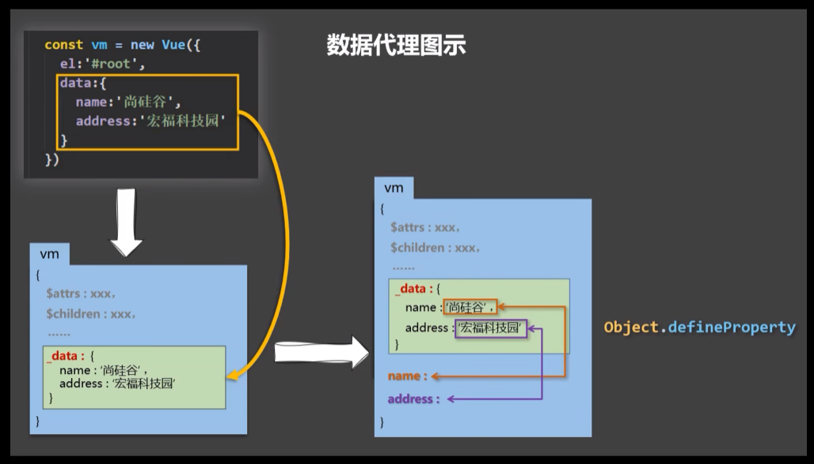

# Vue 知识点

## 1 Vue CLI

Vue CLI 是 Vue 官方出品的快速构建单页应用的脚手架工具。

```bash
cnpm install -g @vue/cli # 全局安装
vue --version # 检查是否安装成功
vue create myapp # 创建项目
```

对于 Vue CLI2.0，我们可以直接修改 Webpack 配置文件。但是对于 Vue CLI3.0，如果需要修改 Webpack 配置，我们需要在项目根目录下新建配置文件 vue.config.js，配置参数可以去[官网](https://cli.vuejs.org/zh/config/)查找，脚手架会把 vue.config.js 中配置的参数翻译成 Webpack 配置参数。

**vue.config.js 文件如下：**

```javascript
module.exports = {
  outputDir: 'dist', // 修改打包后生成的文件所在的目录

  // 配置入口文件
  pages: {
    index: {
      // page的入口
      entry: 'src/index/main.js',
      // 模板来源
      template: 'public/index.html',
      // 在dist/index.html的输出
      filename: 'index.html',
      // 当使用title选项时
      // template中的title标签需要是如下形式
      // <title><%= htmlWebpackPlugin.options.title %></title>
      title: 'Index Page',
      // 在这个页面中包含的块，默认情况下会包含提取出来的通用chunk和vendor chunk
      chunks: ['chunk-vendors', 'chunk-common', 'index'],
    },
    // 当使用只有入口的字符串格式时，模板会被推导为public/subpage.html
    // 并且如果找不到的话，就回退到public/index.html
    // 输出文件名会被推导为subpage.html
    subpage: 'src/subpage/main.js',
  },

  // configureWebpack参数允许我们配置原生的Webpack配置参数，在脚手架生成的Webpack配置文件的基础上，做一个merge
  // 慎用
  // configureWebpack: {},

  // 找文件的时候，会去dist目录、public目录和static目录下找
  // 如果我们在项目中新建一个static目录，目录里新建一个index.json文件
  // 通过网址http://localhost:8080/index.json访问的时候
  // 会去static目录下去找这个文件，同时显示出这个文件中的内容
  devServer: {
    contentBase: [path.resolve(__dirname, 'static')],
  },
  // ...
  // 更多配置参数去官网查找
}
```

**在组件实例中使用组件，比如 LeftNav 组件：**

```vue
<template>
  <div id="app">
    <left-nav></left-nav>
  </div>
</template>

<script>
  import LeftNav from '@/components/LeftNav'
  export default {
    name: 'App',
    data() {
      return {
        count: 1
      }
    },
    components: {
      LeftNav
    }
  }
</script>
```

**补充：** 为什么上面的 data 是一个函数？

每个 .vue 文件都是一个组件（组件是一个可复用的 Vue 实例），这就意味着如果 data 是一个普通的对象，那么所有复用这个实例的组件都将引用同一份数据，这会造成数据污染，如果将 data 定义成一个函数，在实例化组件的时候，每个实例对象的 data 都是经过一次函数执行得到的不同的返回结果，返回的 data 具有自己独立的作用域。

## 2 使用 IconFont 图标步骤

挑选图标，加入购物车，然后在购物车中点击添加至项目（没有项目的话，就自己新建一个）。

图标管理 => 我的项目 => 我发起的项目 => xxxxx（项目名） => Font class => 查看在线链接（如果新添加了图标，就更新一下链接） => 复制链接。

在项目的 index.html 中引入图标：

```html
<link
  rel="stylesheet"
  href="http://at.alicdn.com/t/font_1576692_m2pjqz91r.css"
/>
```

在组件实例中使用图标：

```vue
<i class="icon iconfont icon-hanbao"></i>
```

## 3 使用 ElementUI

1、安装

```bash
npm install --save element-ui
```

2、在 main.js 中**完整引入** Element，样式文件需要单独引入。[官网](https://element.eleme.cn/#/zh-CN/component/quickstart)还有一种**按需引入**的方式，即只引入需要的组件，从而达到减小项目体积的目的

```javascript
import Vue from 'vue'
import App from './App.vue'
import router from './router'
import ElementUI from 'element-ui'
import 'element-ui/lib/theme-chalk/index.css'

Vue.config.productionTip = false
Vue.use(ElementUI)

new Vue({
  render: (h) => h(App),
  router,
}).$mount('#app')
```

3、在组件实例中使用 Element 组件

```vue
<template>
  <div class="pos">
    <el-row>
      <el-col :span="7" class="pos_order" id="posOrder">订单栏</el-col>
      <el-col :span="17" class="pos_goods">商品栏</el-col>
    </el-row>
  </div>
</template>

<script>
export default {
  name: 'Index',
  mounted() {
    const clientHeight = document.body.clientHeight
    document.getElementById('posOrder').style.height = `${clientHeight}px`
  },
}
</script>

<style scoped>
.pos_order {
  background-color: red;
  /* 注意直接通过样式给Element组件设置高度为100%是不起作用的，需要写JS代码来设置高度 */
  /* height: 100%; */
}
</style>
```

## 4 使用 Axios

在 Vue 中，官方推荐使用 Axios 来请求后台接口，获取远程数据。

1、安装

```bash
npm install axios -S
```

2、在组件实例中使用

```vue
<script>
import axios from 'axios'
export default {
  name: 'Index',
  data() {
    return {
      tableData: [],
    }
  },
  // 在created生命周期中请求后台接口
  created() {
    axios('https://xxxxxxxxx')
      // 请求到的数据赋值给data中的tableData
      .then((res) => (this.tableData = res.data))
      .catch((err) => console.log(err))
  },
}
</script>
```

## 5 MVVM

Model：模型，data 中的数据

View：视图，模板代码

ViewModel：视图模型，Vue 实例对象

## 6 数据代理

通过一个对象，代理对另一个对象中属性的操作（读/写），叫做**数据代理**。

下面是一个最简单的数据代理的例子：

```javascript
let obj = { x: 100 }
let obj2 = { y: 200 }
Object.defineProperty(obj2, 'x', {
  get() {
    return obj.x
  },
  set(value) {
    obj.x = value
  },
})
```

Vue 中的数据代理图示：



Vue 中的数据代理是指，通过 vm 对象来代理 data 对象中属性的操作（读/写），好处是更加方便地操作 data 中的数据。

Vue 中数据代理的基本原理：通过 Object.defineProperty 把 data 对象中所有属性添加到 vm 上，并为每一个添加到 vm 上的属性指定一组 getter/setter，然后在 getter/setter 内部去操作（读/写）data 中对应的属性。


