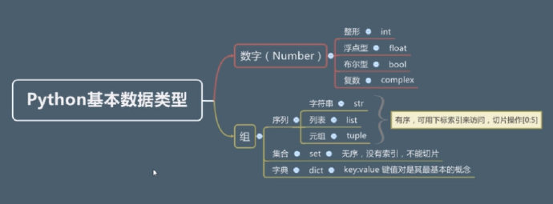
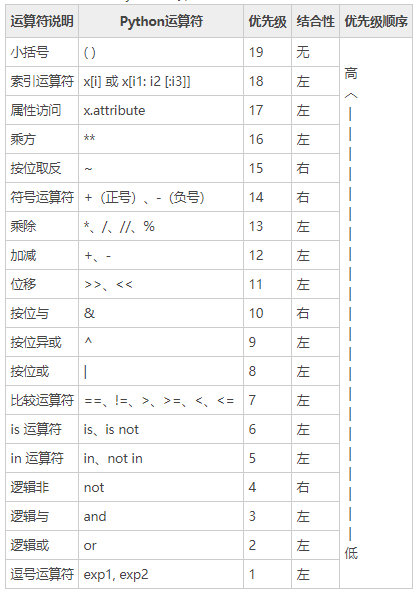

# Python 基础入门

Python 是一门编程语言，是众多编程语言中的一种，它的特点包括开源、面向对象、语法简洁优雅、易于学习、编写的程序容易阅读等。Python 是一个跨平台的语言，可以运行在 Windows、Linux 和 MacOS 操作系统上。Python 具有极为强大而丰富的标准库与第三方库，比如电子邮件、图形 GUI 界面。

相对于 C、C++、Java，Python 的运行效率较慢。

**Python 用途：** 爬虫、大数据与数据分析（Spark）、自动化运维与自动化测试、Web 开发（Flask、Django）、机器学习（Tensor Flow 深度学习框架）、胶水语言（混合如 C++、Java 等语言来一起编程，可以把其它语言编写的各种模块很轻松地联结在一起）。

> **Python 之禅：**
>
> 1、Simple is better than complex.
>
> 2、Now is better than never. Although never is often better than right now.

## 1 进制转换

Python 中通过在数字前面加上 **0b** 来表示该数字是**二进制**的数字，通过在数字前面加上 **0o** 来表示该数字是**八进制**的数字，通过在数字前面加上 **0x** 来表示该数字是**十六进制**的数字。

#### (1) 其它进制转二进制

其它进制转二进制，使用 bin 方法：

```python
bin(10) # => 0b1010
bin(0o7) # => 0b111
bin(0xE) # => 0b1110
```

#### (2) 其它进制转十进制

其它进制转十进制，使用 int 方法：

```python
int(0b111) # => 7
int(0o77) # => 63
```

#### (3) 其它进制转八进制

其它进制转八进制，使用 oct 方法：

```python
oct(0b111) # => 0o7
oct(0x777) # => 0o3567
```

#### (4) 其它进制转十六进制

其它进制转十六进制，使用 hex 方法：

```python
hex(888) # => 0x378
hex(0o7777) # => 0xfff
```

**补充：** 十进制转二进制，采用**短除法**；二进制转十进制，采用**权相加法**。

## 2 基本数据类型

#### (1) 数字

数字类型包括整数（int）、浮点数（float）、布尔类型（bool）和复数（complex）。

需要注意的是，整数除以整数，如果使用单斜杠，那么结果是 float 类型；如果使用双斜杠，那么结果是 int 类型，前提是两个整数相除可以除尽：

```python
type(2/2) # => <class 'float'>
type(2//2) # => <class 'int'>
2//2 # => 1
1//2 # => 0
```

**补充：** 单斜杠是除法运算符，会把结果自动转换成 float 类型；双斜杠可以理解成整除，只会保留整数部分；True 和 False 首字母都要大写，bool 是数字类型的子类；复数通过小写字母 j 来表示，比如 36j 就是一个复数。

```python
int(True) # => 1
int(False) # => 0
bool(1) # => True
# 非0的数值通过bool函数转换后都是True
bool(0) # => False
# 其它类型的数据也可以通过bool函数转换成布尔类型
bool('zoe') # => True
bool('') # => False
bool([]) # => False
bool({}) # => False
bool(None) # => False
```

#### (2) 字符串/str

```python
print(r'c:\northwind\northwest') # => c:\northwind\northwest
print('c:\\northwind\\northwest') # => c:\northwind\northwest
print('hello\
world') # => helloworld
```

当一个字符串前面加上 r/R，表示该字符串不是一个普通字符串，而是一个原始字符串。

字符串运算如下：

```python
'hello' * 3 # => 'hellohellohello'
'hello world'[-1] # => 'd'
'hello world'[0:5] # => 'hello'
'hello world'[0:-1] # => 'hello worl'
'hello world'[6:] # => 'world'
'hello ruby'[-4:] # => 'ruby'
```

#### (3) 列表/list

表示组（序列）的方式有很多种，列表是其中一种。

```python
type([1,2,3,4,5,6]) # => <class 'list'>
```

列表用 `[]` 来定义，列表中的元素可以是各种类型的数据，可以混合出现，且列表中可以嵌套列表。

```python
[0,1,2,3][0:2] # => [0,1]
[0,1,2,3][-1:] # => [3]
[0,1,2,3]+[4,5] # => [0,1,2,3,4,5]
[0,1]*3 # => [0,1,0,1,0,1]
```

#### (4) 元祖/tuple

元祖用 `()` 来定义，用 tuple 来标识。

元祖也是一种基本数据类型，是组的一种表示方式，元祖中的元素访问和基本操作同列表。

元祖中的元素可以是各种类型的数据，可以混合出现。

```python
type((1,2,3)) # => <class 'tuple'>
(1,2,3,4)[0] # => 1

# 注意，只有一个元素的元祖的数据类型并不是tuple
type((1)) # => <class 'int'>
type(('hello')) # => <class 'str'>
```

为什么 `type ((1))` 得到的结果是 `<class 'int'>`，而不是 `<class 'tuple'>` 呢？因为 `()` 在 Python 中也可以用来表示数学运算优先级符号，所以会先计算 `(1)` 得到 `1`，再用 type 函数去检查类型，所以 `type((1))` 等同于 `type(1)`。

如果我们想定义只有一个元素的元祖，可以通过在元素后面加上一个逗号来表示，即 `(1,)`。

可以用 `()` 表示一个空元祖。

```python
type (()) # => <class 'tuple'>
```

元祖和列表有什么区别呢？

#### (5) 集合/set

集合用 `{}` 来定义，它最重要的特征是**无序**和**不重复**。

```python
type({1,2,3,4,5}) # => <class 'set'>
# 获取一个集合的长度
len({1,2,3,4,5}) # => 5
1 in {1,2，3} # => True
1 not in {1,2，3} # => False
# 从集合1中剔除集合2中的元素，即求两个集合的差集
{1,2,3,4,5,6} - {3,4} # => {1,2,5,6}
# 找出两个集合中所共有的元素，即求两个集合的交集
{1,2,3,4,5,6} & {3,4} # => {3，4}
# 合并两个集合，并且去除重复元素，即求两个集合的合集（并集）
{1,2,3,4,5,6} | {3,4，7} # => {1,2,3,4,5,6,7}
```

```python
type({}) # => <class 'dict'>
type(set()) # => <class 'set'>
```

`type({})` 的结果并不是 `<class 'set'>`，因此 `{}` 并不能用来定义空的集合，如果想定义空的集合，需要这样做：`set()`。

#### (6) 字典/dict

字典是一种集合类型，不是序列。

```python
type({'Q':'新月打击', 'W':'苍白之瀑', 'E':'月之降临', 'R':'月神冲刺'}) # => <class 'dict'>
{'Q':'新月打击', 'W':'苍白之瀑', 'E':'月之降临', 'R':'月神冲刺'}['Q'] # => '新月打击'

# 字典中的key可以是字符串，也可以是数字
{1:'新月打击', '1':'苍白之瀑', 'E':'月之降临', 'R':'月神冲刺'}
```

字典中的 value 可以是任意的 Python 数据类型；字典中的 key 必须是不可变类型（int、str、tuple）。

空的字典用 `{}` 来定义。

#### (7) 总结

在 Python 中，str、list、tuple 都是序列。

序列中的每个元素都会被分配一个序号，可以通过 `[序号]` 来访问序列中的元素。

序列可以使用 `+` 和 `*` 运算符。

```python
# 切片
[1,2,3,4,5][-1:] # => [5]
'hello world'[0:8:2] # => 'hlow'
```

```python
# 判断一个序列中是否包含某个元素
3 in [1,2,3,4,5] # => True
# 判断一个序列中是否不包含某个元素
3 not in [1,2,3,4,5] # => False
# 获取一个序列的长度，即一个序列中有几个元素
len('hello world') # => 11
# 求一个序列中最大的元素，min是用来求一个序列中最小的元素
max([1,2,3,4,5]) # => 5
# 如果是字符串的话，是根据字符编码（ascll码）来比较大小的
max('hello world') # => w
```

`in` 和 `not in` 是用来判断两个变量之间逻辑关系的**逻辑运算符（操作符）**。

`ord('w')` 方法用于将参数 `'w'` 转换成 ascll 码。

字符串和元祖是**不可变类型**。



## 3 变量

在 Python 中，变量就是一个名字。变量名一定要有意义。

**定义变量：** 通过赋值符号 `=` 把数据赋值给一个变量。

**变量名的命名规则：** 变量名只能包含字母、数字、下划线；变量名不能以数字开头；保留关键字不能用作变量名；变量名区分大小写。

Python 是动态类型语言，所以变量本身是没有类型的，比如，可以把字符串赋值给一个变量，也可以把列表再赋值给同一个变量。

```python
a = 'abc'
a = [1,2,3]
a = 1
a = (1,2,3)
```

**值类型：** 不可改变的，包括 str、int、tuple。

```python
'python'[0] = 'o' # 报错，因为字符串是不可改变的

a = (1,2,3)
a[0] = '1' # 报错，因为元祖是不可改变的，不可以修改元祖中的元素，也不可以追加、删除元素
```

**引用类型：** 可改变的，包括 list、set、dict。

**补充：** `id()` 方法用于显示某个变量在内存中的地址，一般用 16 进制来表示内存地址。

```python
a = (1,2,3,[1,2,4])
a[2] = '3' # 报错
a[3][2] = '4' # 可以修改成功！！！
```

## 4 运算符

```python
5 % 2 # 5除以2的余数
2 ** 2 # 2的2次方
```

1、算数运算符：`+、 -、 *、 /、 //、 %、 **`

2、赋值运算符：`=、 +=、 -=、 *=、 /=、 %=、 **=、 //=`

```python
b = 1
b += b >=1 # 先逻辑运算再赋值运算
print(b) # 2
```

3、关系运算符：`==、 !=、 >、 <、 >=、 <=`

```python
[1,2,3] > [1,2,4] # => False
(1,2,3) < (1,2,4) # => True
[1,2,3] == [1,2,3] # => True
```

4、逻辑运算符：`and、 or、 not`

```python
'a' and 'b' # => 'b'
'' and 'b' # => ''
'' or 'b' # => 'b'
'a' or 'b' # => 'a'
```

空的列表、集合、字典、元祖在做逻辑运算的时候，会被认为是 False。

5、成员运算符：`in、 not in`

```python
c = 'test'
c in {'test': 1} # => True
```

6、身份运算符：`is、 is not`

```python
# 如果两个变量取值相等，则is运算符返回True
d = 1
e = 1
d is e # => True

f = 1
g = 1.0
f == g # => True
f is g # => False

h = {1,2,3}
i = {1,3,2}
# 集合是无序的，所以h和i的值相等
h == i # => True
h is i # => False

j = (1,2,3)
k = (1,3,2)
j == k # => False
j is k # => False

a = 'hello'
type(a) == str # => True
isinstance(a, str) # => True
# 判断a是否是int/float类型
isinstance(a, (int, float)) # => False
```

对象的三个特征：id（is 运算符）、value（== 运算符）、type（isinstance 方法）。

type 方法不可以判断变量的子类是否属于某种类型，而 isinstance 方法可以。

7、位运算符：`&（按位与）、 |（按位或）、 ^（按位异或）、 ~（按位取反）、 <<（左移动）、 >>（右移动）`，把数字转换成二进制数再进行运算

```python
a = 2
b = 3
a & b # => 2
a | b # => 3
```

## 5 表达式

表达式（expression）是运算符（operator）和操作数（operand）所构成的序列。

表达式中的运算符优先级如下：



**左结合：** 一般表达式的解析都是从左到右的。

## 6 流程控制语句

### 6.1 条件控制

条件控制语句用于解决选择性问题。

```python
mood = True
if mood:
    print('go to left')
else:
    print('go to right')
```

```python
a = 1
b = 2
c = 2
if a or b + 1 == c:
    print('真的') # 打印出真的
else:
    print('假的')
```

```python
account = 'zoe'
password = '123456'
print('please input account')
user_account = input()
print('please input password')
user_password = input()
if account == user_account and password == user_password:
    print('success')
else:
    print('fail')
```

```python
if condition:
    pass # 空语句/占位语句，用于保持代码结构的完整性
else:
    pass
```

```python
print('please input a')
a = input()
a = int(a)
if a == 1:
    print('apple')
elif a == 2:
    print('orange')
elif a == 3:
    print('banana')
else:
    print('others')
```

**补充：** input 方法用于在命令行收集数据。

### 6.2 循环控制

```python
counter = 1
while counter <= 10:
    print(counter)
    counter += 1
else:
    print('EOF')
```

while 循环一般用于不知道循环次数的情况，也常用于递归。

```python
a = [['apple', 'orange', 'banana', 'grape'], (1, 2, 3)]
for x in a:
    for y in x:
        # print(y, end=';') # 在一行打印出所有的元素，元素中间用';'分隔，end默认是'\n'
        print(y)
else:
    print('EOF')

for x in a:
    for y in x:
        if y == 'orange':
            break # 注意这里的break只是终止了内部的循环
        print(y)
else:
    print('EOF') # 会执行
```

```python
b = [1, 2, 3]
for x in b:
    print(x)
    if x == 2:
        break # for循环遇到break语句，会跳出整个循环（循环会立即终止），后面的else也不会执行
else:
    print('EOF')

for x in b:
    if x == 2:
        continue # for循环遇到continue语句，会跳过本次循环
    print(x)
```

```python
# 循环执行10次
for x in range(0, 10):
    print(x)

for x in range(0, 10, 2):
    print(x) # 会打印出0、2、4、6、8，range函数的第三个参数表示步长

for x in range(10, 0, -2):
    print(x)  # 会打印出10、8、6、4、2
```

```python
c = [1, 2, 3, 4, 5, 6, 7, 8]
for i in range(0, len(c), 2):
    print(c[i])

# 扩展学习一下序列的切片用法，第三个参数表示步长
d = c[0: len(c): 2]
print(d) # [1, 3, 5, 7]
```

for 循环一般用于遍历（循环）序列、集合、字典。

## 7 函数

#### (1) 内置函数

Python 中内置了很多函数，比如 round 函数和 print 函数：

```python
a = 1.12386
result = round(a, 3) # 对变量a四舍五入，保留三位小数
print(result) # 1.124
```

#### (2) 函数定义

在 Python 中，定义函数的方式如下：

```python
def funcname(parameter_list):
    pass
```

parameter_list 不是必须的。

函数体中可以 `return value`；如果函数体中没有 `return` 语句，那么该函数默认返回 None；如果 return 后面没有 value，那么该函数也是返回 None。

#### (3) 返回多个结果

在 Python 中，函数可以返回多个结果：

```python
def damage(skill1, skill2):
    damage1 = skill1 * 3
    damage2 = skill2 * 2 + 10
    return damage1, damage2

damages = damage(3, 6) # 结果是元祖类型
print(damages)  # (9, 22)

skill1_damage, skill2_damage = damage(3, 6) # 序列解包
print(skill1_damage)
print(skill2_damage)
```

#### (4) 序列解包

```python
a, b, c = 1, 2, 3
a = b = c = 1 # 链式赋值
d = 1, 2, 3 # b变量是元祖类型的
e, f, g = d # 序列解包
h, i, j = [1, 2, 3] # 序列解包
```

注意，序列解包要保证元素的个数相等，不然会报错。

#### (5) 函数参数

1、必须参数

**必须参数**是指在函数的参数列表中定义的参数，在函数调用时必须传入，即定义了多少个形参，就要传递多少个实参，不然会报错。

```python
# x和y是必须参数
def add(x, y):
    return x + y

print(add(1, 2))
```

2、关键字参数

**关键字参数**允许我们在函数调用的时候，明确告知函数我们传递的实参是给哪个形参赋值的。

```python
def add(x, y):
    return x + y

print(add(y=1, x=2)) # 使用关键字参数的形式来调用函数，可以无需关注函数调用时传入参数的顺序
```

必须参数和关键字参数的区别在于函数的调用。

3、默认参数

```python
def print_student_files(name, gender='女', age=18, college='光明小学'):
    print('我叫' + name)
    print('我是' + gender + '生')
    print('我今年' + str(age) + '岁')
    print('我在' + college + '上学')

print_student_files('叙叙')
print_student_files('秋秋', age=19) # 使用关键字参数
print_student_files('远远', gender='男', 20, college='人民路小学') # 报错，positional argument follows keyword argument，不能混合调用
```

如果没有给某个形参设置默认值，那么在函数调用的时候必须传入该参数，即该参数是必须参数。

设置了默认值的形参也叫可选参数。

定义函数的时候，默认参数后面不能再跟必须参数。

4、可变参数

```python
def demo(*param):
    print(param) # (1, 2, 3)
    print(type(param)) # 元祖类型

# Python会自动把可变参数列表所对应的实参组成一个元祖
demo(1, 2, 3)

# a变量不能直接传入demo函数，param会变成二维元祖，需要在变量a前面加上*
# *a的作用其实就是把元祖中的元素平铺出来，然后传递给可变参数函数
a = (1, 2, 3)
demo(*a)
```

```python
# 等同于上面的可变参数函数
def demo(param):
    pass

demo((1, 2, 3))
```

注意必须参数、默认参数、关键字参数、可变参数混合应用的场景：

```python
def demo(param1, param2=2, *param):
    print(param1)
    print(param2)
    print(param)

demo('a', 1, 2, 3, 4)


def demo2(param1, *param, param2=2):
    print(param1)
    print(param)
    print(param2)

demo2('a', 1, 2, 3, 'param')
demo2('a', 1, 2, 3, param2='param')
```

可变参数列表一般使用 for 循环遍历列表中的每个参数：

```python
def squsum(*param):
    sum = 0
    for i in param:
        sum += i * i
    print(sum)

squsum(1, 2, 3, 4, 5, 6)
squsum(*[1, 2, 3, 4, 5, 6])
```

具有任意个数的关键字参数（关键字可变参数列表）的函数：

```python
def city_temp(**param):
    print(param) # {'beijing': 32, 'nanjing': 31, 'shanghai': 35}
    print(type(param)) # <class 'dict'>

city_temp(beijing=32, nanjing=31, shanghai=35)
```

```python
# 遍历字典
def city_temp(**param):
    for key, value in param.items():
        print(key, ':', value)

city_temp(beijing=32, nanjing=31, shanghai=35)

# 函数调用时传入字典类型的数据
a = {'beijing': 32, 'nanjing': 31, 'shanghai': 35}
city_temp(**a)

# 如果不传递参数就调用函数，那么不会打印出任何东西，因为不会进入for循环
# 如果在for循环前面print(param)，那么会打印出{}
city_temp()
```

#### (6) 补充

如果想查看 Python 的内置函数，首先在 Windows 命令行下通过命令 `python` 进入 Python 命令行（也可以通过直接打开 Python IDLE 来进入 Python 命令行），然后通过命令 `help(round)` 查看内置函数 round 的描述。

在 Python 命令行下，通过命令 `import this` 可以查看 Python 之禅。

通过下面的代码，可以设置允许的最大的函数递归次数：

```python
import sys
sys.setrecursionlimit(9999)
```

## 8 Python 包和模块

**组织结构：** 包 => 模块 => 类 => 函数、变量

函数和变量其实并不属于组织结构，只是为了方便学习和理解。

`包名.模块名` 形成了一个路径，这个路径就叫做**命名空间**。

如何区分普通文件夹和包呢？普通文件夹中如果有特定的文件 `__init__.py`，那么 Python 会把该文件夹认为是一个包。

Python 程序在执行后，会生成 `__pycache__` 目录，目录中有 xxx.pyc 文件，它是由 Python 解释器自动生成的字节码文件，它可以提升 Python 程序的执行效率。如果想在 VSCode 的资源管理器中隐藏 `__pycache__` 目录，可以在 VSCode 中设置 files.exclude，如下：

```json
"files.exclude": {
  "**/__pycache__": true
}
```

### 8.1 `__init__.py`

`__init__.py` 文件也是一个模块，`包名` 就代表这个模块，而无需用 `包名.__init__` 表示。

当一个包或者包中的变量被导入的时候，`__init__.py` 文件会首先被自动执行，可以在该文件中做一些包和模块的初始化工作。

可以在 `__init__.py` 文件中通过 `__all__` 变量来控制哪些模块能被导出：

```python
__all__ = ['模块名']
```

如果包中的多个模块都需要导入相同的一些类库，如果在每个模块顶部通过 `import sys` 的形式导入，会很啰嗦，可以在 `__init__.py` 文件中**批量导入**这些类库，然后在每个模块中 `import t`（t 是 `__init__.py` 文件所在的目录名，即包名），再通过 `t.sys` 来使用：

```python
# t/__init__.py
import sys
import datetime
import io
```

```python
# 模块
import t
print(t.sys.path)
```

### 8.2 导入

#### (1) import 导入

在 test1.py 中定义变量 a，在 test2.py 中如果想使用变量 a，需要在 test2.py 中通过 `import test1` 导入 test1 模块，然后通过 `test1.a` 来使用变量 a；如果 test1.py 在目录 t 下，那么需要在 test2.py 中通过 `import t.test1` 导入 test1 模块，然后通过 `t.test1.a` 来使用变量 a。

```python
# test2.py
import test1
print(test1.a)
```

```python
# test2.py
import t.test1
print(t.test1.a)

# 命名空间简化成一个标识符
import t.test1 as m
print(m.a)
```

注意，`import` 只能导入**模块**。

`import` 的优势在于可以清晰地看出来使用的变量来自于哪个包下面的哪个模块。

#### (2) from import 导入

如果 test1.py 在目录 t 下，那么可以在 test2.py 中通过 `from t.test1 import a` 导入变量 a，也可以通过 `import t from test1` 导入模块 test1，通过 `test1.a` 来使用变量 a：

```python
from t.test1 import a # 导入变量a
print(a)

from t import test1 # 导入模块test1
print(test1.a)

from t.test1 import * # 导入test1模块中的所有变量
print(a)

from t.test1 import a, b # 导入test1模块中的变量a、b

# 如果导入变量太多，一行放不下，可以在行尾加上\，也可以在变量外边加上括号
from t.test1 import a, b, \
c
from t.test1 from (a, b,
c)
```

如果在 test1.py 中增加**模块内置变量**如下，那么通过 `from t.test1 import *` 导入的变量不包括变量 d。

```python
# test1.py
__all__ = ['a', 'c'] # 只会导出变量a和c
a = 2
c = 3
d = 4
```

#### (3) 相对导入和绝对导入

对于顶级包，不可能是入口文件外边的目录，而是跟入口文件的位置相关的，一般跟入口文件平级的目录有可能成为某个模块的顶级包。

```python
# main.py入口文件
import package2.package4.m2 #绝对导入（绝对路径），package2是顶级包
```

相对导入用 `.` 表示当前目录，`..` 表示上级目录，`...` 表示上上级目录，在入口文件中无法使用相对导入，且只能使用 from import 语法来实现相对导入。

入口文件中无法使用相对导入，是因为，相对导入能找到对应的模块是根据当前模块的 `__name__` 变量来定位的，由于入口文件的 `__name__`变量值为 `__main__`，所以无法定位到相对导入的模块。

相对导入只能在普通模块中使用，但是如果在普通模块中相对导入的模块跟该普通模块的顶级包平级（也可以这样理解，相对导入的模块没有顶级包），会报错 `ValueError: attempted relative import beyond top-level package`。

#### (4) 注意事项

包和模块是**不会被重复导入**的，比如 9-1 的例子中，如果多个模块导入 t， `__init__.py` 文件中的 import 不会被重复执行。

在实际开发中，我们一定要**避免循环导入**，比如在 p1.py 中导入 p2.py，在 p2.py 中导入 p1.py。

如果一个模块被导入了，该模块中的代码会被执行。在一个应用程序中，如果某个模块被导入多次，该模块中的代码只会被执行一次。

### 8.3 模块内置变量

`__name__`：模块名，包括命名空间，入口文件中该变量值为 `__main__`

`__package__`：包名，入口文件中该变量值为 NoneType

`__doc__`：模块文档注释，如果没有文档注释，该变量值为 NoneType

`__file__`：模块的绝对路径，如果通过命令 `python z\zoe.py` 执行 zoe.py 入口文件，那么该变量值为 `z\zoe.py`

```python
# 通过python zoe.py执行zoe.py文件，zoe.py文件会被当作应用程序的入口文件，且该文件中没有文档注释
print('name: ' + __name__) # __main__
print('package: ' + (__package__ or '当前模块不属于任何包')) # package: 当前模块不属于任何包
print('doc: ' + (__doc__ or '当前模块没有文档注释')) # doc: 当前模块没有文档注释
print('file: ' + __file__) # zoe.py
```

**入口文件：** 通过命令 `python zoe.py` 执行的 zoe.py 文件会被当作应用程序的入口文件。

在使用模块的内置变量的时候，需要区分开入口文件和普通的模块文件。

通过命令 `python -m z.zoe` 可以把 zoe.py 文件当作模块来执行，前提必须在 z 目录外边的目录中执行该命令，因为要让 zoe.py 成为一个普通模块，该模块必须要有包。注意 `-m` 后面是 `命名空间.模块名`，而不是路径。

#### (1) `dir()` 函数

```python
print(dir()) # 打印出当前模块中的所有变量字符串组成的列表，包括自定义的变量
```

```python
import sys
print(dir(sys)) # 打印sys类库中的变量
```

可以向 `dir()` 函数中传入类名或者模块名，返回该类或者模块中的所有变量。

#### (2) `__name__` 经典用法

Make a script both importable and executable（让一个 Python 脚本既可以被当作普通模块提供给其它应用程序来调用，也可以让其成为一个可执行的文件）：

```python
if __name__ == '__main__':
    print('This is APP')
print('This is module')
```

## 9 补充

可以通过命令 `pip install pylint` 安装 pylint。pip 是 Python 自带的包管理工具。pylint 是语法检测工具，也可以使用 flake8 来检测语法。

Python 中，单行注释使用 `#`，多行注释使用 `'''`；单行注释快捷键是 `ctrl+/`，多行注释快捷键是 `alt+shift+a`。
