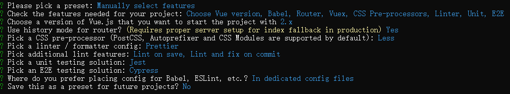

# 微前端学习与实践

微前端是一种多个团队通过独立发布功能的方式来共同构建现代化 Web 应用的技术手段及方法策略。微前端架构旨在解决单体应用在一个相对长的时间跨度下，由于参与的人员、团队的增多、变迁，从一个普通应用演变成一个巨石应用后，随之而来的应用不可维护的问题，这类问题在企业级 Web 应用中尤其常见。

**微前端架构具备以下几个核心价值：**

- **技术栈无关**

  主框架不限制接入应用的技术栈，微应用具备完全自主权。

- **独立开发、独立部署**

  微应用仓库独立，前后端可独立开发，部署完成后主框架自动完成同步更新。

- **增量升级**

  在面对各种复杂场景时，我们通常很难对一个已经存在的系统做全量的技术栈升级或重构，而微前端是一种非常好的实施渐进式重构的手段和策略。

- **独立运行时**

  每个微应用之间状态隔离，运行时状态不共享。

目前，有两个比较成熟的微前端框架，一个是 single-spa，一个是 qiankun。

## 1 single-spa

single-spa 是一个将多个单页面应用聚合为一个整体应用的 JavaScript 微前端框架，实现了路由劫持和应用加载，但是它不够灵活，不能动态加载 JavaScript 文件，且没有做到样式隔离，也没有 JS 沙箱机制。

配置 single-spa 的步骤如下：

1、通过 Vue CLI 创建父应用 parent-vue-project 和子应用 child-vue-project：

```bash
vue create parent-vue-project
vue create child-vue-project
```



2、在 child-vue-project 中，安装 single-spa-vue，在 main.js 中导出一些钩子函数，并做一些配置：

```bash
npm install single-spa-vue --save 
```

```javascript
import Vue from "vue";
import App from "./App.vue";
import router from "./router";
import store from "./store";
import singleSpaVue from "single-spa-vue";

Vue.config.productionTip = false;

// 对于使用了动态路由的子应用，在切换路由时，无法找到JS文件
// 需要配置打包后的文件引用路径
if (window.singleSpaNavigate) {
  // eslint-disable-next-line no-undef
  __webpack_public_path__ = "http://localhost:10000/";
}

// 子应用单独运行
if (!window.singleSpaNavigate) {
  new Vue({
    router,
    store,
    render: (h) => h(App),
  }).$mount("#app");
}

const appOptions = {
  // 挂载到父应用中id为childVueProjectContainer的元素中
  el: "#childVueProjectContainer",
  router,
  store,
  render: (h) => h(App),
};

const lifeCycle = singleSpaVue({
  Vue,
  appOptions,
});

// 协议接入，父应用会调用这些方法
// 父应用加载子应用，需要将子应用打包成一个个lib，给父应用使用
export const bootstrap = lifeCycle.bootstrap;
export const mount = lifeCycle.mount;
export const unmount = lifeCycle.unmount;
```

3、在 child-vue-project 项目的 vue.config.js 中增加配置，用于把子应用打包成 lib：

```javascript
// 运行时，子应用会被打包，并把导出的方法挂载到window对象上
module.exports = {
  configureWebpack: {
    output: {
      // 打包出来的lib库的名字是childVueProject，且是umd模块
      // umd模块会把bootstrap、mount、unmount方法挂载到window.childVueProject上
      library: "childVueProject",
      libraryTarget: "umd",
    },
    devServer: {
      port: 10000,
    },
  },
};
```

什么是 umd？

`commonJS`、`requireJS` 都是用来处理 JS 模块化的，其中 `commonJS` 用来给 `nodejs` 使用（使用了 `module.exports` 的用法）。后来使用 `import/export` 来导入/导出模块。`umd` 是统一模块定义方法，可以兼容所有其他的模块定义方法。

4、修改 child-vue-project 的路由文件，增加路由前缀 `/child-vue-project`：

```javascript
// ...
const router = new VueRouter({
  mode: "history",
  base: "/child-vue-project",
  routes,
});
```

5、在 parent-vue-project 中，安装 single-spa，同时注册并挂载子应用：

```bash
npm install single-spa --save
```

```vue
<!-- App.vue -->
<template>
  <div id="app">
    <router-link to="/child-vue-project">加载child-vue-project</router-link>
    <!-- 加载子应用的位置 -->
    <div id="childVueProjectContainer"></div>
  </div>
</template>

<style lang="less"></style>
```

```javascript
// main.js
import Vue from "vue";
import App from "./App.vue";
import router from "./router";
import store from "./store";
import { registerApplication, start } from "single-spa";

Vue.config.productionTip = false;

async function loadScript(url) {
  return new Promise((resolve, reject) => {
    const script = document.createElement("script");
    script.src = url;
    script.onload = resolve;
    script.onerror = reject;
    document.head.appendChild(script);
  });
}

registerApplication(
  "childVueProject",
  async () => {
    // systemJS
    // 动态创建script标签，并引入该文件
    await loadScript("http://localhost:10000/js/chunk-vendors.js");
    await loadScript("http://localhost:10000/js/app.js");
    // window.childVueProject中有子应用的bootstrap、mount、unmount方法
    return window.childVueProject;
  },
  (location) => location.pathname.startsWith("/child-vue-project"),
  { msg: "传递到子应用的数据" }
);
start();

new Vue({
  router,
  store,
  render: (h) => h(App),
}).$mount("#app");
```

6、分别启动 parent-vue-project 和 child-vue-project。

## 2 qiankun

qiankun 是一个基于 single-spa 的微前端实现库，旨在帮助大家能更简单、无痛的构建一个生产可用微前端架构系统。

**qiankun 的特性：**

- 📦 **基于 [single-spa](https://github.com/CanopyTax/single-spa)** 封装，提供了更加开箱即用的 API。
- 📱 **技术栈无关**，任意技术栈的应用均可使用/接入，不论是 React/Vue/Angular/JQuery 还是其他等框架。
- 💪 **HTML Entry 接入方式**，让你接入微应用像使用 iframe 一样简单。
- 🛡 **样式隔离**，确保微应用之间样式互相不干扰。
- 🧳 **JS 沙箱**，确保微应用之间**全局变量/事件**不冲突。
- ⚡️ **资源预加载**
- 在浏览器空闲时间预加载未打开的微应用资源，加速微应用打开速度。
- 🔌 **umi 插件**，提供了 [@umijs/plugin-qiankun](https://github.com/umijs/plugins/tree/master/packages/plugin-qiankun) 供 umi 应用一键切换成微前端架构系统。

**下面介绍使用 Vue 搭建基座项目，并通过 qiankun 整合 React 项目和 Vue 项目的步骤。**

#### 安装项目

使用官方脚手架搭建三个项目，qiankun-base 是基座项目，qiankun-vue 和 qiankun-react 是需要整合到基座项目上的子项目：

```bash
vue create qiankun-base
```

```bash
vue create qiankun-vue
```

```bash
npx create-react-app qiankun-react
```

#### 配置 qiankun-base

1、安装 qiankun：

```bash
npm install qiankun --save
```

2、在 main.js 中注册子应用：

```javascript
import Vue from "vue";
import ElementUI from "element-ui";
import { registerMicroApps, start } from "qiankun";
import "element-ui/lib/theme-chalk/index.css";

import App from "./App.vue";
import router from "./router";

Vue.config.productionTip = false;

Vue.use(ElementUI);

const apps = [
  {
    name: "vueApp",
    // 默认会加载//localhost:5500的html，解析里面的js，是动态执行的
    // 内部用fetch来读取js文件的
    // 子应用必须支持跨域
    entry: "//localhost:5500",
    // 父应用中的容器元素id，用于挂载子应用
    container: "#vueApp",
    // 访问/vue-app时，把子应用挂载到元素#vueApp上
    activeRule: "/vue-app",
    props: { msg: "传递给vueApp的消息" },
  },
  {
    name: "reactApp",
    // http://localhost:6600
    entry: "//localhost:6600",
    container: "#reactApp",
    activeRule: "/react-app",
  },
];

// 注册应用
// 可以通过生命周期函数增加loading等效果
registerMicroApps(apps, {
  beforeMount() {},
  afterMount() {},
});

start({
  prefetch: false, // 取消预加载
});

new Vue({
  router,
  render: (h) => h(App),
}).$mount("#app");
```

当子应用信息注册完之后，一旦浏览器的 url 发生变化，便会自动触发 qiankun 的匹配逻辑，所有 activeRule 规则匹配上的子应用就会被插入到指定的 container 中，同时依次调用子应用暴露出的生命周期钩子。

3、在 App.js 中配置路由：

```vue
<template>
  <div>
    <el-menu :router="true" mode="horizontal">
      <!-- 自己的路由 -->
      <el-menu-item index="/">Home</el-menu-item>
      <!-- 引用其它子应用 -->
      <el-menu-item index="/vue-app">Vue应用</el-menu-item>
      <el-menu-item index="/react-app">React应用</el-menu-item>
    </el-menu>
    <router-view></router-view>
    <div id="vueApp"></div>
    <div id="reactApp"></div>
  </div>
</template>
```

#### 配置 qiankun-vue

1、配置路由 base：

```javascript
// src/router/index.js

// ...

const router = new VueRouter({
  mode: "history",
  base: "/vue-app",
  routes,
});

export default router;
```

2、配置打包方式和 devServer：

```javascript
// vue.config.js
const { defineConfig } = require("@vue/cli-service");
module.exports = defineConfig({
  transpileDependencies: true,
  devServer: {
    port: 5500,
    headers: {
      // 开发环境下，支持跨域
      "Access-Control-Allow-Origin": "*",
    },
  },
  configureWebpack: {
    output: {
      library: "vueApp",
      libraryTarget: "umd",
    },
  },
});
```

3、在入口函数 main.js 中，配置独立运行、配置 publicPath、导出协议函数等：

```javascript
import Vue from "vue";
import App from "./App.vue";
import router from "./router";

Vue.config.productionTip = false;

let instance = null;
function render(props) {
  instance = new Vue({
    router,
    render: (h) => h(App),
    // 挂载到自己的HTML中，基座会拿到这个挂载后的HTML，插入到基座#vueApp元素中
  }).$mount("#app");
}

// qiankun将会在微应用bootstrap之前注入一个运行时的publicPath变量
// runtime publicPath主要解决的是微应用动态载入的脚本、样式、图片等地址不正确的问题
// 动态添加publicPath
if (window.__POWERED_BY_QIANKUN__) {
  // eslint-disable-next-line no-undef
  __webpack_public_path__ = window.__INJECTED_PUBLIC_PATH_BY_QIANKUN__;
}

// 应用独立运行
if (!window.__POWERED_BY_QIANKUN__) {
  render();
}

export async function bootstrap(props) {}

export async function mount(props) {
  // 父应用通过props传递数据过来
  // console.log(props);
  render(props);
}

export async function unmount(props) {
  instance.$destroy();
  instance = null;
}
```

#### 配置 qiankun-react

1、在 App.js 中配置路由：

```jsx
import { BrowserRouter, Routes, Route, Link } from 'react-router-dom'

function Home() {
  return <h2>Home Page</h2>
}

function About() {
  return <h2>About Page</h2>
}

function App() {
  return (
    <BrowserRouter basename="/react-app">
      <Link to="/">首页</Link>
      <Link to="/about">关于页面</Link>
      <Routes>
        <Route path="/" exact element={<Home></Home>} />
        <Route path="/about" element={<About></About>} />
      </Routes>
    </BrowserRouter>
  )
}

export default App
```

2、在 config-overrides.js 中，配置跨域和打包方式：

```javascript
// 需要了解如何使用react-app-rewired修改create-react-app项目的配置
module.exports = {
  webpack: config => {
    config.output.library = 'reactApp'
    config.output.libraryTarget = 'umd'
    // 访问资源路径
    config.output.publicPath = 'http://localhost:6600/'
    return config
  },
  devServer: configFunction => {
    return function (proxy, allowedHost) {
      const config = configFunction(proxy, allowedHost)
      config.headers = {
        'Access-Control-Allow-Origin': '*',
      }
      return config
    }
  },
}
```

3、新增 .env 文件，配置端口号：

```bash
PORT=6600
WDS_SOCKET_PORT=6600
```

配置 WDS_SOCKET_PORT，防止热更新失败。

4、在入口文件 index.js 中，配置独立运行、导出协议函数：

```jsx
import React from 'react'
import ReactDOM from 'react-dom'
import App from './App'

function render() {
  ReactDOM.render(
    <React.StrictMode>
      <App />
    </React.StrictMode>,
    document.getElementById('root')
  )
}

// 应用独立运行
if (!window.__POWERED_BY_QIANKUN__) {
  render()
}

export async function bootstrap() {}

export async function mount() {
  render()
}

export async function unmount() {
  ReactDOM.unmountComponentAtNode(document.getElementById('root'))
}
```

## 3 了解

### 3.1 主子应用通信

1、基于 URL 进行数据传递（传递消息能力较弱）；

2、基于 CustomEvent 实现通信；

3、基于 props 在主子应用之间通信；

4、使用全局变量、Redux 进行通信。

对于主子应用的公共依赖，可以通过 CDN 引入外部依赖或者使用 Webpack5 联邦模块。

### 3.2 样式隔离

**子应用之间样式隔离：**

可以使用动态样式表，当应用切换时，移除老应用样式，添加新应用样式。

**主子应用之间样式隔离方案：**

1、BEM（Block Element Modifier）约定项目前缀；

2、CSS Modules，打包时生成不冲突的选择器名，比较主流；

3、css-in-js，不推荐使用；

4、Shadow DOM，真正意义上的隔离，也是 qiankun 使用的方案。

Shadow DOM 例子：

```html
<body>
  <div>
    <p>Hello World</p>
    <div id="shadow"></div>
  </div>
  <script>
    // closed表示外界无法访问Shadow DOM
    // 对于在body上添加属性的子项目，比如一些组件弹框是直接挂在body上的，Shadow DOM无法做到样式隔离
    let shadowDom = document.getElementById("shadow").attachShadow({ mode: "closed" });
    let pElement = document.createElement("p");
    pElement.innerHTML = "Shadow DOM";
    let styleElement = document.createElement("style");
    styleElement.textContent = "p{ color: blue; } ";
    shadowDom.appendChild(styleElement);
    shadowDom.appendChild(pElement);
  </script>
</body>
```

### 3.3 JS 沙箱

如果子应用向 window 上添加了属性，且其它子应用能访问到，就造成了全局污染。可以使用 JS 沙箱来解决这个问题。

JS 沙箱包括**代理沙箱**和**快照沙箱**。

需要注意的是，**快照沙箱**不适用于多应用。如果是**多应用**，推荐使用**代理沙箱**（ES6 Proxy）。代理沙箱的原理是使用不同的 Proxy 来处理不同的应用。

下面是一个手写快照沙箱的例子：

```html
<script>
  class SnapshotSandbox {
    constructor() {
      this.proxy = window
      this.modifyPropsMap = {} // 记录在window上的修改
      this.active()
    }

    active() {
      this.windowSnapshot = {}
      for (const prop in window) {
        if (window.hasOwnProperty(prop)) {
          this.windowSnapshot[prop] = window[prop]
        }
      }

      Object.keys(this.modifyPropsMap).forEach(p => {
        window[p] = this.modifyPropsMap[p]
      })
    }

    deactive() {
      for (const prop in window) {
        if (window.hasOwnProperty(prop)) {
          if (window[prop] !== this.windowSnapshot[prop]) {
            this.modifyPropsMap[prop] = window[prop]
            window[prop] = this.windowSnapshot[prop]
          }
        }
      }
    }
  }

  let sandbox = new SnapshotSandbox()
  ;(window => {
    window.a = 1
    window.b = 2
    console.log(window.a, window.b)
    sandbox.deactive()
    console.log(window.a, window.b)
    sandbox.active()
    console.log(window.a, window.b)
  })(sandbox.proxy) // sandbox.proxy就是window
</script>
```

**补充：** 在计算机安全中，**沙箱（Sandbox）是一种用于隔离正在运行程序的安全机制**，通常用于执行未经测试或不受信任的程序或代码，它会**为待执行的程序创建一个独立的执行环境，内部程序的执行不会影响到外部程序的运行**。
